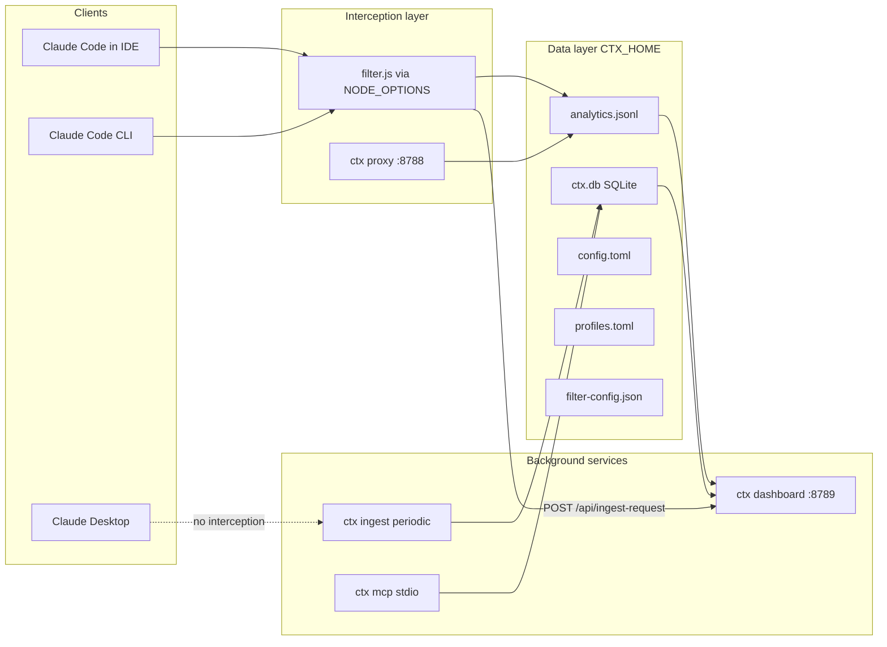
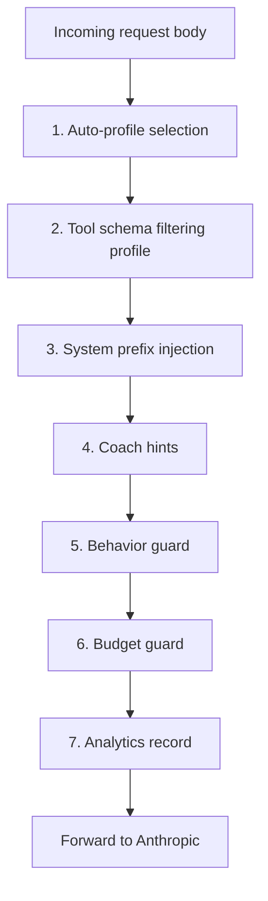

# ctx architecture

Contributor-oriented overview of how the Rust CLI, Node hook, background services, SQLite store, dashboard, and MCP server fit together. End-user install steps live in [README.md](README.md).

## System overview



**Default path:** Claude Code loads `filter.js` through `NODE_OPTIONS=--require …` in `~/.claude/settings.json`. The hook patches Node `http` / `https`, rewrites `/v1/messages` bodies, appends to `analytics.jsonl`, and POSTs rows to the dashboard.

**Optional path:** `ctx proxy` terminates TLS for `api.anthropic.com` and runs the same gate logic in Rust (`proxy::run_gates`) for parity with `filter.js`.

**Desktop:** No `NODE_OPTIONS` in the main app process. MCP (`ctx mcp`) and `ctx ingest` still read and write shared data under `CTX_HOME`.

---

## Module map (`src/`)

| Layer | Modules | Role |
| --- | --- | --- |
| CLI | `main.rs`, `lib.rs`, `cli.rs` | Tokio entry, `run()` dispatch, clap subcommands |
| Setup and host | `setup.rs`, `host.rs`, `daemon.rs` | One-shot install, IDE vs terminal vs Desktop detection, launchd / systemd / fallback processes |
| Interception | `filter.rs`, `filter_hook.rs`, `proxy.rs`, `ca.rs` | Rust tool strip parity, deploy `filter.js` + `filter-config.json`, HTTPS MITM, local CA |
| Pipeline gates | `profiles.rs`, `inject.rs`, `coach.rs`, `behavior_guard.rs`, `budget_guard.rs`, `quality_guard.rs` | Profiles, system prefix, coach signals, behavior hints, budget warnings, profile-switch safety |
| Analytics and storage | `analytics.rs`, `db.rs`, `conversations.rs`, `embedder.rs` | JSONL records, SQLite schema, JSONL + Desktop ingest, embeddings |
| User-facing | `dashboard.rs`, `dashboard.html`, `mcp.rs` | Local Axum UI + REST, stdio MCP tools |
| Config | `config.rs`, `user_profile.rs` | Paths, `config.toml`, calibrated user thresholds |

Supporting: `test_lock.rs` (tests).

**Asset:** `assets/filter.js` is copied to `CTX_HOME/filter.js` at setup; logic mirrors `filter.rs` / `proxy::run_gates`.

---

## Request pipeline (gates)

Single outbound `/v1/messages` body passes through the same ordered stages in `filter.js` and in `proxy::run_gates`:



Implementation detail: `proxy.rs` wraps the inner pipeline in `catch_unwind` and fails open to the original body on error.

---

## Storage layout (`CTX_HOME`, default `~/.ctx`)

| Path | Purpose |
| --- | --- |
| `config.toml` | Active profile, ports, budgets, `inject_enabled`, `store_prompt_text`, `embeddings_enabled`, … |
| `filter.js` | Node preload script (from `assets/filter.js`) |
| `filter-config.json` | Active profile, keep-lists, toggles, dashboard port (synced from Rust) |
| `profiles.toml` | Custom profile definitions |
| `analytics.jsonl` | Append-only per-request analytics |
| `ctx.db` | SQLite WAL DB for sessions, turns, tool invocations, requests, embeddings |
| `system_prefix.md` | Optional text injected into the system message |
| `behavior-hints.json` | Hint file for the behavior guard |
| `ca-cert.pem`, `ca-key.pem` | Local CA for MITM proxy |
| `models/` | Optional ONNX MiniLM weights (`--features onnx`) |
| `*.stdout.log`, `*.stderr.log` | Daemon logs |

**External read paths (ingest):** `~/.claude/projects/**/*.jsonl` (Claude Code), and Desktop `local-agent-mode-sessions/**/audit.jsonl` under the OS Claude support directory (see `config::claude_desktop_session_roots`).

---

## Background services (`daemon.rs`)

| Service | Default | macOS | Linux | Role |
| --- | --- | --- | --- | --- |
| Proxy | `:8788` | `com.ctx.proxy` LaunchAgent | `ctx-proxy.service` | `ctx proxy start` (CONNECT MITM + legacy HTTP forward) |
| Dashboard | `:8789` | `com.ctx.dashboard` | `ctx-dashboard.service` | `ctx dashboard --no-open` |
| Ingest | every 300s | `com.ctx.ingest` | `ctx-ingest.timer` + service | `ctx ingest` |

Install happens from `setup::run` after assets exist. Uninstall removes plists or systemd units and stops services.

**When periodic ingest installs:** `host::HostAdapter::needs_periodic_ingest()` is true for IDE hosts, Desktop-only host, and terminal host if the Claude Desktop data directory exists (so mixed installs still get Desktop JSONL picked up).

On OS targets without launchd or systemd user support, setup falls back to detached processes and prints log paths.

---

## MCP server (`mcp.rs`)

stdio JSON-RPC. Registered in `mcpServers.ctx` with `command` = path to `ctx` binary and `args: ["mcp"]`. Tools expose spend, sessions, tips, patterns, settings, and profiles by reading `ctx.db` and `analytics.jsonl`. Merge targets include `~/.claude/settings.json`, Cursor `mcp.json`, Windsurf config, and `claude_desktop_config.json` when present.

---

## Dashboard (`dashboard.rs`)

Axum serves embedded `dashboard.html` and JSON APIs under `/api/*`. Reads `analytics.jsonl`, `ctx.db`, and in-memory profile or guard helpers. Accepts `POST /api/ingest-request` from `filter.js` for live request rows.

---

## Claude Desktop limitations

See the **Compatibility** table in [README.md](README.md).

Standalone Desktop does not load `NODE_OPTIONS` from `~/.claude/settings.json` for the main Electron chat process. There is no supported way to point Desktop HTTPS traffic at `ctx proxy` via `ANTHROPIC_BASE_URL`. Per-request tracing and hook-driven savings rows show up after **Claude Code** runs with the hook enabled, not after standalone Desktop chat alone.

Desktop still benefits from: MCP tools, the dashboard, and **session-level** data when `ctx ingest` finds `audit.jsonl` under local-agent session roots.

---

## CLI surface

All commands are defined in `src/cli.rs` and dispatched from `src/lib.rs::run`. Summary:

| Command | Purpose |
| --- | --- |
| `ctx setup` | Full install (proxy, dashboard, ingest services, assets, MCP, optional `proxy::install`) |
| `ctx setup --uninstall` | Reverse proxy env, daemons, MCP entries |
| `ctx use`, `ctx profile *`, `ctx status` | Profiles |
| `ctx ingest` | Index Claude Code JSONL + Desktop audit logs into `ctx.db` |
| `ctx dashboard` | Foreground dashboard server |
| `ctx proxy start\|install\|uninstall\|status` | MITM proxy and settings wiring |
| `ctx gain`, `ctx inject *` | Savings display, stop hook, system prefix |
| `ctx mcp` | stdio MCP entrypoint for IDEs and Desktop |

---

## Tests

```bash
cargo test
```

Integration tests use `CTX_HOME` isolation via `test_lock` where needed.
