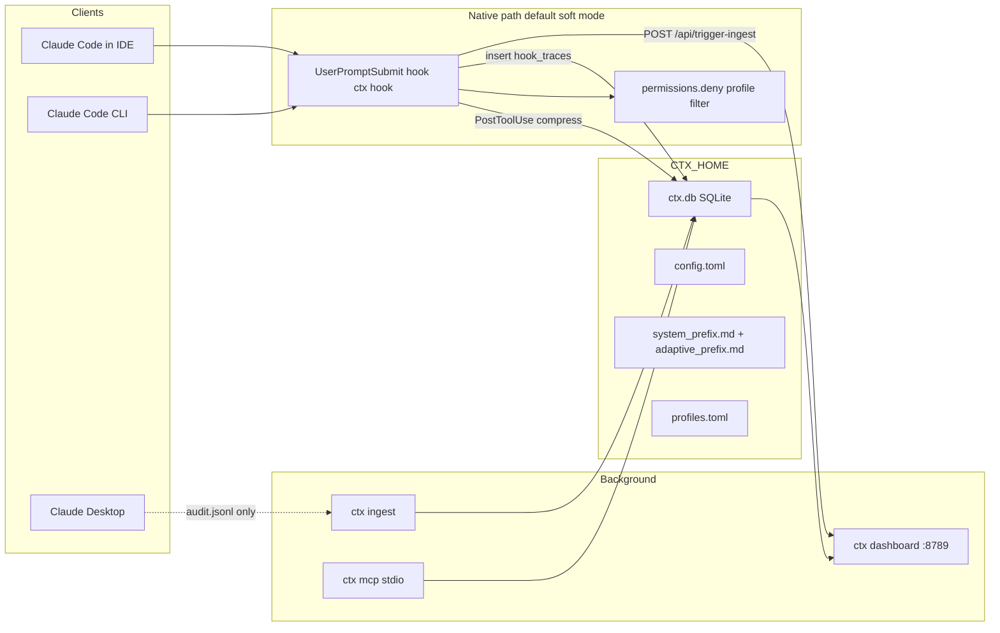

# ctx architecture (v0.4.0)

Contributor-oriented overview of the Rust CLI, native Claude Code hooks, SQLite store, dashboard, and MCP server. End-user install steps live in [README.md](README.md).

**Primary audience:** Claude Code users (terminal CLI or IDE-embedded). Claude Desktop is secondary — analytics and `ctx mcp` only; no hooks or native filtering path.

## System overview



**Default path (soft filter):** Claude Code hides stripped MCP tools via `permissions.deny` in `~/.claude/settings.json` — either server wildcards (`mcp__claude_ai_{Server}__*`) for prefix-based profiles, or **exact tool names** when `keep_tools` is set. MCP servers **stay connected** in `/mcp` in soft mode (tool-level profiles can keep 4 of 22 Atlassian tools while the server stays connected). On each prompt, `ctx hook user-prompt-submit` runs similarity-first auto-profile, optional prefix injection, coaching, budget hard-stop, and records a row in `hook_traces`. Ingest enriches those rows with token and cost data from session JSONL. **`personal`** profile is upserted from observed tool usage (≥ `min_tool_invocations_per_tool` per tool) once `[profile_thresholds]` are met; category profiles require a higher bar or `ctx profile generate`.

**Strict mode (opt-in):** `filter_mode = strict` uses `allowedMcpServers` instead — non-allowlisted remote connectors disconnect for maximum token savings.

**No proxy:** ctx is hook-first. It never terminates TLS, installs a CA, or edits requests on the wire. The MITM proxy was removed in ADR 0015; the only thing ctx changes in the cached request prefix is the system-prefix injection it asks Claude Code to add through the hook. (`filter.js` + `NODE_OPTIONS` are also deprecated; Bun-based Claude Code ignores Node preload.)

**Desktop:** No hooks path. MCP tools, dashboard, and ingest of `audit.jsonl` still work.

---

## Module map (`src/`)

| Layer | Modules | Role |
| --- | --- | --- |
| CLI | `main.rs`, `lib.rs`, `cli.rs` | Entry, subcommands |
| Setup | `setup.rs`, `host.rs`, `daemon.rs` | Install, host detection, launchd/systemd |
| Native hooks | `hook.rs`, `filter_control.rs`, `claude_settings.rs`, `profiles.rs` | `UserPromptSubmit`, filter modes, settings merge, deny/allowlist |
| Gates | `inject.rs`, `adaptive.rs`, `coach.rs`, `budget_guard.rs`, `behavior_guard.rs` | Prefixes, coaching, budget |
| Compress | `compress/` | PostToolUse output compression (Bash, Read, Grep, Glob, MCP) |
| A/B | `ab.rs`, `config::AbTestConfig` | Per-feature treatment vs control coin flips |
| Modes | `modes.rs` | Named presets (profile + toggles) |
| Tuning | `tuning.rs` | Post-ingest A/B comparison → `ab-results.json` |
| Simulate | `simulate.rs` | Dry-run pipeline, profile comparison, replay |
| Socket | `socket.rs` | Unix domain socket at `ctx.sock` |
| Storage | `db.rs`, `conversations.rs`, `embedder.rs` | SQLite schema, JSONL ingest, embeddings |
| UI | `dashboard.rs`, `dashboard.html` | Axum API + embedded UI |
| MCP | `mcp.rs` | stdio tools over `ctx.db` |
| Config | `config.rs`, `user_profile.rs` | `config.toml`, calibrated thresholds |
| Legacy | `filter_hook.rs`, `analytics.rs` | Deprecated JSONL paths |

---

## Filter modes (`config::FilterMode`, `filter_control.rs`)

| Mode | Settings mechanism | Connectors in `/mcp` |
| --- | --- | --- |
| `soft` (default) | `permissions.deny` with `mcp__claude_ai_*__*` wildcards | All stay connected |
| `strict` | `allowedMcpServers` allowlist | Non-listed disconnect |
| `off` | Strip ctx-managed deny and allowlist | All connected |

- `profiles::deny_patterns_for_profile()` maps profile keep-lists → deny wildcards (prefix mode) or per-tool deny entries (`keep_tools` mode); local MCP servers (including `ctx`) are never denied.
- `Profile::keeps_tool()` / `filters_tool()` — tool-level filtering when `keep_tools` is non-empty; soft mode emits per-tool `permissions.deny` entries via the same methods.
- `ctx profile migrate-tools` expands legacy server-prefix `keep` into `keep_tools` from SQLite invocation counts.
- `claude_settings::merge_profile_filter()` applies mode-specific merge; `strip_ctx_deny_rules()` on uninstall.
- CLI: `ctx filter mode|expand|clear-expansion`.
- Session expansion (`session_expansion` in config): temporarily remove deny rules for a named server during soft mode.

---

## Request pipeline (native hooks)

On each `UserPromptSubmit`, `hook::user_prompt_submit()`:

1. Resolve A/B assignments (`ab.rs`) when `[ab_test]` is present in `config.toml`.
2. Auto-profile (if enabled and profile gate is treatment): similarity vote over past sessions (hook trace profiles preferred), then cwd/path fallback on visible profiles only.
3. Budget hard-stop on huge prompts.
4. Build `additionalContext`: static `system_prefix.md`, coaching, `adaptive_prefix.md` (model-budget capped).
5. Insert `hook_traces` with gate flags, savings metrics, and optional `ab_group` string.
6. Fire-and-forget `POST /api/trigger-ingest` so the dashboard refreshes JSONL.

MCP tool stripping happens outside the hook via **`permissions.deny`** (soft mode) or **`allowedMcpServers`** (strict mode) when the profile gate is in treatment. In soft mode, `hook_sync_profile()` rewrites deny rules on auto-profile without touching `allowedMcpServers`. Control profile requests skip filtering and record `P:C` in `ab_group`.

---

## SQLite (`ctx.db`)

Primary tables: `sessions`, `turns`, `tool_invocations`, `requests` (legacy rows), `hook_traces`, `hook_events`, `session_embeddings`, `profile_changes`, `meta`.

### `hook_traces`

Written synchronously from the hook. Enriched on ingest by matching the nearest turn (session + timestamp). Key columns:

| Column | Source |
| --- | --- |
| `profile`, `tools_*`, `inject_fired`, `adaptive_fired`, `coach_kind` | Hook |
| `ab_group` | Hook, e.g. `P:T I:C A:T C:T` (null when no experiment) |
| `input_tokens`, `output_tokens`, `cost_usd`, `model`, `enriched` | Ingest |
| `human_text_prefix` | Copied from matched turn on enrich |
| `mode` | Active context mode name when set |
| `parent_session_id` | Parent session for subagent / Task tool child sessions |

### Install watermark

`meta.ctx_active_since` stamps the first hook or filtered request. Dashboard APIs default to `ts >= watermark` unless `?since=all`.

---

## A/B experiments

Config block in `config.toml`:

```toml
[ab_test]
profile_pct = 50   # 0 = always control, 100 = always treatment
inject_pct = 100
adaptive_pct = 50
coaching_pct = 100

dev_mode = true    # optional: show Experiment tab
```

- Per request, each feature gets an independent coin flip (`ab_assign`), keyed by session id + cwd + prompt so assignments vary across hook subprocesses.
- `ab_group` is null when `[ab_test]` is omitted or all percentages are 100.
- Dashboard: `GET /api/ab-report`, `GET /api/ab-daily` (watermark-aware).
- Experiment tab visible when `dev_mode`, `?dev=1`, or `localStorage.ctx_dev`.

### Self-tuning (`tuning.rs`)

After each ingest, when `[ab_test]` is active and cohorts have at least 100 enriched rows per arm, `run_tuning_after_ingest()` compares treatment vs control average `cost_usd` per feature (profile, inject, adaptive, coaching). Results go to `~/.ctx/ab-results.json` with verdicts: `beneficial`, `no_benefit`, `harmful`, `insufficient_data`.

- CLI: `ctx experiment status`, `apply`, `reset`
- Dashboard Settings: recommendation card + `auto_apply_recommendations` toggle
- `auto_apply_recommendations = true`: disables features with no benefit or harm, clears `[ab_test]`

---

## Context modes (`modes.rs`)

`config.toml` holds `[modes.<name>]` tables (`ModeConfig`: profile, inject, coaching, adaptive). `ctx mode <name>` sets `active_mode`, copies toggles to top-level config keys, and calls `profiles::apply_profile()`. Hook rows record `hook_traces.mode` for the dashboard trace chip.

---

## Subagent cost grouping

`hook.rs` reads `parentSessionId` / `parent_session_id` from hook stdin JSON. `GET /api/task-costs` groups enriched `hook_traces` by `COALESCE(parent_session_id, session_id)` with per-child session breakdown. Prompt Stats tab: “Cost by task” card.

---

## Unix socket (`socket.rs`)

`ctx dashboard` spawns `run_listener()` on `~/.ctx/ctx.sock` (removed on graceful shutdown). Protocol: one JSON line in, one JSON line out. Queries: `profile`, `budget`, `experiment`, `last-trace`, `adaptive-status`. Sidebar shows “Event stream: active” while the dashboard runs.

---

## Dashboard

Axum serves embedded `dashboard.html` via `include_str!` in `dashboard.rs`. Tabs include Savings, Prompt Stats, Profiles, Request Trace (hook rows), Pipeline, Settings, and Experiment (dev).

Notable APIs: `/api/stats`, `/api/hook-traces`, `/api/task-costs`, `/api/simulate`, `/api/settings`, `/api/settings/mode`, `/api/trigger-ingest`, `/api/ab-report`, `/api/ab-daily`.

Request Trace shows user prompt text after enrich, expandable “What ctx did” bullets, and `ab_group` chips when present.

### Dashboard static assets

Source of truth for UI edits is `src/dashboard_static/`, not `src/dashboard.html` directly.

| Path | Role |
| --- | --- |
| `src/dashboard_static/MANIFEST` | Stitch order for fragments |
| `fragments/shell_head.html`, `shell_body.html`, `modals.html`, `tail.html` | Layout shell |
| `fragments/onboarding.fragment.html` | First-run wizard markup (inside `#onboarding-wrap`) |
| `styles/dashboard_part1.css`, `onboarding.css`, `dashboard_part2.css` | Styles (concatenated inside one `<style>` block) |
| `tabs/*.html` | Tab panel markup |
| `js/*.js` | Inlined into a single `<script>` block at stitch time |

Regenerate the committed HTML after fragment edits:

```bash
make dashboard          # write src/dashboard.html
make dashboard-check    # fail if dashboard.html is stale vs fragments
```

Initial extraction from a monolithic file (one-time or after a deliberate merge-back): `python3 scripts/split-dashboard.py` (reads `src/dashboard.html` at that moment).

---

## Background services

| Service | Default | Role |
| --- | --- | --- |
| Dashboard | `:8789` | UI + APIs |
| Ingest | every 300s | JSONL → SQLite, enrich `hook_traces`, rebuild adaptive prefix |

---

## MCP server (`mcp.rs`)

stdio JSON-RPC. Tools read `ctx.db` and config. Registered in Claude/Cursor/Desktop MCP configs by `ctx setup`.

---

## Tests

```bash
cargo test
```

Integration tests isolate `CTX_HOME`. Hook and A/B: `tests/ab_hook.rs`, `tests/journey_ab_experiment.rs`, `tests/ab_api.rs`. Soft filter: `tests/permissions_filter_test.rs`. Power features: `tests/journey_mode_switch.rs`, `journey_subagent_costs.rs`, `journey_socket.rs`, `journey_self_tuning.rs`. Simulate: `journey_simulate.rs`. Dashboard stitch: `tests/dashboard_stitch_test.rs`.

---

## File inventory (high signal)

| Path | Purpose |
| --- | --- |
| `src/hook.rs` | Native hook |
| `src/filter_control.rs` | Filter mode CLI + hook profile sync |
| `src/claude_settings.rs` | Deny/allowlist merge, hooks wiring |
| `src/ab.rs` | A/B coin flip + group formatting |
| `src/modes.rs` | Context mode switch/list/save |
| `src/tuning.rs` | Self-tuning engine + experiment CLI |
| `src/simulate.rs` | Dry-run pipeline, `--all-profiles`, `--replay-last` |
| `src/socket.rs` | Unix socket listener |
| `src/adaptive.rs` | Adaptive prefix generation |
| `src/dashboard.html` | Stitched UI (embedded via `include_str!`) |
| `src/dashboard_static/` | Fragment source for dashboard HTML/CSS/JS |
| `assets/filter.js` | Legacy preload copy |
| `test.sh` | Hook smoke + focused cargo test |

`analytics.jsonl` remains for legacy filter paths but is not the primary analytics store for hook-native installs.
