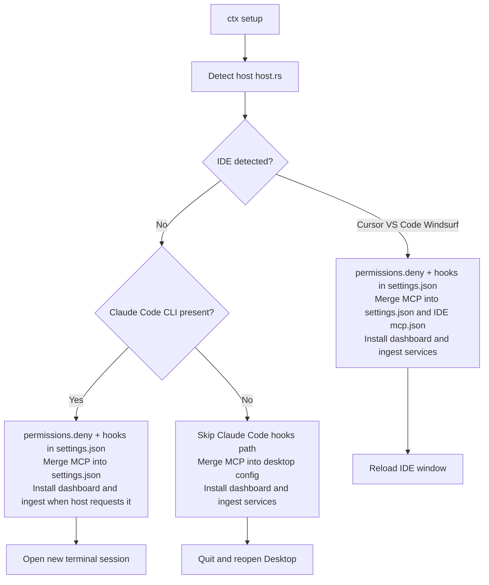

# ctx

ctx is a self-learning context controller for coding agents. It watches your real sessions, learns what each tool's output actually needs to keep for the next decision in *this* repo, and trims the rest, getting sharper the more you use it. Filtering unused MCP tools and tracking per-session cost are mechanisms, not the headline. No cloud, no LLM in the hook.

Alpha install: one command, no repo access and no Rust. Ask for an alpha token, then:

```bash
curl -fsSL <endpoint>/install.sh | CTX_TOKEN=<your-token> sh
```

It downloads a checksum-verified binary, wires ctx into Claude Code, and starts the dashboard at http://127.0.0.1:8789. The live endpoint and token minting are in [`services/ctx-dist`](services/ctx-dist). Maintainers building from source: see [Build from source](#build-from-source) below.

### How it earns its turn

Compression starts **off**. ctx first runs in shadow mode: for every tool result it records the lines it *would* keep or drop and then watches the next few turns to see if dropping them would have caused a correction or a re-read. Only when a tool's own collected labels clear the evidence bar does ctx turn user-facing trimming on for that tool, lowest-risk first (git, test, grep before Read and MCP). The original output always stays in your transcript.

```bash
ctx context status     # collection progress + which tools have earned activation
ctx context learn      # train the local outcome model on your labels (volume-gated)
ctx context on         # opt into the safe preset (git/test/grep); tools still gate on evidence
ctx bench run          # reproducible, outcome-first benchmark on your own sessions
```

The dashboard's **Context** home is the spine: Learning (what ctx is recording, with 0 corrections caused), Earning (which tools turned on and the count of your runs behind each), and Improving (the local model's version history). The honesty gate: ctx does not claim to beat native compaction until the Act 2 benchmark has real data.

After setup, ctx stays on the `all` profile until MCP usage crosses configurable thresholds, then builds a **`personal`** profile automatically from your tool history. Q&A-only turns with no MCP calls still benefit from similarity-based auto-select once past sessions exist in the index.

## Compatibility

| Feature | Claude Code in an IDE | Terminal CLI | Claude Desktop |
| --- | --- | --- | --- |
| Native MCP filter (`permissions.deny` soft mode, or opt-in `allowedMcpServers` strict mode in `~/.claude/settings.json`) | Yes | Yes | No (Desktop uses its own config) |
| Claude Code hooks (`UserPromptSubmit`, `PostToolUse`, …) | Yes | Yes | No |
| Legacy in-process filter (`NODE_OPTIONS` + `filter.js`) | Deprecated (ignored by Bun-based `claude` binary) | Deprecated | No |
| Per-request tracing (dashboard Request Trace tab) | Yes (native hooks, no proxy) | Yes | No |
| MCP tools (`ctx_spend`, `ctx_sessions`, …) | Yes | Yes | Yes (after MCP config + app restart) |
| Dashboard | Yes | Yes | Yes |
| Session ingest + analytics (`ctx ingest`) | Yes | Yes | Yes (Desktop `audit.jsonl` under local-agent sessions) |
| Real-time ingest (per turn) | Yes — `filter.js` or hooks hit `POST /api/trigger-ingest` / hook events | Yes | No (run `ctx ingest` manually) |
| Periodic background ingest | Yes on macOS and Linux via background services | No (run `ctx ingest` or cron) | Yes on macOS and Linux when periodic ingest is installed |
| Reload | Command Palette → Reload Window | New shell session | Quit Desktop fully, reopen |

“Claude Code in an IDE” includes Cursor, VS Code, Windsurf, or any editor where Claude Code runs in an integrated terminal. `ctx setup` picks Windsurf or Cursor MCP paths when those environments are detected.

### Claude Desktop: no Claude Code hooks path

Desktop is an Electron app. It does not load `~/.claude/settings.json` the way the Claude Code CLI does for MCP filtering and hooks. Per-request tracing in the dashboard applies in **Claude Code** (CLI or IDE) via native hooks and SQLite, not in standalone Desktop chat. On Desktop, use MCP plus `ctx ingest` for session-level data when local-agent `audit.jsonl` logs exist.

## Install journey

`ctx setup` is the single entry point after you build or install the `ctx` binary. It detects your environment ([`host.rs`](src/host.rs)), writes files under `CTX_HOME` (default `~/.ctx`), starts background services where supported, merges MCP config, and merges **`permissions.deny` (soft filter) plus Claude Code `hooks`** into `~/.claude/settings.json` when Claude Code settings apply. Legacy `NODE_OPTIONS --require filter.js` is stripped when present; the shipped `claude` binary is Bun-based and does not honor Node preload.



Detection order in code: Windsurf markers, then Cursor, then VS Code integrated terminal, then **Desktop-only** if the Claude Desktop data directory exists **and** the Claude Code CLI is absent, otherwise plain terminal. If Desktop is installed alongside Claude Code, the primary host is IDE or terminal, but `ctx setup` still merges the `ctx` MCP entry into `claude_desktop_config.json` when that file exists.

**What each surface gets** is summarized in the [Compatibility](#compatibility) table above (no duplicate matrix here).

Quick paths:

- **Claude Code in an IDE (recommended):** Run these in a terminal, then reload the IDE window.
  ```bash
  gh repo clone saurabh0392/ctx ~/Documents/ctx 2>/dev/null || git -C ~/Documents/ctx pull
  bash ~/Documents/ctx/scripts/install.sh
  ctx setup
  ctx use <profile>   # optional — setup picks one when history exists
```
- **Claude Code in a terminal only:** Same install, then reload Claude Code so `~/.claude/settings.json` hooks and soft filter rules apply.
- **Claude Desktop:** Same install from an OS terminal, run `ctx setup`, then quit Desktop fully and reopen. Native Claude Code filtering is not available on Desktop (see table), but MCP tools and the dashboard work.
- **Build from source:** `gh repo clone saurabh0392/ctx ~/Documents/ctx` then `source "$HOME/.cargo/env" && cargo install --locked --path ~/Documents/ctx` (or follow [`INSTALL_PROMPT.md`](INSTALL_PROMPT.md)).

### What happens during `ctx setup`

1. Ensure `CTX_HOME`, write `filter.js` from the embedded asset (legacy experiments only).
2. Create default `system_prefix.md` if missing; optionally download ONNX embedding weights when built with the `onnx` feature.
3. Open or create `ctx.db`, run an initial ingest when Claude Code project JSONL exists, pick a default profile, sync `filter-config.json`.
4. Install and start the dashboard (default port `8789`).
5. When `needs_periodic_ingest` is true, install a periodic `ctx ingest` job (macOS and Linux user services).
6. Unless `--no-install`, merge **`permissions.deny`** (soft filter), **hooks** (`ctx hook user-prompt-submit`, async `POST /api/hook/event`), and strip legacy `NODE_OPTIONS` filter preload when `supports_node_options` is true (not Desktop-only).
7. Register `ctx mcp` in Claude settings, IDE-specific MCP JSON when applicable, and Desktop config when present.
8. Open the dashboard URL in a browser when ready.

Other entry points: paste the prompt from [`INSTALL_PROMPT.md`](INSTALL_PROMPT.md) for a guided Claude Code install, or run [`scripts/install-desktop.sh`](scripts/install-desktop.sh) from an OS terminal for a Desktop-first flow.

### Post-install checks

- `curl -s -o /dev/null -w "%{http_code}" http://127.0.0.1:8789/` should print `200` after services are up.
- `ctx status` should print the active profile and related info.
- In Claude Code or Desktop, reload or restart so MCP lists include `ctx_*` tools.

Contributor-level diagrams, module tables, and pipeline detail: [ARCHITECTURE.md](ARCHITECTURE.md).

## Teardown

- `ctx setup --uninstall` removes background services where supported, strips ctx from MCP JSON files (Claude settings, Cursor, Windsurf, Desktop), removes ctx native hooks and ctx-managed filter rules (`permissions.deny` and `allowedMcpServers`), and clears any leftover env from older proxy installs.
- Reload the IDE window or restart Desktop so removed env and MCP entries apply.

---

## Install

**Pre-built binary (no Rust required) — requires `gh` authenticated to the saurabh0392 account:**

```bash
gh repo clone saurabh0392/ctx ~/Documents/ctx 2>/dev/null || git -C ~/Documents/ctx pull
bash ~/Documents/ctx/scripts/install.sh
ctx setup
```

`setup` indexes your Claude Code JSONL, generates MCP profiles from usage history when available, and activates the best match. Re-run `ctx profile generate` only after you add or remove MCP connectors.

`install.sh` detects your platform (macOS arm64/x86_64 or Linux x86_64), downloads the matching binary from the [latest release](https://github.com/saurabh0392/ctx/releases/latest) via `gh release download`, and installs it to `/usr/local/bin`. Set `CTX_INSTALL_DIR` to override the destination.

No `gh` but have a PAT? `GITHUB_TOKEN=<pat> bash scripts/install.sh` works too.

**Build from source (requires Rust):**

```bash
gh repo clone saurabh0392/ctx ~/Documents/ctx
source "$HOME/.cargo/env" && cargo install --locked --path ~/Documents/ctx
ctx setup
```

After installing the binary, run setup once:

```bash
ctx setup
```

`setup` writes assets under `CTX_HOME` (default `~/.ctx`): `filter.js`, `filter-config.json` (legacy), merges **`permissions.deny` (soft filter) and hooks** into `~/.claude/settings.json` where configured, and installs background services on macOS (launchd) and Linux (systemd user units). On other OS targets it starts `ctx dashboard` as a detached process and prints how to schedule ingest yourself.

## Filtering paths

ctx supports three **filter modes** (see `filter_mode` in `~/.ctx/config.toml` or `ctx filter mode`):

| Mode | Mechanism | MCP servers in `/mcp` | Token savings |
| --- | --- | --- | --- |
| **soft** (default) | `permissions.deny` wildcards like `mcp__claude_ai_Figma__*` | All stay connected | High — tools hidden from model |
| **strict** (opt-in) | `allowedMcpServers` allowlist | Non-listed servers disconnect | Maximum |
| **off** | No ctx filter rules | All connected | None |

Claude Code **MCP Tool Search** (on by default) defers tool schemas until needed. ctx soft filtering complements this by hiding stripped tools from discovery. ctx is hook-first: it never routes your traffic through a proxy, so it never disables tool search.

1. **Default (native Claude Code, soft mode)**  
   `permissions.deny` in `~/.claude/settings.json` plus hooks. MCP servers outside the active profile have their tools denied; **servers stay connected** in `/mcp`. `ctx hook user-prompt-submit` handles auto-profile, budget hard-stop, optional JSONL-based coaching, and `additionalContext` injection from `~/.ctx/system_prefix.md`. Async hooks POST telemetry to `http://127.0.0.1:8789/api/hook/event`. Request Trace shows per-turn pipeline cards and enriches them with cost after JSONL ingest.

2. **Strict mode (opt-in maximum savings)**  
   `ctx filter mode strict` switches to `allowedMcpServers`. Non-allowlisted remote connectors **disconnect** from `/mcp`. Use when you need every token saved and can tolerate dropped connectors.

3. **Legacy (`NODE_OPTIONS` + `filter.js`)**  
   Deprecated: the `claude` CLI is a Bun binary and ignores Node preload. Files remain under `CTX_HOME` for experiments only.

Keep feature work aligned with the native soft-filter path so dashboards stay populated for everyone who uses Claude Code with hooks.

## Profiles

Profiles live in the Rust side (`profiles` module), sync to **`permissions.deny`** in soft mode (default) or **`allowedMcpServers`** in strict mode, and still export `filter-config.json` for legacy setups. Each profile lists MCP server prefixes (legacy) or explicit **tool names** (`keep_tools`) to **keep**; other tools are hidden via soft deny, or whole servers disconnect in strict mode.

**Tool-level profiles:** When `keep_tools` is set in `profiles.toml`, it overrides server-prefix `keep`. New `[personal]` and category profiles are written with `keep_tools` automatically once usage thresholds are met. To convert older server-prefix entries already in `profiles.toml`:

```bash
ctx profile migrate-tools          # all prefix-based profiles in profiles.toml
ctx profile migrate-tools data     # copy a built-in template, then convert to keep_tools
ctx profile add mine --keep-tool mcp__claude_ai_Atlassian__jira_get_issue
```

**Personal profile (automatic):** After ingest indexes enough MCP usage (defaults: 20 tool calls, 3 servers, 2 sessions in the last 30 days), ctx writes `[personal]` with a `keep_tools` list to `~/.ctx/profiles.toml` and activates it when you are still on `all`. Until then, ctx stays on `all` with no filtering. Override thresholds in `~/.ctx/config.toml`:

```toml
[profile_thresholds]
min_tool_invocations = 20
min_distinct_servers = 3
min_sessions_with_mcp = 2
lookback_days = 30
min_tool_invocations_categories = 80
min_tool_invocations_per_tool = 3
```

**Auto-select:** On each prompt, the hook embeds `[dir: {cwd}] {prompt}`, finds similar past sessions, and votes among **visible** profiles (weighted by similarity × tokens saved from enriched hook traces). Falls back to cwd/path matching on usage-generated profiles when embeddings are unavailable.

**Category profiles (optional):** At a higher usage bar (default 80 tool calls) or via manual generate:

```bash
ctx profile generate
```

This groups observed servers by category and writes named profiles to `~/.ctx/profiles.toml`. Run `ctx ingest` first if you just finished a Claude Code session.

Switch the active profile:

```bash
ctx use <profile>
```

List available profiles and their per-request token cost estimates:

```bash
ctx profile list
```

Tighter profiles remove more tool schemas, which saves more tokens on each request.

## Filter mode CLI

```bash
ctx filter mode soft      # default — permissions.deny, servers stay connected
ctx filter mode strict    # allowedMcpServers — maximum savings, connectors drop
ctx filter mode off       # no ctx filter rules
ctx filter expand figma   # temporarily allow a stripped server this session (soft mode)
ctx filter expand mcp__claude_ai_Figma__get_file   # or a specific tool name
ctx filter clear-expansion
```

`ctx status` shows the active profile and filter mode.

## Output compression

ctx Compress runs as a **PostToolUse** hook (`ctx hook post-tool-use`). The real command or tool call runs unchanged; Claude sees a shorter `updatedToolOutput` when output is large. This covers **Bash, Read, Grep, Glob, and MCP** in one hook. Requires Claude Code with `updatedToolOutput` support (v2.1.121+).

Default config in `~/.ctx/config.toml`:

```toml
compress_enabled = true
compress_max_output_chars = 12000
compress_target_chars = 2500
compress_tools = ["Bash", "Read", "Grep", "Glob"]
compress_redact_secrets = true
compress_preserve_errors = true
```

**What we measure:** chars removed from tool results per session (observed in `compress_events` and Trace rows). **What we do not claim:** headline percent savings until you have your own corpus numbers.

Pipeline and Savings tabs show today's compression count when data exists. Optional A/B:

```toml
[ab_test]
compress_pct = 50
```

Treatment runs the compressor; control passes output through. Compare correction rate and input tokens in the Experiment tab after ingest.

## Dashboard

```bash
ctx dashboard
```

Serves HTML on localhost, reads `~/.ctx/analytics.jsonl`, spend snapshots from local Claude exports where present, and shows:

- Savings totals (cache-read dollars plus a worst-case Sonnet-input estimate)
- Per-folder aggregates (`working_directory` from the system prompt)
- MCP **tools sent** vs **tools used** (used counts need non-stream responses the hook parses)
- Prompt stats, budgets, pipeline gate cards
- SQLite-backed intelligence when `~/.ctx/ctx.db` has data: quality alerts, project health by week, similar sessions via 384-d embeddings
- Hook trace rows: per `UserPromptSubmit`, profile-derived tool savings flags; after ingest, rows gain turn cost, model, and token totals from the session JSONL

The dashboard server binds its HTTP port immediately on startup; Claude Code JSONL discovery and ingest run in the background so the UI stays responsive.

Session similarity uses a fast hash embedding by default. Build with `cargo build --release --features onnx` to enable all-MiniLM-L6-v2 via ONNX Runtime for semantic matching. `ctx setup` downloads the ~30 MB model automatically when built with the `onnx` feature. Next `ctx ingest` re-embeds all sessions with the better model.

Index Claude Code JSONL plus Desktop session logs into the DB:

```bash
ctx ingest
```

When running Claude Code in an IDE or terminal, the dashboard ingests hook payloads (`POST /api/hook/event`) and legacy paths still hit `POST /api/trigger-ingest` when `filter.js` runs under Node. Desktop sessions require a manual `ctx ingest` run (or the periodic background service where installed).

## A/B experiments (optional)

You can measure whether each gate (profile filter, system prefix, adaptive prefix, coaching, output compression) actually lowers cost per request. Add to `~/.ctx/config.toml`:

```toml
[ab_test]
profile_pct = 50
inject_pct = 100
adaptive_pct = 50
coaching_pct = 100
compress_pct = 100
```

Each prompt gets an independent coin flip per feature. Control requests skip that gate but still appear in `hook_traces` with an `ab_group` label like `P:T I:C A:T C:T X:T`. After ingest enriches rows with cost data, open the dashboard with `?dev=1` or enable `dev_mode = true` in config to use the Experiment tab. Settings also has sliders and Start/Stop 50/50 buttons.

Omit `[ab_test]` entirely for normal operation (all gates always on, no experiment metadata).

After enough enriched hook traces, ctx writes `~/.ctx/ab-results.json` with per-feature verdicts (beneficial, no benefit, harmful, insufficient data). Use the Settings recommendation card or:

```bash
ctx experiment status    # A/B config + recommendations
ctx experiment apply     # disable features with no benefit; clear experiment
ctx experiment reset     # remove ab-results.json
```

Set `auto_apply_recommendations = true` in config to apply recommendations automatically after each ingest.

### 15-day automated experiment plan

Run a calendar-driven stress test without daily manual config changes:

```bash
ctx experiment plan init --corpus ~/Documents/the-gaffer --template gaffer
ctx experiment install-schedule   # macOS: daily tick at 09:00 via launchd
ctx experiment tick               # apply today's phase, ingest, digest, notify
ctx experiment digest             # human-readable summary
ctx experiment plan status        # current day / phase
```

Plan file: `~/.ctx/experiment-plan.toml`. Journal: `~/.ctx/experiment-journal.jsonl`. See [`docs/15-day-stress-test.md`](docs/15-day-stress-test.md).

Days 1–2 run **without ctx hooks** (true baseline). Day 3 turns ctx fully on before feature A/B tests. Reload your IDE when the phase changes.

Keep `auto_apply_recommendations = false` during the 15-day plan — use `ctx experiment apply` manually on day 15 if desired.

## Context modes

Bundle profile + inject + coaching + adaptive into one named preset in `~/.ctx/config.toml`:

```toml
[modes.debug]
profile = "minimal"
inject_enabled = true
coaching_enabled = true
adaptive_prefix_enabled = false

[modes.review]
profile = "carrier"
inject_enabled = true
coaching_enabled = false
adaptive_prefix_enabled = true
```

```bash
ctx mode debug           # switch to a mode
ctx mode list
ctx mode show review
ctx mode save focus      # save current toggles as a mode
```

The dashboard Settings tab has a mode dropdown (`POST /api/settings/mode`). Request Trace rows show a mode chip when `active_mode` is set.

## Local event stream (Unix socket)

While `ctx dashboard` runs, a read-only socket listens at `~/.ctx/ctx.sock`. Newline-delimited JSON request/response (one line each, connection closes).

| Request | Response fields |
| --- | --- |
| `{"q":"profile"}` | `profile`, `mode` |
| `{"q":"budget"}` | `remaining_usd`, `used_usd`, `pct` |
| `{"q":"experiment"}` | `active`, `profile_pct`, … |
| `{"q":"last-trace"}` | `ts`, `profile`, `tokens_saved`, `cost_usd` |
| `{"q":"adaptive-status"}` | `enabled`, `chars`, `budget`, `stale` |

Shell prompt example (`~/.zshrc`):

```bash
ctx_prompt() {
  local p=$(echo '{"q":"profile"}' | nc -U ~/.ctx/ctx.sock 2>/dev/null | jq -r '.profile // empty')
  [[ -n "$p" ]] && echo " ctx:$p"
}
PROMPT='%~ $(ctx_prompt) %# '
```

tmux status bar:

```bash
set -g status-right '#(echo {"q":"budget"} | nc -U ~/.ctx/ctx.sock | jq -r "\"$\" + (.remaining_usd | tostring)")'
```

If the dashboard is not running, the socket file is absent. Consumers should fail silently.

## Simulate (dry-run)

Run a prompt through the full pipeline without consuming tokens:

```bash
ctx simulate --prompt "fix the bug" --cwd /path/to/project
ctx simulate --prompt "fix the bug" --all-profiles
ctx simulate --replay-last 5
ctx simulate --prompt "test" --json
```

Shows gates fired, tools stripped, tokens saved, injected context preview, and per-request cost estimate. `--all-profiles` compares every profile against the same prompt. `--replay-last N` re-runs recent hook traces to compare actual vs simulated results.

The dashboard has a Simulate tab under Dev mode (same gate as Experiment). `POST /api/simulate` returns `SimulateResult` JSON.

## Coaching (hook mode)

When `coaching_enabled` is true in `~/.ctx/config.toml` (default), `UserPromptSubmit` reads the tail of the session JSONL under `~/.claude/projects/` (matched by `session_id`), runs the rule-based coach, and appends the suggestion to `hookSpecificOutput.additionalContext` so Claude sees it on the next model call. Severe correction fatigue (five or more correction-style turns in the last six user messages) returns `decision: "block"` with a `reason` so you start a fresh session instead of burning more context.

`additionalContext` from hooks is honored by the Claude Code CLI and Cursor. The VS Code Claude Code extension has a known limitation where `additionalContext` is not applied ([anthropics/claude-code#49063](https://github.com/anthropics/claude-code/issues/49063)); use the CLI or Cursor for coaching there, or rely on the visible block path for severe cases.

## Configuration

`~/.ctx/config.toml` holds `active_profile`, `monthly_budget_usd`, and feature toggles. The session budget guard derives its alert threshold from `monthly_budget_usd` (see `budget_guard::session_threshold_usd`).

| Key | Default | Purpose |
| --- | --- | --- |
| `active_profile` | `all` | Currently active MCP filter profile |
| `filter_mode` | `soft` | MCP filter: `soft` (permissions.deny), `strict` (allowedMcpServers), or `off` |
| `inject_enabled` | `true` | When true, prepend `~/.ctx/system_prefix.md` via `additionalContext` on each prompt |
| `coaching_enabled` | `true` | When true, scan session JSONL for correction cascades and re-asks; optional hard block on severe fatigue |
| `monthly_budget_usd` | (none) | Triggers budget alerts when projected spend approaches this limit |
| `session_gap_minutes` | `30` | Idle minutes between turns before a new session boundary in analytics |
| `dashboard_port` | `8789` | Dashboard HTTP listen port |
| `active_mode` | (none) | Last mode applied via `ctx mode` or dashboard |
| `auto_apply_recommendations` | `false` | Apply self-tuning after ingest when true |

## Repository layout (short)

| Path | Role |
| --- | --- |
| [`ARCHITECTURE.md`](ARCHITECTURE.md) | Contributor architecture, data flows, pipeline, storage |
| `src/` | CLI, filters, analytics aggregation, dashboard server |
| `src/daemon.rs` | launchd / systemd / fallback background install |
| `src/host.rs` | IDE vs terminal detection for setup output and MCP paths |
| `assets/filter.js` | In-process request rewriting + JSONL append |
| `src/dashboard.html` | Embedded dashboard UI |
| [`scripts/install.sh`](scripts/install.sh) | One-liner binary installer (no Rust required) |
| [`.github/workflows/release.yml`](.github/workflows/release.yml) | CI release pipeline: builds macOS + Linux binaries, publishes GitHub release |

## Tests

```bash
cargo test
```
