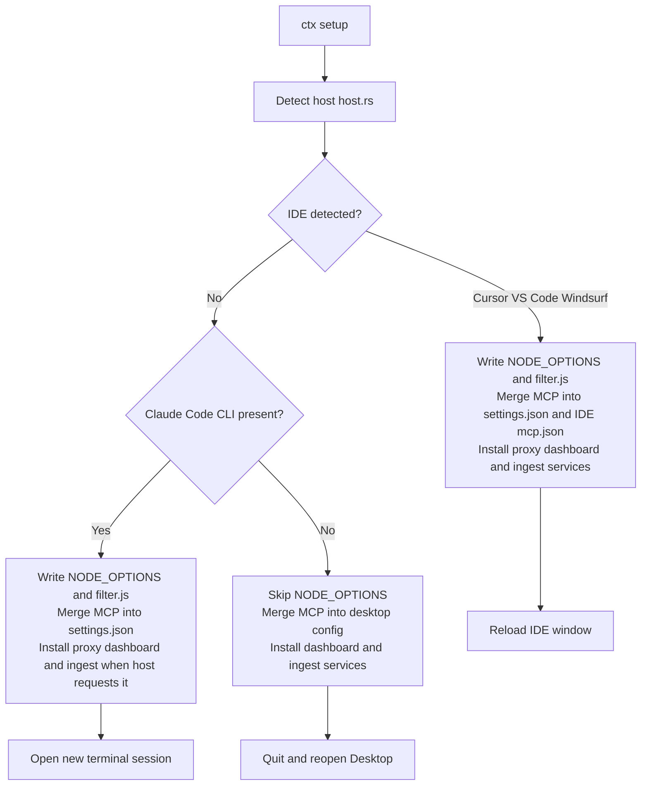

# ctx

Rust CLI plus a Node `filter.js` hook for Claude Code and related clients. It strips MCP tool definitions you do not need, records one JSONL line per request when the hook runs, prepends optional coaching text, and ships a local dashboard.

## Compatibility

| Feature | Claude Code in an IDE | Terminal CLI | Claude Desktop |
| --- | --- | --- | --- |
| In-process tool filtering (`NODE_OPTIONS` + `filter.js`) | Yes | Yes | No (Desktop does not load shell `NODE_OPTIONS`) |
| Per-request tracing (dashboard Request Trace tab) | Yes | Yes | No |
| Optional HTTPS MITM proxy (`ctx proxy`) with the same stripping logic | Yes | Yes | No |
| MCP tools (`ctx_spend`, `ctx_sessions`, …) | Yes | Yes | Yes (after MCP config + app restart) |
| Dashboard | Yes | Yes | Yes |
| Session ingest + analytics (`ctx ingest`) | Yes | Yes | Yes (Desktop `audit.jsonl` under local-agent sessions) |
| Periodic auto-ingest | Yes on macOS and Linux via background services | No (run `ctx ingest` or cron) | Yes on macOS and Linux when periodic ingest is installed |
| Reload | Command Palette → Reload Window | New shell session | Quit Desktop fully, reopen |

“Claude Code in an IDE” includes Cursor, VS Code, Windsurf, or any editor where Claude Code runs in an integrated terminal. `ctx setup` picks Windsurf or Cursor MCP paths when those environments are detected.

### Claude Desktop: no API interception

Desktop is an Electron app. It does not read `NODE_OPTIONS` from `~/.claude/settings.json` the way the Claude Code CLI does. It also does not expose a user setting to point `ANTHROPIC_BASE_URL` at a local reverse proxy, so you cannot route its HTTPS API traffic through `ctx proxy` the way you wire Claude Code. Per-request tracing, tool stripping, and hook-driven savings on the dashboard are **Claude Code only**. On Desktop, use MCP plus `ctx ingest` for session-level data when local-agent `audit.jsonl` logs exist.

## Install journey

`ctx setup` is the single entry point after you build or install the `ctx` binary. It detects your environment ([`host.rs`](src/host.rs)), writes files under `CTX_HOME` (default `~/.ctx`), starts background services where supported, merges MCP config, and wires `NODE_OPTIONS` plus `filter.js` into `~/.claude/settings.json` when the host adapter reports `supports_node_options`.



Detection order in code: Windsurf markers, then Cursor, then VS Code integrated terminal, then **Desktop-only** if the Claude Desktop data directory exists **and** the Claude Code CLI is absent, otherwise plain terminal. If Desktop is installed alongside Claude Code, the primary host is IDE or terminal, but `ctx setup` still merges the `ctx` MCP entry into `claude_desktop_config.json` when that file exists.

**What each surface gets** is summarized in the [Compatibility](#compatibility) table above (no duplicate matrix here).

Quick paths:

- **Claude Code in an IDE:** Install Rust, `cargo install --path .` (or follow [`INSTALL_PROMPT.md`](INSTALL_PROMPT.md)), run `ctx setup` (`--yes` in CI), then reload the editor window.
- **Claude Code in a terminal only:** Same build and `ctx setup`, then open a **new** shell so `NODE_OPTIONS` applies. Run `ctx ingest` yourself on schedules where periodic ingest is not installed (see table).
- **Claude Desktop:** Install from a normal OS terminal, run `ctx setup`, quit Desktop fully and reopen for MCP, then run `ctx ingest` (or wait for the timer) so local-agent `audit.jsonl` feeds the dashboard.

### What happens during `ctx setup`

1. Ensure `CTX_HOME`, generate local CA material for the proxy if needed, write `filter.js` from the embedded asset.
2. Install and start the proxy (default port `8788`), wait until it listens.
3. Create default `system_prefix.md` if missing; optionally download ONNX embedding weights when built with the `onnx` feature.
4. Open or create `ctx.db`, run an initial ingest when Claude Code project JSONL exists, pick a default profile, sync `filter-config.json`.
5. Install and start the dashboard (default port `8789`).
6. When `needs_periodic_ingest` is true, install a periodic `ctx ingest` job (macOS and Linux user services).
7. Unless `--no-install`, run `proxy::install` to merge `NODE_OPTIONS` and hooks into `~/.claude/settings.json` **only** when `supports_node_options` is true (not Desktop-only).
8. Register `ctx mcp` in Claude settings, IDE-specific MCP JSON when applicable, and Desktop config when present.
9. Open the dashboard URL in a browser when ready.

Other entry points: paste the prompt from [`INSTALL_PROMPT.md`](INSTALL_PROMPT.md) for a guided Claude Code install, or run [`scripts/install-desktop.sh`](scripts/install-desktop.sh) from an OS terminal for a Desktop-first flow.

### Post-install checks

- `curl -s -o /dev/null -w "%{http_code}" http://127.0.0.1:8789/` should print `200` after services are up.
- `ctx status` should print the active profile and related info.
- In Claude Code or Desktop, reload or restart so MCP lists include `ctx_*` tools.

Contributor-level diagrams, module tables, and pipeline detail: [ARCHITECTURE.md](ARCHITECTURE.md).

## Teardown

- `ctx setup --uninstall` removes background services where supported, strips ctx from MCP JSON files (Claude settings, Cursor, Windsurf, Desktop), and runs `ctx proxy uninstall` for `NODE_OPTIONS` cleanup.
- Reload the IDE window or restart Desktop so removed env and MCP entries apply.

---

## Build

```bash
cargo build --release
# binary: target/release/ctx
```

First-time machine setup:

```bash
ctx setup
```

`setup` writes assets under `CTX_HOME` (default `~/.ctx`): `filter.js`, `filter-config.json`, optional CA material for the proxy, merges Node `NODE_OPTIONS` plus Claude hook entries where configured, and installs background services on macOS (launchd) and Linux (systemd user units). On other OS targets it starts `ctx proxy` / `ctx dashboard` as detached processes and prints how to schedule ingest yourself.

## Two interception paths

1. **Default (`NODE_OPTIONS` + `filter.js`)**  
   Runs inside the Claude Code Node process. Tool filtering, analytics JSONL, auto-profile selection, inject / coach / behavior hints, and session budget prep all execute here. No TLS proxy required.

2. **HTTPS proxy**  
   Optional MITM path for the Anthropic API host. Same gates exist in Rust for parity tests and for teams who route traffic through the proxy. Start or stop it with the CLI commands listed in `ctx --help`.

Keep feature work aligned with the default path so dashboards stay populated for everyone who uses Claude Code with Node hooks.

## Profiles

Profiles live in the Rust side (`profiles` module) and export into `filter-config.json` for the hook. Each profile lists MCP server prefixes to **keep**; everything else is removed from the outbound tools array.

Switch the active profile:

```bash
ctx profile switch data
```

Tighter profiles remove more tool schemas, which saves more tokens on each request.

## Dashboard

```bash
ctx dashboard
```

Serves HTML on localhost, reads `~/.ctx/analytics.jsonl`, spend snapshots from local Claude exports where present, and shows:

- Savings totals (cache-read dollars plus a worst-case Sonnet-input estimate)
- Per-folder aggregates (`working_directory` from the system prompt)
- MCP **tools sent** vs **tools used** (used counts need non-stream responses the hook parses)
- Prompt stats, budgets, pipeline gate cards
- SQLite-backed intelligence when `~/.ctx/ctx.db` has data: quality alerts, project health by week, similar sessions via 384-d embeddings

Session similarity uses a fast hash embedding by default. Build with `cargo build --release --features onnx` to enable all-MiniLM-L6-v2 via ONNX Runtime for semantic matching. `ctx setup` downloads the ~30 MB model automatically when built with the `onnx` feature. Next `ctx ingest` re-embeds all sessions with the better model.

Index Claude Code JSONL plus Desktop session logs into the DB:

```bash
ctx ingest
```

## Configuration

`~/.ctx/config.toml` holds `active_profile`, `monthly_budget_usd`, feature toggles, and proxy port. The session budget guard derives its alert threshold from `monthly_budget_usd` (see `budget_guard::session_threshold_usd`).

## Repository layout (short)

| Path | Role |
| --- | --- |
| [`ARCHITECTURE.md`](ARCHITECTURE.md) | Contributor architecture, data flows, pipeline, storage |
| `src/` | CLI, proxy, filters, analytics aggregation, dashboard server |
| `src/daemon.rs` | launchd / systemd / fallback background install |
| `src/host.rs` | IDE vs terminal detection for setup output and MCP paths |
| `assets/filter.js` | In-process request rewriting + JSONL append |
| `src/dashboard.html` | Embedded dashboard UI |

## Tests

```bash
cargo test
```
