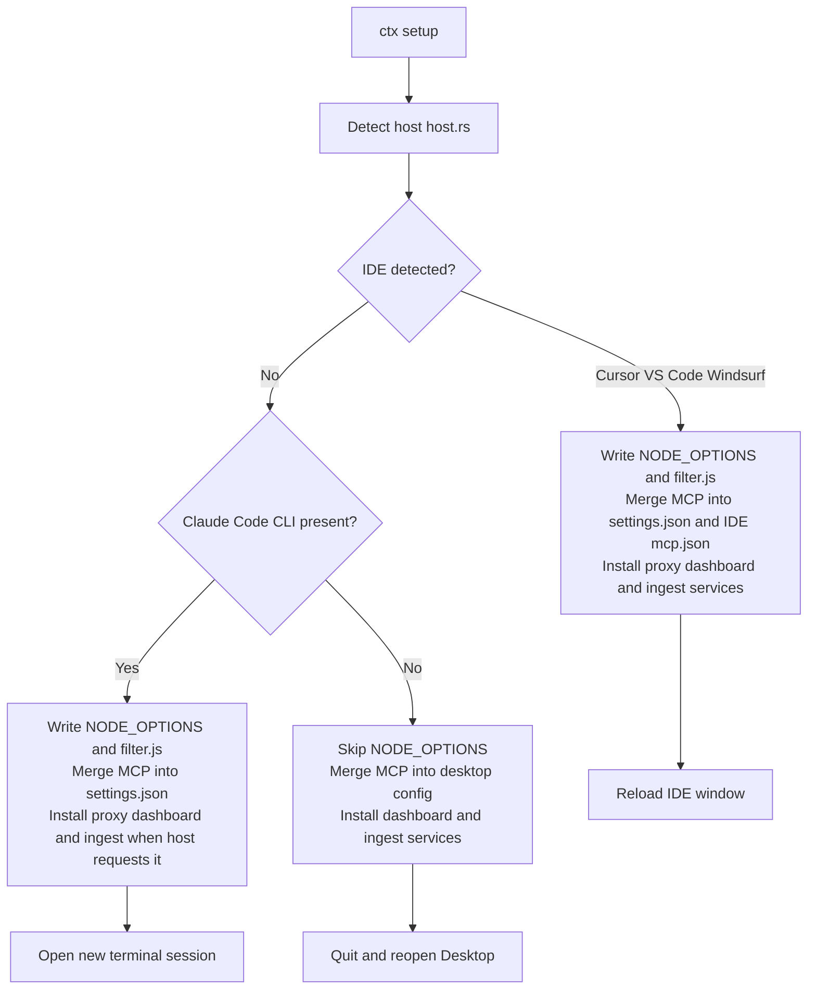

# ctx

ctx strips the MCP tool definitions Claude Code doesn't need for the current task, tracks what each session actually costs, and serves a local dashboard. Install with no Rust required — just `gh` authenticated to the goshippo org.

```bash
gh repo clone goshippo/ctx ~/Documents/ctx 2>/dev/null || git -C ~/Documents/ctx pull
bash ~/Documents/ctx/scripts/install.sh
ctx setup
```

After setup, run `ctx profile generate` once to build profiles tailored to your MCP stack, then `ctx use <profile>` to activate one.

## Compatibility

| Feature | Claude Code in an IDE | Terminal CLI | Claude Desktop |
| --- | --- | --- | --- |
| In-process tool filtering (`NODE_OPTIONS` + `filter.js`) | Yes | Yes | No (Desktop does not load shell `NODE_OPTIONS`) |
| Per-request tracing (dashboard Request Trace tab) | Yes | Yes | No |
| Optional HTTPS MITM proxy (`ctx proxy`) with the same stripping logic | Yes | Yes | No |
| MCP tools (`ctx_spend`, `ctx_sessions`, …) | Yes | Yes | Yes (after MCP config + app restart) |
| Dashboard | Yes | Yes | Yes |
| Session ingest + analytics (`ctx ingest`) | Yes | Yes | Yes (Desktop `audit.jsonl` under local-agent sessions) |
| Real-time ingest (per turn) | Yes — dashboard updates after every API request via `POST /api/trigger-ingest` | Yes | No (run `ctx ingest` manually) |
| Periodic background ingest | Yes on macOS and Linux via background services | No (run `ctx ingest` or cron) | Yes on macOS and Linux when periodic ingest is installed |
| Reload | Command Palette → Reload Window | New shell session | Quit Desktop fully, reopen |

“Claude Code in an IDE” includes Cursor, VS Code, Windsurf, or any editor where Claude Code runs in an integrated terminal. `ctx setup` picks Windsurf or Cursor MCP paths when those environments are detected.

### Claude Desktop: no API interception

Desktop is an Electron app. It does not read `NODE_OPTIONS` from `~/.claude/settings.json` the way the Claude Code CLI does. It also does not expose a user setting to point `ANTHROPIC_BASE_URL` at a local reverse proxy, so you cannot route its HTTPS API traffic through `ctx proxy` the way you wire Claude Code. Per-request tracing, tool stripping, and hook-driven savings on the dashboard are **Claude Code only**. On Desktop, use MCP plus `ctx ingest` for session-level data when local-agent `audit.jsonl` logs exist.

## Install journey

`ctx setup` is the single entry point after you build or install the `ctx` binary. It detects your environment ([`host.rs`](src/host.rs)), writes files under `CTX_HOME` (default `~/.ctx`), starts background services where supported, merges MCP config, and wires `NODE_OPTIONS` plus `filter.js` into `~/.claude/settings.json` when the host adapter reports `supports_node_options`.



Detection order in code: Windsurf markers, then Cursor, then VS Code integrated terminal, then **Desktop-only** if the Claude Desktop data directory exists **and** the Claude Code CLI is absent, otherwise plain terminal. If Desktop is installed alongside Claude Code, the primary host is IDE or terminal, but `ctx setup` still merges the `ctx` MCP entry into `claude_desktop_config.json` when that file exists.

**What each surface gets** is summarized in the [Compatibility](#compatibility) table above (no duplicate matrix here).

Quick paths:

- **Claude Code in an IDE (recommended):** Run these in a terminal, then reload the IDE window.
  ```bash
  gh repo clone goshippo/ctx ~/Documents/ctx 2>/dev/null || git -C ~/Documents/ctx pull
  bash ~/Documents/ctx/scripts/install.sh
  ctx setup
  ctx profile generate   # build profiles from your actual MCP stack
  ctx use <profile>
  ```
- **Claude Code in a terminal only:** Same install, then open a **new** shell so `NODE_OPTIONS` applies.
- **Claude Desktop:** Same install from an OS terminal, run `ctx setup`, then quit Desktop fully and reopen. Per-request filtering and tracing are not available on Desktop (see table), but MCP tools and the dashboard work.
- **Build from source:** `gh repo clone goshippo/ctx ~/Documents/ctx` then `source "$HOME/.cargo/env" && cargo install --locked --path ~/Documents/ctx` (or follow [`INSTALL_PROMPT.md`](INSTALL_PROMPT.md)).

### What happens during `ctx setup`

1. Ensure `CTX_HOME`, generate local CA material for the proxy if needed, write `filter.js` from the embedded asset.
2. Install and start the proxy (default port `8788`), wait until it listens.
3. Create default `system_prefix.md` if missing; optionally download ONNX embedding weights when built with the `onnx` feature.
4. Open or create `ctx.db`, run an initial ingest when Claude Code project JSONL exists, pick a default profile, sync `filter-config.json`.
5. Install and start the dashboard (default port `8789`).
6. When `needs_periodic_ingest` is true, install a periodic `ctx ingest` job (macOS and Linux user services).
7. Unless `--no-install`, run `proxy::install` to merge `NODE_OPTIONS` and hooks into `~/.claude/settings.json` **only** when `supports_node_options` is true (not Desktop-only).
8. Register `ctx mcp` in Claude settings, IDE-specific MCP JSON when applicable, and Desktop config when present.
9. Open the dashboard URL in a browser when ready.

Other entry points: paste the prompt from [`INSTALL_PROMPT.md`](INSTALL_PROMPT.md) for a guided Claude Code install, or run [`scripts/install-desktop.sh`](scripts/install-desktop.sh) from an OS terminal for a Desktop-first flow.

### Post-install checks

- `curl -s -o /dev/null -w "%{http_code}" http://127.0.0.1:8789/` should print `200` after services are up.
- `ctx status` should print the active profile and related info.
- In Claude Code or Desktop, reload or restart so MCP lists include `ctx_*` tools.

Contributor-level diagrams, module tables, and pipeline detail: [ARCHITECTURE.md](ARCHITECTURE.md).

## Teardown

- `ctx setup --uninstall` removes background services where supported, strips ctx from MCP JSON files (Claude settings, Cursor, Windsurf, Desktop), and runs `ctx proxy uninstall` for `NODE_OPTIONS` cleanup.
- Reload the IDE window or restart Desktop so removed env and MCP entries apply.

---

## Install

**Pre-built binary (no Rust required) — requires `gh` authenticated to the goshippo org:**

```bash
gh repo clone goshippo/ctx ~/Documents/ctx 2>/dev/null || git -C ~/Documents/ctx pull
bash ~/Documents/ctx/scripts/install.sh
ctx setup
ctx profile generate
```

`install.sh` detects your platform (macOS arm64/x86_64 or Linux x86_64), downloads the matching binary from the [latest release](https://github.com/goshippo/ctx/releases/latest) via `gh release download`, and installs it to `/usr/local/bin`. Set `CTX_INSTALL_DIR` to override the destination.

No `gh` but have a PAT? `GITHUB_TOKEN=<pat> bash scripts/install.sh` works too.

**Build from source (requires Rust):**

```bash
gh repo clone goshippo/ctx ~/Documents/ctx
source "$HOME/.cargo/env" && cargo install --locked --path ~/Documents/ctx
ctx setup
```

After installing the binary, run setup once:

```bash
ctx setup
```

`setup` writes assets under `CTX_HOME` (default `~/.ctx`): `filter.js`, `filter-config.json`, optional CA material for the proxy, merges Node `NODE_OPTIONS` plus Claude hook entries where configured, and installs background services on macOS (launchd) and Linux (systemd user units). On other OS targets it starts `ctx proxy` / `ctx dashboard` as detached processes and prints how to schedule ingest yourself.

## Two interception paths

1. **Default (`NODE_OPTIONS` + `filter.js`)**  
   Runs inside the Claude Code Node process. Tool filtering, analytics JSONL, auto-profile selection, inject / coach / behavior hints, and session budget prep all execute here. No TLS proxy required.

2. **HTTPS proxy**  
   Optional MITM path for the Anthropic API host. Same gates exist in Rust for parity tests and for teams who route traffic through the proxy. Start or stop it with the CLI commands listed in `ctx --help`.

Keep feature work aligned with the default path so dashboards stay populated for everyone who uses Claude Code with Node hooks.

## Profiles

Profiles live in the Rust side (`profiles` module) and export into `filter-config.json` for the hook. Each profile lists MCP server prefixes to **keep**; everything else is removed from the outbound tools array.

Generate profiles from your actual MCP stack (no usage history required):

```bash
ctx profile generate
```

This inspects your configured MCP servers, groups them by category (data, design, comms, work, files, finance, infra), and writes named profiles to `~/.ctx/profiles.toml`. Each profile is named after its primary category and includes communication tools alongside it so common workflows stay intact. Run it once after `ctx setup`, then re-run whenever you add or remove MCP servers.

Switch the active profile:

```bash
ctx use <profile>
```

List available profiles and their per-request token cost estimates:

```bash
ctx profile list
```

Tighter profiles remove more tool schemas, which saves more tokens on each request.

## Dashboard

```bash
ctx dashboard
```

Serves HTML on localhost, reads `~/.ctx/analytics.jsonl`, spend snapshots from local Claude exports where present, and shows:

- Savings totals (cache-read dollars plus a worst-case Sonnet-input estimate)
- Per-folder aggregates (`working_directory` from the system prompt)
- MCP **tools sent** vs **tools used** (used counts need non-stream responses the hook parses)
- Prompt stats, budgets, pipeline gate cards
- SQLite-backed intelligence when `~/.ctx/ctx.db` has data: quality alerts, project health by week, similar sessions via 384-d embeddings

Session similarity uses a fast hash embedding by default. Build with `cargo build --release --features onnx` to enable all-MiniLM-L6-v2 via ONNX Runtime for semantic matching. `ctx setup` downloads the ~30 MB model automatically when built with the `onnx` feature. Next `ctx ingest` re-embeds all sessions with the better model.

Index Claude Code JSONL plus Desktop session logs into the DB:

```bash
ctx ingest
```

When running Claude Code in an IDE or terminal, the dashboard updates automatically after every turn. `filter.js` fires a `POST /api/trigger-ingest` to the dashboard server from inside the Node process, so spend and savings figures reflect the most recent request without any manual refresh. Desktop sessions require a manual `ctx ingest` run (or the periodic background service where installed).

## Configuration

`~/.ctx/config.toml` holds `active_profile`, `monthly_budget_usd`, feature toggles, and proxy port. The session budget guard derives its alert threshold from `monthly_budget_usd` (see `budget_guard::session_threshold_usd`).

| Key | Default | Purpose |
| --- | --- | --- |
| `active_profile` | `all` | Currently active MCP filter profile |
| `monthly_budget_usd` | (none) | Triggers budget alerts when projected spend approaches this limit |
| `session_gap_minutes` | `30` | Idle minutes between turns before a new session boundary in analytics |
| `proxy_port` | `8788` | Local MITM proxy listen port |
| `dashboard_port` | `8789` | Dashboard HTTP listen port |

## Repository layout (short)

| Path | Role |
| --- | --- |
| [`ARCHITECTURE.md`](ARCHITECTURE.md) | Contributor architecture, data flows, pipeline, storage |
| `src/` | CLI, proxy, filters, analytics aggregation, dashboard server |
| `src/daemon.rs` | launchd / systemd / fallback background install |
| `src/host.rs` | IDE vs terminal detection for setup output and MCP paths |
| `assets/filter.js` | In-process request rewriting + JSONL append |
| `src/dashboard.html` | Embedded dashboard UI |
| [`scripts/install.sh`](scripts/install.sh) | One-liner binary installer (no Rust required) |
| [`.github/workflows/release.yml`](.github/workflows/release.yml) | CI release pipeline: builds macOS + Linux binaries, publishes GitHub release |

## Tests

```bash
cargo test
```
