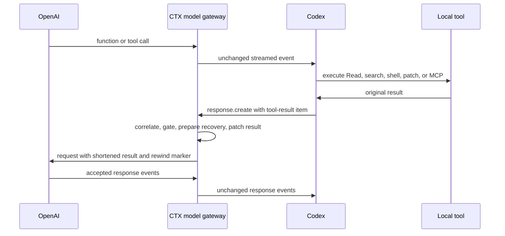

# CTX model gateway — Codex surface plan

Status: proposed surface plan
Date: 2026-07-21
Owner: Saurabh
Target: post-v0.6 Codex coverage wave
Parent: `docs/model-gateway-implementation-plan.md`
Companions: ADR 0015, ADR 0037, ADR 0046, ADR 0047,
`docs/codex-plugin-implementation-plan.md`, `docs/claims.md`, and `SECURITY.md`

## Decision summary

Implement Codex as a surface pack on the shared local CTX model gateway. The Codex surface adapter
will route supported Codex CLI and app model traffic through explicit user-level provider
configuration. The OpenAI Responses protocol adapter will inspect client-originated requests,
shorten eligible local tool-result items through CTX's existing canonical, evidence-gated, exactly
recoverable pipeline, and forward the request to the verified OpenAI or ChatGPT Codex upstream.

This document owns Codex-specific configuration, authentication, Responses item shapes, transport
fixtures, installation, commands, capability receipts, and release gates. The parent plan owns the
shared gateway runtime, extension contracts, security baseline, lifecycle semantics, rollout waves,
and cross-surface commercial definition.

The Codex route is an explicitly configured loopback reverse proxy, not the TLS MITM removed by ADR
0015:

- no CTX certificate authority;
- no DNS rewriting, ambient `HTTPS_PROXY`, or impersonation of an OpenAI hostname;
- no generic `CONNECT` proxy or user-selectable upstream;
- no CTX-operated cloud relay; and
- no transformation of non-Codex traffic.

Standard CTX remains the installation default. Model-path mode is a separate opt-in and must pass
the parent plan's M0 ADR and route gates before runtime implementation.

Use these Codex names consistently:

| Context | Name |
| --- | --- |
| Product setting | **Codex model-path trimming** |
| Surface pack | **Codex surface adapter** |
| Protocol pack | **OpenAI Responses adapter** |
| CLI alias | `ctx codex gateway ...` |
| Shared CLI | `ctx model-gateway ... --surface codex` |

Do not call this “full Codex coverage.” OpenAI-hosted tool results that never return through a local
Codex request remain outside CTX's control.

## Product outcome

With standard mode, Codex keeps its current capability:

- eligible shell output may be shortened through the verified Codex-specific wrapper path;
- selected MCP servers may be shortened through the explicit CTX MCP gateway; and
- built-in Read/search and direct MCP results remain observed only.

Installation alone does not make those observed paths trimmable. With a verified model-path route
enabled, CTX can shorten eligible tool results at the later local boundary before Codex sends them
to the model. This should include built-in local tools and direct MCP tools only when Codex
serializes their results into a supported Responses item.

The user-facing explanation is:

> Codex model-path trimming lets a CTX process on this device read supported Codex model requests,
> shorten eligible local tool results, and forward the request to the displayed OpenAI destination.
> CTX operates no cloud relay for this traffic. Exact originals for applied trims remain available
> under the user's local recovery settings.

Enabling the route requires explicit consent because the local gateway necessarily sees prompts,
instructions, tool definitions and results, source code included in them, and OpenAI authorization
headers in memory.

## Why the Codex boundary can work

Codex's `PostToolUse` hook can observe a completed built-in or MCP result but cannot replace the
normal result the model receives. The later model request is the convergence point:



The gateway changes only the model-bound representation after the tool action has completed. It
does not change the tool's filesystem, process, or MCP behavior.

Codex exposes user-level configuration for `openai_base_url`, custom model providers, the Responses
wire API, command-backed bearer tokens, and WebSocket-capable providers. Provider-routing keys must
not be written into project-local `.codex/config.toml`; the reversible transaction belongs in the
user-level Codex configuration or a CTX-owned user profile.

References:

- [Codex configuration reference](https://learn.chatgpt.com/docs/config-file/config-reference)
- [Codex advanced configuration](https://learn.chatgpt.com/docs/config-file/config-advanced#custom-model-providers)
- [Codex hooks](https://learn.chatgpt.com/docs/hooks)
- [Headroom Codex provider setup](https://github.com/headroomlabs-ai/headroom/blob/main/headroom/providers/codex/install.py)
- [Headroom Responses handler](https://github.com/headroomlabs-ai/headroom/blob/main/headroom/proxy/handlers/openai.py)
- [Headroom Codex compatibility history](https://github.com/headroomlabs-ai/headroom/issues/71)

Headroom is feasibility evidence, not CTX's compatibility contract. CTX must earn support from its
own captured wire corpus, authentication matrix, acceptance receipt, and recovery proof.

## Target Codex routes

| Route dimension | Required first-release contract |
| --- | --- |
| Surface | current verified Codex CLI plus separately verified app/IDE builds |
| Configuration | user-level `openai_base_url` preferred; CTX custom provider only as a verified fallback |
| Authentication | ChatGPT OAuth/subscription and OpenAI API key tested independently |
| Protocol | OpenAI Responses only |
| Transport | HTTP/SSE and every WebSocket mode enabled by the supported Codex configuration |
| Upstream | fixed verified OpenAI API or ChatGPT Codex endpoint selected by auth contract |
| Client results | verified textual local tool-result items only |

The Codex surface receipt must include the client build, configuration strategy, authentication
mode, Responses contract version, transport, encoding, and fixed upstream class. Evidence from one
row does not activate another.

## Scope and capability contract

### Candidate Responses items

Only textual output inside verified client-originated Responses items is eligible:

| Responses item | Intended coverage | Initial behavior |
| --- | --- | --- |
| `function_call_output` | built-in local functions and client-side MCP | shadow, then evidence-gated apply |
| `custom_tool_call_output` | verified custom/client tools | shadow, then evidence-gated apply |
| `local_shell_call_output` | Codex local shell contracts | detect existing wrapper marker; otherwise shadow first |
| `apply_patch_call_output` | patch status or diagnostics | preserve by default; activate only from a separate contract |

An item is not eligible merely because its type matches. CTX must also resolve:

- a stable Codex session/connection and call ID;
- the earlier tool call and normalized tool identity;
- a supported textual output shape;
- a captured Responses contract and client version;
- the exact auth/upstream route; and
- an activation key earned on this transport.

### Codex exclusions

- user messages, developer instructions, system instructions, and tool-call arguments;
- tool definitions and JSON schemas;
- images, audio, binary content, opaque file parts, or typed parts without a verified text contract;
- provider response text, reasoning, or encrypted reasoning material;
- errors, permission prompts, mutation confirmations, and incomplete tool calls;
- OpenAI-hosted tool results consumed entirely inside the provider boundary;
- compaction requests or items until a separate explicit lifecycle contract exists;
- non-OpenAI custom providers, Azure OpenAI, and third-party routers in the first Codex release;
- Chat Completions, Realtime, or any non-Responses protocol; and
- unknown item, encoding, event, header requirement, or protocol version.

Unknown means byte-faithful pass-through with a specific Codex coverage reason.

## Codex operating modes

| Mode | Model traffic through CTX | Built-in local results | Direct MCP | CTX-routed MCP | Hosted tools |
| --- | --- | --- | --- | --- | --- |
| Standard | No | observe only | observe only | can shorten | unavailable |
| Model-path shadow | Yes | measure only | measure only | already-shortened guard | unavailable |
| Model-path testing | Yes | randomized per verified contract | randomized | already-shortened guard | unavailable |
| Model-path active | Yes | earned contracts can shorten | earned contracts can shorten | already-shortened guard | unavailable |

The standard mode stays the installation default until private-beta evidence justifies changing it.
The first public increment may offer only shadow and testing modes.

## Codex surface and protocol composition

Codex uses the shared parent architecture as follows:

```text
CodexSurfaceAdapter
  -> OpenAIResponsesProtocol
  -> shared CanonicalModelExchange
  -> existing tool-result gate and strategies
  -> OpenAIUpstream or verified ChatGPTCodexUpstream
```

Codex-specific code belongs under the shared boundary:

```text
src/model_gateway/
├── surfaces/codex.rs          probe, config transaction, restore, route receipt
├── protocols/openai_responses.rs
│                              HTTP/WS items, call correlation, output spans
└── upstreams/openai.rs        fixed API/ChatGPT routing and header policy
```

Do not create a separate `src/codex_gateway/` runtime. Listener, relay, encoding, atomic apply,
receipts, security, service lifecycle, and recovery are shared infrastructure owned by the parent
plan.

## Responses transport requirements

### HTTP and SSE

- Serve only the verified `/v1/responses` path family and shared CTX health endpoint.
- Accept bounded request bodies and only encodings observed from supported Codex builds, including
  streaming zstd frames if the capture proves them.
- Preserve the original request body and content encoding byte-for-byte when no mutation is applied.
- When mutating, remove or correctly regenerate `Content-Length` and `Content-Encoding`.
- Forward provider status, safe headers, rate-limit headers, error bodies, and SSE bytes without
  changing provider output.
- Disable redirects, ambient proxy variables, arbitrary destinations, and user-controlled upstream
  overrides.

### Responses WebSocket

- Support the exact upgrade, subprotocol, and beta-header contracts in captured Codex fixtures.
- Forward required authorization and account-routing headers in memory.
- Handle text, binary, ping, pong, close, fragmentation, cancellation, and reconnect behavior.
- Inspect every client-to-upstream `response.create` frame, not only the first frame.
- Preserve `previous_response_id`, response identifiers, frame order, and close codes exactly.
- Observe upstream-to-client function/tool calls only to establish call-ID-to-tool identity; never
  modify provider response events in the first release.
- Bound frame size, session count, idle duration, transform time, and queued bytes.

### Determinism and prompt caching

Applied transformations must produce the same model-visible text for the same original, Codex route
contract, and transform version. The rewind marker and omission language must also remain stable so
re-sent history does not change on every turn.

Unchanged requests remain byte-identical. Mutated requests preserve unrelated values and ordering.
Start with ordered parsing and deterministic serialization; require a surgical raw-JSON patcher
before active rollout if G1-G4 cache experiments show material prefix churn.

Track cached-input usage before and after activation. Token reduction is not a commercial win when
cache loss costs more than the removed context.

## Authentication and upstream routing

Support two explicit Codex authentication contracts:

| Codex auth mode | Upstream | Product requirement |
| --- | --- | --- |
| ChatGPT OAuth/subscription | verified ChatGPT Codex backend | required for commercial beta |
| OpenAI API key | `https://api.openai.com` | required |

The gateway receives authorization because Codex sends it to the configured base URL. CTX may
classify the credential or accompanying account metadata in memory only to select the fixed
upstream and required header policy. It must never log, hash, store, export, or include credential
material in diagnostics.

G0 compares two reversible configuration strategies:

1. **Preferred:** change only user-level `openai_base_url`, preserving Codex's built-in provider,
   authentication behavior, account menu, model selection, and thread identity.
2. **Fallback:** install a CTX-owned model-provider/profile stanza with `wire_api = "responses"`,
   `supports_websockets = true` when required, and a verified authentication contract. Use it only
   if base-URL-only routing cannot preserve both auth modes.

Do not depend on reading tokens from `~/.codex/auth.json`. If auth-mode discovery requires a local
state file, read only non-secret mode metadata through a documented contract and record the trust
requirement. Never mutate credential state.

Authentication release gates:

- login and token refresh work through the gateway without credential persistence;
- account, plan, allowance, and usage UI remain available in ChatGPT mode;
- API-key users are not forced into OAuth;
- 401, 403, 429, and provider error bodies relay faithfully;
- reconnects do not duplicate or lose tool-result turns; and
- bypass, disable, and uninstall restore direct behavior without requiring a new login.

If ChatGPT subscription auth fails these gates, do not advertise general Codex model-path support.
An API-key-only experimental route may be useful engineering evidence but is not a substitute for
the target user experience.

## Codex call correlation

Maintain a bounded in-memory registry keyed by installed route, connection/session, response ID,
and call ID:

```text
upstream function/tool call
  -> response_id + call_id + item type + tool name + model + session
next client response.create
  -> matching *_call_output
  -> normalized tool identity + canonical result + exact output span
```

Persist no raw provider response for correlation. Expire entries on completion, cancellation,
disconnect, timeout, or bounded LRU eviction. Parallel tools and subagents must not share ambiguous
call state.

The full activation identity is:

```text
surface=codex
+ Codex client and surface contract version
+ transport=local-model-gateway
+ authentication and fixed-upstream contract
+ Responses protocol version
+ normalized tool identity
+ result shape
+ transform version
```

Shell-wrapper, MCP-gateway, Claude Code, Cursor, Chat Completions, API-key, or earlier Codex wire
evidence does not authorize this identity.

## Double-trim and recovery rules

- Detect the existing CTX rewind marker and never transform it again.
- Treat output already emitted by `ctx run` as controlled.
- Treat MCP output already shortened by the CTX MCP gateway as controlled.
- Never trim `ctx_expand`, `ctx_status`, recovery checks, gateway diagnostics, or bypass operations.
- Preserve the shared mutation/error/permission/incomplete deny set.
- Record `already-shortened` as coverage, not as another applied trim.
- Prepare exact recovery before patching and record applied savings only after upstream acceptance.

## Codex compaction and lifecycle

The existing Codex plugin's `PreCompact` and `PostCompact` hooks remain the primary explicit
compaction evidence. Per ADR 0047, pre is attempted and post is completed. The model gateway may add
a protocol lifecycle receipt only when a captured Responses contract exposes a distinct explicit
event.

Do not infer completed compaction from a smaller Responses request, a changed
`previous_response_id`, cache usage, or a gap in recorded history. Report those as an unknown history
change unless the live contract proves otherwise. Do not merge a provider context-management event
with Codex client compaction without a stable join.

## Failure behavior

Shared failure behavior from the parent plan applies. Codex-specific recovery must include:

- `ctx codex gateway bypass` restoring the prior user-level provider/base-URL fields immediately;
- a `ctx doctor` path that does not need the gateway process;
- startup and pass-through probes before any Codex config switch;
- preservation of the existing Codex plugin, hooks, MCP registrations, and unrelated settings; and
- automatic route restoration before CTX uninstall removes the service or binary.

Never silently route around CTX after an applied-marker decision; that could make recovery and
model-visible receipts disagree.

## Codex security additions

The parent security contract applies. The Codex surface additionally requires:

- only compiled-in, verified OpenAI API and ChatGPT Codex upstream classes;
- exact forwarding rules for required OpenAI beta, account, organization, and project headers;
- no credential extraction from Codex auth storage;
- no arbitrary custom-provider pass-through in the first release;
- sanitized fixtures that retain structure but contain no prompts, tool output, source code,
  account identifiers, cookies, or credentials; and
- seeded-secret tests covering HTTP, WebSocket, service logs, doctor, diagnostics, SQLite, and crash
  output.

The displayed claim is:

> CTX processes this Codex route locally and forwards it to the displayed OpenAI destination. CTX
> operates no cloud relay. It persists only the exact originals required for applied-trim recovery,
> under local retention and purge controls.

This does not mean the data stays on the machine: Codex still sends it to OpenAI.

## CLI, setup, and reversible configuration

Codex aliases:

```text
ctx codex gateway probe                 # read-only config/auth/wire compatibility probe
ctx codex gateway enable --shadow       # consent, start/probe service, then switch config
ctx codex gateway enable --testing      # require successful shadow proof and confirmation
ctx codex gateway status --json
ctx codex gateway bypass                # immediately restore the prior Codex route
ctx codex gateway disable               # restore config and remove the Codex route
```

The shared internal service remains `ctx model-gateway serve`; do not start a Codex-only daemon.

The Codex config transaction must:

- back up the exact user-level provider/base-URL assignments it owns;
- never overwrite unrelated tables, keys, profiles, hooks, plugins, or MCP configuration;
- write a versioned CTX ownership record outside project-local configuration;
- prefer `openai_base_url` only after G0 validates both authentication contracts;
- start and probe the service before switching Codex;
- verify Codex actually reached the expected local route and upstream;
- detect post-activation user edits and refuse destructive restoration;
- restore config before removing route/service state; and
- test install, upgrade, bypass, disable, uninstall, and purge independently.

## Codex dashboard contract

Replace the current single Codex capability paragraph with route and path receipts:

```text
Codex · ChatGPT login · OpenAI Responses                 MODEL-PATH TESTING

Built-in local results crossing this route              Testing before shortening
Direct MCP results crossing this route                  Testing before shortening
Shell results already controlled by CTX                 Can shorten
MCP servers routed through CTX's MCP gateway            Can shorten
OpenAI-hosted tools                                     CTX cannot shorten these

Traffic
Codex requests pass through this device                 Yes
Verified destination                                    OpenAI / ChatGPT Codex
Sent through a CTX cloud service                        No
Visible to the local CTX process                        Prompts, tools, credentials in memory
Last accepted applied trim                              2 minutes ago / none
Exact originals retained                                37 / 100 MiB local limit

Compaction
Attempted                                               3
Completed from PostCompact                              2
Unknown history changes                                 1
```

The default view must answer:

1. Is this exact Codex route enabled now?
2. Which results can be shortened and which remain observed or unavailable?
3. Did the last upstream-accepted request contain an applied trim?
4. What destination and authentication class did the verified route use?
5. What can the local CTX process see and retain?
6. What compaction evidence is confirmed versus unknown?
7. How can the user bypass the route immediately?

## Codex implementation gates

These surface gates compose with the parent M0-M6 increments; they do not create a second runtime.

### G0 — Codex compatibility and decision spike

- Capture sanitized HTTP/SSE and WebSocket traffic from the current supported Codex builds.
- Compare base-URL-only and CTX-owned provider/profile configuration.
- Prove ChatGPT OAuth, API-key auth, account/usage UI, model selection, thread identity, rate limits,
  and restoration.
- Prove built-in local, shell, patch, and direct MCP results appear in client-originated Responses
  items and can be correlated to stable tool names.
- Send one synthetic shortened result through a controlled upstream and one real-model smoke.
- Record every hosted/server-side exclusion.

Exit gate: at least one supported reversible strategy works with both auth modes; target local tool
outputs are present and mutable; and no CA or undocumented credential/config mutation is required.

Kill or narrow the route if:

- ChatGPT subscription auth cannot be preserved;
- request integrity prevents safe output-only mutation;
- important built-in results do not cross the local route;
- stable tool identity cannot be recovered;
- thread/history behavior regresses materially; or
- provider policy or supported configuration explicitly disallows the route.

### G1 — Transparent HTTP/SSE Codex route

- Register the Codex route on the shared listener and fixed OpenAI upstream connector.
- Add Codex HTTP paths, header policy, bounded encoding corpus, SSE fixtures, and structural metrics.
- Keep mutation disabled.
- Exercise 401, 403, 429, 5xx, disconnect, timeout, cancellation, malformed encoding, and large-body
  behavior.

Exit gate: all supported unchanged bodies are byte-identical upstream, allowed header differences
are documented, and Codex behavior matches direct routing.

### G2 — Responses WebSocket and auth matrix

- Add captured Codex WebSocket upgrade, subprotocol, headers, frames, and multi-turn
  `response.create` behavior to the shared relay.
- Exercise ChatGPT OAuth refresh and API-key flows on clean profiles.
- Preserve close codes, rate limits, response IDs, cancellations, reconnects, and concurrent agents.

Exit gate: a 30-minute scripted session and failure-injection suite complete with zero lost,
duplicated, reordered, or corrupted frames.

### G3 — Responses canonical shadow adapter

- Add versioned parsing for the four candidate output item families.
- Build bounded call correlation from upstream tool-call events.
- Normalize results into the shared canonical exchange without raw-request persistence.
- Run strategies in shadow mode and record content-free coverage reasons.
- Add already-shortened, recovery-tool, unknown, and hosted guards.

Exit gate: every supported result reaches the same canonical decision as its equivalent native/MCP
fixture; unsupported items remain exact pass-through.

### G4 — Atomic model-visible Codex apply

- Use the shared prepare/persist/emit/accept boundary.
- Mutate only the target output leaf and preserve opaque item fields.
- Add deterministic replay, cache stability, recovery, double-trim, rollback, rejection, and crash-
  window tests.
- Enable a synthetic contract, then one low-risk real Codex tool trial.

Exit gate: the mock upstream proves it accepted the shortened item, `ctx_expand` returns the exact
original, and no failed/rejected request is counted as applied.

### G5 — Codex surface transaction and lifecycle

- Add Codex aliases, user-level config ownership, setup guidance, probe, doctor, bypass, disable,
  restoration, and uninstall integration on the shared service.
- Test pre-existing providers/profiles, user edits, upgrades, port conflicts, crashes, stale state,
  and absent binaries.
- Preserve plugin hooks and use explicit `PreCompact`/`PostCompact` semantics.
- Keep model-path setup opt-in; ordinary `ctx setup` must not silently enable it.

Exit gate: a clean beta-user install can enable, prove, use, bypass, disable, reinstall, and uninstall
the Codex route without hand-editing configuration or reauthenticating.

### G6 — Codex evidence, dashboard, and claims

- Add Codex client/wire/auth/upstream dimensions to activation and product-proof receipts.
- Show attempted, accepted, applied, held-whole, already-shortened, unsupported, hosted, and bypassed
  counts.
- Add gateway health, destination, last upstream acceptance, latency, cache impact, recovery,
  retention, and purge UI.
- Keep compaction attempted/completed/unknown states distinct.
- Update Codex onboarding, `docs/claims.md`, `SECURITY.md`, portfolio copy, and release checks.

Exit gate: a first-time user can accurately explain the Codex data path, exact controlled and
unavailable results, local trust boundary, recovery, compaction evidence, and bypass action from the
main card.

### G7 — Codex private beta and commercial gate

- Dogfood shadow, then one-tool randomized trials, then evidence-earned per-contract activation.
- Test real source reads, searches, tests/logs, patches, local and remote MCP, large JSON, errors,
  cancellation, parallel agents, long sessions, and compaction-adjacent turns.
- Run macOS and Linux live coverage; keep Windows experimental until service and transport lifecycle
  tests pass there.
- Include the Codex route in the signed artifact, SBOM, dependency audit, threat model, seeded-secret
  audit, and independent review.

Exit gate: Codex thresholds hold, security findings are resolved or disclosed, and every public
Codex statement maps to a live proof.

## Codex PR slices

The parent plan owns the cross-surface PR sequence. Within those PRs, keep these Codex slices
independently reviewable:

| Slice | Scope | Required proof |
| --- | --- | --- |
| C0 | sanitized captures and configuration/auth probe | no runtime routing change |
| C1 | Codex transparent HTTP/SSE route | byte-faithful pass-through |
| C2 | Codex WebSocket fixtures and auth/upstream matrix | multi-turn live smoke |
| C3 | call correlation and Responses shadow adapter | content-free coverage ledger |
| C4 | Codex activation identities and one atomic trial | model-visible plus exact rewind |
| C5 | config transaction, aliases, doctor, bypass, uninstall | clean beta-user lifecycle test |
| C6 | dashboard, consent, privacy/security claims | comprehension and seeded-secret tests |
| C7 | real-session trials and signed beta | cache/value and security-review evidence |

Do not combine transparent transport, active mutation, and the Codex configuration switch in one
PR. Follow project workflow: relevant local tests, `make pr-fitcheck PR=<number>`, and one Copilot
review pass without requesting or waiting for a second pass.

## Codex test and proof matrix

### Protocol fidelity

- HTTP POST/SSE and every advertised Responses WebSocket transport.
- zstd streaming frames, gzip, deflate, brotli, identity, malformed, and unsupported encodings as
  captured.
- Header casing/duplicates, beta and account headers, subprotocols, query strings, and rate limits.
- Fragmented and binary frames, ping/pong, cancellation, reconnect, half-close, abrupt reset, and
  backpressure.
- `previous_response_id`, parallel tool calls, subagents, repeated history, compaction-adjacent
  requests, and unknown item fields.

### Tool-result semantics

- each candidate output item with every verified textual content shape;
- multiple outputs, duplicate/missing IDs, late output, expired correlation, and ambiguous identity;
- direct MCP, CTX-routed MCP, wrapped and unwrapped shell, Read/search, patch, and recovery tools;
- nonzero/error/mutation/permission/incomplete, binary, and hosted results staying whole;
- deterministic repeated history and exact marker stability; and
- mock capture of the exact request the upstream accepted.

### Authentication and routing

- fresh ChatGPT login, refresh, account switching, logout, plan/usage display, and rate limits;
- full/restricted API keys, invalid and revoked keys, and missing scopes;
- no authorization, cookie, account ID, prompt, tool output, or source text in logs, SQLite, service
  state, doctor, or diagnostics;
- fixed-origin enforcement, redirects and ambient proxy disabled, and TLS failure handling.

### Lifecycle and security

- install over clean and customized user-level Codex configurations;
- atomic activation, port conflict, fake listener, crash, upgrade, bypass, disable, uninstall,
  reinstall, and purge;
- plugin/hook/MCP preservation and user-edit conflict behavior;
- loopback IPv4/IPv6, Host/Origin rejection, unsupported paths, and generic proxy attempts;
- exact recovery across expected restarts; and
- same-user local attacker limitations documented rather than overclaimed.

## Codex metrics and guardrails

Track by full Codex activation identity:

- model-visible characters and estimated tokens removed by tool path;
- percentage of Codex local tool-result bytes crossing a verified route;
- eligible, control, testing, active, held-whole, already-shortened, hosted, and unsupported shares;
- first upstream-accepted recoverable trim;
- recovery success and correction/re-touch outcomes;
- explicit compaction attempts/completions and unknown history changes separately;
- cached-input and effective cost/allowance impact; and
- added latency, transport failures, reconnects, and bypass usage.

Codex-specific non-negotiable guardrails:

- Codex credentials persisted anywhere: **zero**;
- prompts, instructions, arguments, or provider output persisted outside the exact applied-result
  recovery contract: **zero**;
- request sent to an unapproved OpenAI upstream: **zero**;
- unchanged request or response-stream mismatch outside documented policy: **zero**;
- applied receipt without upstream acceptance and exact recovery: **zero**;
- unknown Codex contract modified: **zero**;
- size-only history change labeled completed compaction: **zero**; and
- OpenAI-hosted result described as CTX-controlled: **zero**.

Use the parent plan's provisional latency and reliability targets until Codex G1-G4 measurements
justify route-specific numbers.

## Codex commercial-ready definition

Codex model-path trimming is commercially supportable only when:

- currently advertised Codex CLI and app/IDE builds pass versioned HTTP/SSE/WebSocket probes;
- both ChatGPT subscription and API-key routes work without credential persistence or re-login;
- built-in local and direct MCP outputs have real upstream-accepted applied receipts;
- OpenAI-hosted and unknown-contract gaps are shown plainly;
- cache-adjusted savings remain positive over the beta cohort;
- correction/re-touch evidence is isolated by full Codex activation identity;
- installation, bypass, upgrade, recovery, disable, uninstall, and purge pass on every supported OS;
- signed artifacts, SBOM, audit, threat model, and independent review include the Codex route; and
- every public Codex claim has automated or inspectable proof.

Until then, the Codex route is **shadow**, **testing**, or **experimental**. Standard Codex built-in
and direct MCP results remain observed-only when model-path mode is not enabled and proven.

## Open Codex decisions

1. Whether base-URL-only routing preserves provider identity and both authentication modes.
2. The supported and stable ChatGPT Codex upstream contract for subscription traffic.
3. Whether all target Codex app and IDE builds honor the same user-level route as the CLI.
4. Which WebSocket library and relay strategy best preserve Codex upgrades, fragmentation,
   backpressure, cancellation, and TLS.
5. Whether mutated Responses bodies need surgical byte-span replacement before beta.
6. Which Codex versions and OS combinations are supported rather than experimental.
7. Whether model-path mode ever becomes a Codex default; no current milestone assumes that it does.
