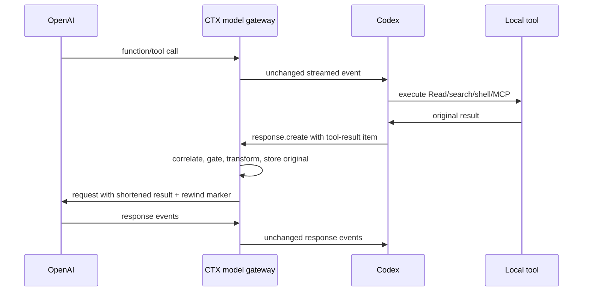

# CTX Codex model-path trimming implementation plan

Status: proposed
Date: 2026-07-21
Owner: Saurabh
Target: post-v0.6 Codex coverage wave
Parent: `docs/tool-trimming-architecture-revamp.md`
Companions: ADR 0015, ADR 0037, ADR 0046, `docs/codex-plugin-implementation-plan.md`,
`docs/claims.md`, `SECURITY.md`

## Decision summary

Build an opt-in **local Codex model gateway** that Codex reaches through its supported model-provider
configuration. The gateway will inspect OpenAI Responses API requests on the loopback interface,
shorten eligible local tool-result items through CTX's existing canonical, evidence-gated, exactly
recoverable pipeline, and forward the request directly to the correct OpenAI endpoint.

This is an application-layer intermediary and must be described as one. It is not the TLS MITM
removed by ADR 0015:

- no CTX certificate authority;
- no DNS rewriting, `HTTPS_PROXY`, or arbitrary HTTPS interception;
- no impersonation of `api.openai.com`;
- no generic `CONNECT` proxy or user-selectable upstream URL;
- no CTX-operated cloud relay; and
- no transformation of non-Codex traffic.

ADR 0015 remains correct about certificate-based interception. Before runtime implementation, a new
ADR must narrow its broader prohibition on model-request editing and record the new trust tradeoff.
Standard CTX remains hook-first with no model-traffic proxy. Model-path mode is a separate, explicit
choice.

Use these names consistently:

| Context | Name |
| --- | --- |
| Product setting | **Codex model-path trimming** |
| Technical component | **local Codex model gateway** |
| CLI namespace | `ctx codex gateway ...` |
| Security description | explicitly configured loopback reverse proxy |

Do not call the product mode “full coverage.” OpenAI-hosted tools whose results never return through
the client request remain outside CTX's control.

## Product outcome

With standard mode, Codex keeps its current capability:

- shell output can be shortened through the verified pre-call wrapper;
- selected MCP servers can be shortened through the explicit CTX MCP gateway; and
- built-in Read/search and direct MCP results remain observed only.

With model-path trimming enabled, CTX can shorten eligible tool results at the final local boundary
before Codex sends them to the model. This should include built-in local tools and direct MCP tools
when Codex serializes their results into a supported Responses item. Coverage becomes a measured
wire-contract fact, not a platform-wide assumption.

The user-facing explanation is:

> Codex model-path trimming lets CTX read Codex requests on this device, shorten eligible local tool
> results, and forward the request directly to OpenAI. CTX does not send that traffic through a CTX
> service. Exact originals for applied trims remain available under your local recovery settings.

Enabling the mode requires an explicit consent screen because the gateway necessarily sees prompts,
tool results, instructions, and OpenAI authorization headers in memory.

## Why this boundary works

Codex's `PostToolUse` hook can observe a completed built-in or MCP result but cannot replace the
normal result the model receives. The model request is the later convergence point:



The gateway does not need a replace-capable tool hook. It changes only the model-bound representation
after the tool action is already complete.

Codex currently exposes supported configuration for `openai_base_url`, custom model providers,
Responses wire format, and WebSocket-capable providers. Headroom's public implementation also proves
that this approach is possible, while its compatibility history demonstrates why CTX needs a strict
wire corpus and release gates rather than a generic JSON proxy.

References:

- [Codex custom model providers](https://learn.chatgpt.com/docs/config-file/config-advanced#custom-model-providers)
- [Codex hooks](https://learn.chatgpt.com/docs/hooks)
- [Headroom Codex provider setup](https://github.com/headroomlabs-ai/headroom/blob/main/headroom/providers/codex/install.py)
- [Headroom Responses handler](https://github.com/headroomlabs-ai/headroom/blob/main/headroom/proxy/handlers/openai.py)
- [Headroom Codex compatibility history](https://github.com/headroomlabs-ai/headroom/issues/71)

## Scope and capability contract

### Eligible for the first release

Only textual output inside verified client-originated Responses items:

| Responses item | Intended coverage | Initial behavior |
| --- | --- | --- |
| `function_call_output` | built-in local functions and client-side MCP | shadow, then evidence-gated apply |
| `custom_tool_call_output` | verified custom/client tools | shadow, then evidence-gated apply |
| `local_shell_call_output` | Codex local shell contracts | skip if already wrapped; otherwise shadow first |
| `apply_patch_call_output` | patch status or diagnostics | preserve by default; activate only from a separate contract |

An item is not eligible merely because its type matches. CTX must also resolve a stable tool identity,
supported output shape, wire-contract version, and activation key.

### Explicitly excluded from the first release

- user messages, developer instructions, system instructions, and tool-call arguments;
- tool definitions and JSON schemas;
- images, audio, binary content, and opaque file parts;
- provider response text or reasoning;
- errors, permission prompts, mutation confirmations, and incomplete tool calls;
- OpenAI-hosted tool results already consumed inside the provider boundary;
- compaction requests until they have a separate verified contract;
- non-OpenAI custom providers, Azure OpenAI, and OpenAI-compatible third-party routers;
- arbitrary Chat Completions or Realtime API traffic; and
- any unknown item, encoding, event, header requirement, or protocol version.

Unknown means byte-faithful pass-through with a specific coverage reason.

## Operating modes

| Mode | Model traffic through CTX | Built-in local results | Direct MCP | CTX-routed MCP | Hosted tools |
| --- | --- | --- | --- | --- | --- |
| Standard | No | observe only | observe only | can shorten | unavailable |
| Model-path shadow | Yes | measure only | measure only | already-trimmed guard | unavailable |
| Model-path testing | Yes | randomized per verified contract | randomized | already-trimmed guard | unavailable |
| Model-path active | Yes | earned contracts can shorten | earned contracts can shorten | already-trimmed guard | unavailable |

The standard mode stays the installation default until private-beta evidence justifies changing it.
The first public increment may offer only shadow and testing modes.

## Target architecture

```mermaid
flowchart LR
  Codex[Codex CLI or app] -->|HTTP / WebSocket Responses| Listener[Loopback listener]
  Listener --> Decode[Bounded decode and wire validation]
  Decode --> Correlate[Session and call correlation]
  Correlate --> Adapter[Responses-to-canonical adapter]
  Adapter --> Gate[Eligibility and evidence gate]
  Gate --> Apply[Existing atomic trim + rewind store]
  Apply --> Patch[Deterministic request mutation]
  Patch --> Route[Fixed OpenAI upstream router]
  Route --> OpenAI[OpenAI or ChatGPT Codex endpoint]
  OpenAI --> Relay[Byte-faithful response relay]
  Relay --> Codex
  Gate -->|unsupported or held whole| Route
```



Add a new `src/codex_gateway/` subsystem rather than reviving the deleted general proxy:

```text
src/codex_gateway/
├── mod.rs                 command orchestration and shared limits
├── listener.rs            loopback HTTP/WebSocket server
├── http.rs                Responses HTTP forwarding and SSE relay
├── websocket.rs           bidirectional Responses WebSocket relay
├── encoding.rs            zstd/gzip/deflate/brotli request decoding
├── wire.rs                versioned Responses frame/item parsing
├── correlate.rs           response-id/call-id/tool identity registry
├── adapter.rs             canonical tool exchange construction
├── mutate.rs              deterministic output-only request mutation
├── auth.rs                in-memory auth classification and header policy
├── upstream.rs            fixed endpoint selection and TLS client
├── receipts.rs            prepared/written/accepted model-path evidence
├── config.rs              CTX-owned service configuration
└── install.rs             reversible Codex config transaction
```

The model gateway and MCP gateway are separate trust boundaries and processes. A defect in one must
not create routing authority in the other.

## Wire and transport requirements

### HTTP Responses path

- Serve only the required `/v1/responses` family and CTX-owned health endpoint.
- Reject generic proxy paths, absolute-form URLs, `CONNECT`, and arbitrary destinations.
- Accept bounded request bodies and support the content encodings observed from supported Codex
  versions, including streaming zstd frames.
- Preserve the original body and content encoding byte-for-byte when no mutation is applied.
- When mutating, remove or correctly regenerate `Content-Length` and `Content-Encoding`.
- Forward provider status, safe headers, rate-limit headers, and SSE bytes without interpreting or
  changing provider output.
- Disable ambient proxy variables, redirects, and user-controlled upstream overrides.

### WebSocket Responses path

- Support the exact Codex WebSocket upgrade, subprotocol, and beta-header contracts in the captured
  fixtures.
- Forward required authorization and account-routing headers in memory.
- Handle text, binary, ping, pong, close, fragmentation, cancellation, and reconnect behavior.
- Inspect every client-to-upstream `response.create` frame, not only the first frame.
- Preserve `previous_response_id` and response identifiers exactly.
- Never modify upstream-to-client events in the first release; observe function/tool calls only to
  establish call-id-to-tool identity.
- Bound frame size, session count, idle duration, transform time, and queued bytes.

### Determinism and prompt-cache protection

Applied transformations must produce the same model-visible text for the same original, contract,
and transform version. The rewind marker and omission language must also be stable. This prevents a
re-sent historical result from changing on every turn and unnecessarily invalidating the provider's
prompt cache.

Unchanged requests remain byte-identical. Mutated requests must preserve all unrelated values and
field ordering. Start with ordered parsing and deterministic serialization; add a surgical raw-JSON
patcher before active rollout if cache experiments show material prefix churn.

Track cached-input usage before and after activation. Token reduction alone is not a win if cache
loss costs more than the removed context.

## Authentication and upstream routing

Support two explicit authentication contracts:

| Codex auth mode | Upstream | Product support |
| --- | --- | --- |
| ChatGPT OAuth/subscription | verified ChatGPT Codex backend | required for commercial beta |
| OpenAI API key | `https://api.openai.com` | required |

The gateway receives the authorization header because Codex sends it to the configured base URL.
CTX may classify the credential in memory only to choose the fixed upstream and required account
header. It must never log, hash, store, export, or include any credential material in diagnostics.

The G0 spike must compare two configuration strategies:

1. **Preferred:** change only user-level `openai_base_url`, preserving Codex's built-in provider,
   authentication behavior, account menu, and thread identity.
2. **Fallback:** install a CTX model-provider stanza with `supports_websockets = true` and conditional
   `requires_openai_auth`, only if the base-URL-only approach cannot preserve both auth modes.

Do not depend on reading tokens from `~/.codex/auth.json`. If mode discovery requires that file,
read only the minimum non-secret mode metadata and record the requirement in the threat model. Do
not mutate the file.

Authentication release gates:

- login and refresh work through the gateway without copying credentials into CTX storage;
- account and usage UI remain available in ChatGPT mode;
- API-key users do not get forced into OAuth;
- 401/403 and rate-limit responses are relayed faithfully;
- reconnects do not duplicate or lose tool-result turns; and
- disable/uninstall restores the previous Codex behavior without requiring a new login.

If ChatGPT subscription auth cannot pass these gates, do not advertise general Codex model-path
support. An API-key-only experimental mode is not a substitute for the target user experience.

## Correlation and canonical apply

The proxy must know what produced each result. Maintain an in-memory, bounded registry keyed by
connection/session, response ID, and call ID:

```text
response/tool call from upstream
  -> call_id + tool name + item type + model + session
next client response.create
  -> matching *_call_output
  -> canonical ToolIdentity + CanonicalToolResult
```

Persist no raw provider response for correlation. Expire entries on completion, cancellation,
disconnect, timeout, or a bounded LRU limit.

Generalize the existing MCP-specific two-phase apply boundary into a transport-neutral operation:

1. parse and validate the exact wire item;
2. resolve tool identity and contract version;
3. calculate or retrieve the eligible proposal;
4. ask the surface/transport/strategy evidence gate whether this call is control, testing, or active;
5. commit the exact original to the rewind store;
6. render the shortened output and marker into the same Responses item shape;
7. write the request/frame upstream;
8. wait for upstream acceptance: HTTP success or the first valid response event; and
9. only then record `applied = true` and model-visible character/token estimates.

If steps 1-6 fail, forward the original. If the upstream write or acceptance fails, keep recovery
available but do not claim savings. Under-counting is preferable to a false model-visible claim.

Activation identity becomes:

```text
surface=codex
+ transport=codex-model-gateway
+ auth contract
+ Codex wire contract version
+ normalized tool identity
+ result shape
+ transform version
```

Evidence earned by the shell wrapper, MCP gateway, Claude Code, Cursor, or an earlier wire contract
does not authorize this transport.

## Double-trim and recursion protection

- Detect a valid CTX rewind marker and never transform it again.
- Treat output already emitted by `ctx run` as already controlled.
- Treat MCP output already shortened by the CTX MCP gateway as already controlled.
- Never trim `ctx_expand`, `ctx_status`, recovery checks, or gateway diagnostics.
- Preserve the existing deny set for mutations and one-shot actions.
- Record `already-shortened` as coverage, not as another applied trim.

## Failure behavior

“Fail open” has two meanings and the product must distinguish them:

- **Transform failure:** forward the exact original through the live gateway.
- **Gateway process unavailable:** Codex cannot reach OpenAI through a dead configured endpoint.

The second case cannot be made transparent. Mitigate it with:

- a supervised, separate background service;
- health checks before configuration is switched;
- atomic config activation only after a live pass-through probe;
- startup retry with a bounded deadline;
- `ctx codex gateway bypass` that restores the previous config immediately;
- `ctx doctor` instructions that work without the gateway running; and
- automatic restoration during CTX uninstall.

Never silently route around CTX after an applied-marker decision; that could make receipts and model
visibility disagree.

## Security and privacy contract

### Trust boundary

In model-path mode, CTX can read:

- prompts and instructions;
- tool definitions and tool results;
- source code included in those values;
- model and request metadata; and
- OpenAI authorization headers in process memory.

That fact must appear before enablement, in Settings, in `ctx doctor`, and in the published threat
model. “Runs locally” is not a substitute for disclosure.

### Required controls

- bind only to loopback, with no `0.0.0.0` option in production builds;
- use a dedicated local port and refuse non-loopback Host/Origin values;
- expose no arbitrary forward-proxy behavior;
- allow only versioned, compiled-in OpenAI upstream origins;
- verify upstream TLS with the platform/web PKI and no user-supplied CA in the first release;
- disable redirects and ambient HTTP proxy settings;
- redact all auth, cookies, prompts, instructions, tool arguments, and result content from logs;
- keep structural diagnostics and bounded counters only;
- store content only when an applied trim needs exact rewind recovery;
- apply existing owner-only permissions, retention limits, restore test, and immediate purge;
- scan release logs and diagnostic bundles with seeded secrets; and
- provide one-command bypass, disable, and complete uninstall.

### Threats to document

| Threat | Control | Residual risk |
| --- | --- | --- |
| Credential leakage through logs | centralized header/content redaction and seeded-secret tests | debugger or same-user process can still inspect memory |
| Rogue local client uses gateway | loopback-only, fixed paths/upstream, optional install nonce | same-user compromise remains outside CTX's protection |
| Port hijack before service start | supervised service, readiness probe, optional nonce path/header | same-user process can read user-owned config |
| Request corruption | byte-faithful pass-through corpus and unknown-shape bypass | Codex/OpenAI wire changes require updates |
| Prompt-cache regression | deterministic transforms and cache-usage experiment | any changed context can affect cache economics |
| Recovery database disclosure | owner-only storage, bounds, purge, optional future OS encryption | local account compromise can read retained originals |
| Proxy outage strands Codex | supervisor, atomic enable, bypass/restore, uninstall proof | active sessions can still fail during a crash |
| Supply-chain compromise | signed artifacts, SBOM, dependency audit, independent review | CTX is intentionally trusted with model traffic |

### Revised claim

Retire any claim that CTX “never sees model traffic” when this mode is active. The target claim is:

> CTX processes Codex model requests locally and forwards them directly to OpenAI. CTX operates no
> cloud relay for this traffic. It persists only the exact originals needed for applied-trim recovery,
> under your local retention and purge controls.

This does not mean the data stays on the machine: Codex still sends it to OpenAI.

## CLI, setup, and lifecycle

Proposed commands:

```text
ctx codex gateway probe                 # read-only compatibility/auth/wire probe
ctx codex gateway enable --shadow       # explicit consent, install service, then switch config
ctx codex gateway enable --testing      # requires successful shadow corpus and user confirmation
ctx codex gateway status --json
ctx codex gateway bypass                # immediately restore the prior Codex provider config
ctx codex gateway disable               # restore config and stop/remove the service
ctx codex gateway serve                 # internal supervised entry point
```

Installer requirements:

- back up the exact user-level Codex provider/base-URL assignments before changing anything;
- never overwrite unrelated tables or keys;
- place a versioned CTX ownership block at TOML root;
- prefer `openai_base_url` without changing provider identity when the G0 spike validates it;
- detect user edits and refuse destructive restoration;
- start and probe the service before activating the config;
- preserve the existing Codex plugin and MCP registrations;
- restore config before removing the service or binary; and
- test install, upgrade, bypass, disable, uninstall, and purge as independent operations.

The model gateway runs as a separate launchd agent, systemd user service, or Windows scheduled/user
service. It must not share the dashboard listener or dashboard process.

## Dashboard and comprehension contract

Replace the current single Codex capability paragraph with path receipts:

```text
Codex                                                   MODEL-PATH TESTING

Built-in local tool results                             Testing before shortening
Direct MCP results sent through Codex                   Testing before shortening
Shell results already controlled by CTX                 Can shorten
MCP servers routed through CTX's MCP gateway             Can shorten
OpenAI-hosted tools                                     CTX cannot shorten these

Traffic
Codex requests pass through this device                 Yes
Forwarded directly to                                  OpenAI
Sent through a CTX service                              No
Prompts and authorization visible to local CTX process  Yes
Exact originals retained                               37 / 100 MiB local limit
```

The default view answers:

1. Is Codex routed through CTX right now?
2. Which exact paths can be shortened?
3. Did the last accepted request contain an applied trim?
4. Where was the request sent?
5. What content can CTX see and retain?
6. How do I bypass it immediately?

Detailed Evidence may show contract versions, trial arms, confidence intervals, cache impact,
latency, and rejection reasons.

## Implementation increments

### G0 — Decision and compatibility spike

- Add the ADR narrowing ADR 0015 and approving only an explicit loopback Codex gateway.
- Capture sanitized HTTP and WebSocket traffic shapes from the currently supported Codex build.
- Prove whether base-URL-only configuration preserves ChatGPT OAuth, API-key auth, account UI, thread
  identity, rate-limit reporting, and model selection.
- Prove that built-in local, shell, patch, and direct MCP results appear in client-originated
  Responses items and can be correlated to tool names.
- Send one synthetic shortened tool result through a controlled upstream and a real-model smoke.
- Record hosted/server-side tool exclusions.

Exit gate: at least one supported, reversible configuration works with both auth modes; target local
tool outputs are present and mutable; no CA or undocumented Codex file mutation is required.

Kill or narrow the project if:

- ChatGPT subscription auth cannot be preserved;
- request integrity prevents safe output-only mutation;
- important built-in results do not cross this boundary;
- a stable tool identity cannot be recovered;
- Codex cannot preserve thread/history behavior acceptably; or
- provider policy or supported configuration explicitly disallows the route.

### G1 — Byte-faithful transparent HTTP gateway

- Add the loopback listener, fixed upstream router, header policy, bounded encoding support, SSE
  relay, structural metrics, and health endpoint.
- Keep all transformation disabled.
- Add fake-upstream and recorded-corpus tests proving exact request/response pass-through.
- Add 401, 403, 429, 5xx, disconnect, timeout, cancellation, malformed encoding, and large-body tests.

Exit gate: with optimization off, every supported HTTP request body is byte-identical upstream;
headers differ only under the documented hop-by-hop and fixed-upstream policy; and Codex behavior
matches direct routing.

### G2 — WebSocket gateway and auth matrix

- Add bidirectional Responses WebSocket support, required headers/subprotocols, call observation,
  multi-turn `response.create` handling, and connection limits.
- Exercise ChatGPT OAuth refresh and API-key flows on clean profiles.
- Preserve close codes, rate limits, previous response IDs, cancellations, reconnects, and concurrent
  subagent sessions.

Exit gate: a 30-minute scripted Codex session and failure-injection suite complete with zero lost,
duplicated, reordered, or corrupted frames.

### G3 — Responses canonical adapter in shadow mode

- Add versioned parsers for the four initial output item types.
- Build the bounded call-correlation registry from upstream tool-call events.
- Normalize eligible outputs into `CanonicalToolExchange` without persisting raw requests.
- Run existing strategies in content-local shadow mode and record content-free coverage reasons.
- Add already-shortened and recovery-tool guards.

Exit gate: every supported result reaches the same canonical decision as its native/gateway fixture;
unknown and hosted items remain exact pass-through.

### G4 — Atomic model-visible apply

- Generalize the prepare/emit receipt boundary for model transport.
- Store exact originals before mutation and append the existing recovery marker.
- Mutate only the target output field and preserve all opaque item fields.
- Record applied savings only after upstream acceptance.
- Add deterministic replay, cache stability, recovery, double-trim, rollback, and crash-window tests.
- Enable only a synthetic internal contract, then one low-risk real tool trial.

Exit gate: mock upstream proves it received the shortened item, `ctx_expand` returns the exact
original, and no failed/rejected request is counted as applied.

### G5 — Reversible installation and supervised service

- Add CLI commands, owned configuration, service definitions, port allocation, startup probe, config
  backup, bypass, restoration, doctor checks, and uninstall integration.
- Test pre-existing custom Codex settings, user edits after activation, upgrades, port conflicts,
  process crashes, stale locks, and absent binaries.
- Keep setup opt-in; do not enable model-path mode from ordinary `ctx setup`.

Exit gate: a clean beta-user install can enable, use, bypass, disable, reinstall, and uninstall the
gateway without hand-editing Codex configuration or re-authenticating.

### G6 — Evidence, dashboard, and claim migration

- Add transport/wire/auth dimensions to activation evidence and product-proof receipts.
- Show exact applied, attempted, held-whole, already-shortened, unsupported, and hosted counts.
- Add last upstream acceptance, gateway health, latency, cache impact, and destination receipts.
- Implement the consent, status, bypass, retention, recovery, and purge UI.
- Update `README.md`, install copy, `docs/claims.md`, `SECURITY.md`, portfolio copy, and release checks.

Exit gate: a first-time user can accurately explain the data path, coverage, local trust boundary,
recovery, hosted-tool gap, and bypass action after reading only the main Codex card.

### G7 — Private beta and commercial gate

- Dogfood shadow mode first, then one-tool randomized trials, then per-contract activation.
- Test a real corpus covering source reads, search, tests/logs, patches, local MCP, remote MCP, large
  JSON, errors, cancellations, compaction-adjacent turns, and long sessions.
- Run macOS and Linux live coverage; keep Windows experimental until its service and transport matrix
  passes live tests.
- Produce signed artifacts, SBOM, dependency audit, threat model, known-gap matrix, and an independent
  review focused on auth forwarding, request mutation, local listener exposure, and config recovery.

Exit gate: beta thresholds hold, the security review is resolved or disclosed, and the public claim
ledger maps every Codex statement to a live proof.

## Proposed PR sequence

Keep each increment on a focused branch and PR. Run relevant local tests and
`make pr-fitcheck PR=<number>` before merge. Let Copilot review each PR once, address or explicitly
accept that pass, and do not request or wait for a second Copilot review.

| PR | Scope | Required proof |
| --- | --- | --- |
| 1 | ADR, sanitized wire fixtures, compatibility probe harness | no runtime routing change |
| 2 | transparent HTTP listener/forwarder and encoding corpus | byte-faithful pass-through |
| 3 | WebSocket relay and auth/upstream matrix | multi-turn live smoke |
| 4 | call correlation and canonical shadow adapter | content-free coverage ledger |
| 5 | transport-neutral atomic apply and deterministic mutation | mock model-visible + exact rewind |
| 6 | service, Codex config transaction, CLI, doctor, uninstall | clean beta-user lifecycle test |
| 7 | dashboard, consent, privacy/security/claim migration | comprehension and seeded-secret tests |
| 8 | trials, performance/cache gates, signed beta release | real-session and security-review evidence |

Do not combine the transparent transport, active transformation, and installer switch in one PR.
Each must be independently testable and revertible.

## Test and proof matrix

### Protocol fidelity

- HTTP POST plus SSE and Responses WebSocket transports.
- zstd streaming frames, gzip, deflate, brotli, identity, malformed and unsupported encodings.
- Header casing, duplicate headers, beta headers, subprotocols, query strings, and rate-limit headers.
- Fragmented frames, binary frames, ping/pong, cancellation, reconnect, half-close, and abrupt reset.
- Stateful `previous_response_id`, `store=false`, parallel tool calls, subagents, and compaction-adjacent
  requests.
- Unknown item types and extension fields.

### Model-path semantics

- each initial output item type with string and typed-part output;
- multiple outputs in one frame, duplicate call IDs, missing tool calls, late outputs, and expired
  correlation;
- direct MCP, CTX-routed MCP, wrapped shell, unwrapped shell, Read/search, patch, and recovery tools;
- nonzero/error/mutation/permission/incomplete results remain whole;
- deterministic repeated history and exact marker stability; and
- mock upstream capture of the exact model-visible request.

### Auth and routing

- fresh ChatGPT login, token refresh, account switching, logout, plan/usage display, and rate limits;
- full and restricted API keys, invalid keys, revoked keys, and missing scopes;
- no Authorization, cookie, account ID, prompt, tool output, or source text in logs/SQLite/diagnostics;
- fixed-origin enforcement, redirects disabled, ambient proxy disabled, and TLS failure handling.

### Lifecycle and security

- install over clean and customized Codex configs;
- atomic activation, port conflict, fake listener, service crash, upgrade, bypass, disable, uninstall,
  reinstall, and purge;
- loopback binding on IPv4/IPv6, Origin/Host rejection, unsupported paths, and generic-proxy attempts;
- seeded-secret network/log/storage audit;
- exact recovery before and after expected restarts; and
- same-user local attacker limitations documented rather than overclaimed.

## Metrics and guardrails

Product metrics:

- model-visible characters and estimated tokens removed by exact tool path;
- percentage of Codex local tool-result bytes crossing a verified gateway contract;
- percentage eligible, testing, active, held whole, already shortened, and unsupported;
- time from enablement to first recoverable accepted trim;
- recovery use and success;
- correction/re-touch outcomes by the full activation identity;
- upstream cached-input delta and effective cost/allowance impact; and
- added latency, gateway failures, reconnects, and bypass usage.

Non-negotiable guardrails:

- authorization or prompt/tool content written outside the bounded rewind store: **zero**;
- request sent to a non-approved upstream: **zero**;
- pass-through request-body, response-event, or semantic mismatch outside the documented header
  policy for supported unchanged traffic: **zero**;
- applied receipt when upstream did not accept the modified request: **zero**;
- applied trim without exact recovery: **zero**;
- unknown contract modified: **zero**; and
- hosted result described as CTX-controlled: **zero**.

Provisional beta performance targets, excluding provider latency:

- pass-through added p95: at most 20 ms;
- applied trim added p95 for results up to 1 MiB: at most 200 ms;
- transform deadline: 500 ms, after which the exact original passes through;
- active-session transport success: at least 99.9%; and
- gateway-caused reconnect or duplicate-turn rate: below 0.1%.

Calibrate the latency targets from G1-G4 measurements before publishing them. Do not relax fidelity,
recovery, auth, or destination guardrails to hit a latency number.

## Commercial-ready definition

Codex model-path trimming is commercially supportable only when:

- current supported Codex CLI and app builds pass the versioned HTTP/WebSocket contract probes;
- both ChatGPT subscription and API-key auth pass without credential persistence or re-login;
- built-in local and direct MCP outputs have real model-visible applied receipts;
- hosted-tool and unknown-contract gaps are shown plainly;
- cache-adjusted savings remain positive over the beta cohort;
- correction/re-touch safety evidence is isolated by the full activation identity;
- installation, bypass, upgrade, recovery, disable, and uninstall are proven on each supported OS;
- signed artifacts, SBOM, audit, threat model, and independent review are complete; and
- every public claim is backed by an automated or inspectable receipt.

Until then, the dashboard label is **testing** or **experimental**, never “active everywhere.”

## Open decisions

1. Whether base-URL-only routing can preserve provider identity and both authentication modes.
2. The supported and stable ChatGPT Codex upstream contract for subscription traffic.
3. Which Rust WebSocket stack best preserves upgrade headers, fragmentation, backpressure, and TLS.
4. Whether changed JSON bodies need surgical byte-span patching before beta to protect prompt-cache
   behavior.
5. Whether a per-install nonce path/header materially improves the loopback threat model given the
   same-user trust boundary.
6. Whether retained originals need OS-backed encryption before commercial release or whether
   owner-only storage plus clear disclosure is sufficient.
7. Which Codex app/CLI versions and OS combinations CTX will sell as supported rather than
   experimental.
8. Whether model-path mode ever becomes a default; no current milestone assumes that it does.
