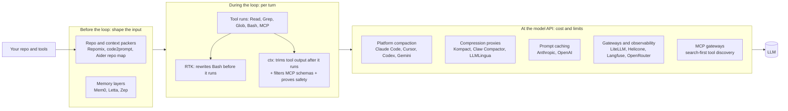

# The landscape: who does what to the context budget

Last updated: 2026-06-13.

Everyone in this map is trying to make an AI agent spend fewer or cheaper tokens without making it worse. They do it at different points in the request path. That is the cleanest way to tell them apart, and it is how ctx should be positioned.

## The request path, and where each category acts

Read it left to right. Packers and memory decide what enters context before the loop. During the loop, tools run and either RTK rewrites the command first or ctx trims the result after. At the API boundary, the platforms compact, proxies compress, caching discounts the stable prefix, and gateways route and observe.

## Categories, who is in each, and how they relate to ctx

| Category | Who | What they touch | Relation to ctx |
| --- | --- | --- | --- |
| Tool-output / command compressors | RTK (primary), Kompact, Claw Compactor | Shell command output (RTK), or the whole request via proxy/library (Kompact, Claw) | Direct. RTK is the primary competitor on framing; the proxies are mechanism lookalikes |
| Platform-native compaction | Claude Code, Cursor, Codex, Gemini CLI | Conversation and tool results, server-side | Direct, and the biggest absorption risk |
| Prompt / context compression (general) | LLMLingua family | Whole prompt, by information score | Adjacent. A library, not an agent product |
| MCP tool filtering / routing | mcp-tool-search, mcpmux, Docker MCP Gateway, StackOne, MCPJungle | MCP tool schemas in the prefix | Direct on ctx's MCP profile feature; commoditizing fast |
| Prompt caching | Anthropic, OpenAI | The stable prefix (cost, not size) | Different mechanism, same budget; also a design constraint for ctx |
| Memory layers | Mem0, Letta, Zep | Cross-session knowledge | Different problem; complementary |
| Repo / context packers | Repomix, code2prompt, files-to-prompt, Aider repo map | What code enters context up front | Adjacent, complementary |
| Proxy / observability / gateways | LiteLLM, Helicone, Langfuse, OpenRouter, Braintrust | Routing, logging, traces, evals | Different problem; a future integration target |

## The one-screen read

- The crowded, commoditizing middle is "cut tokens." RTK owns the Bash framing. The platforms cut tokens for free. The proxies cut tokens on benchmarks.
- The empty seat is "prove the cut did not hurt, on your real work, across more than one agent." Nobody in this map sits there. The platforms grade their own homework. The proxies and libraries grade ROUGE and BFCL. The observability tools grade offline eval sets and LLM judges. None of them watch whether the human had to fix the agent's work.
- ctx's two structural openings: native tool output and MCP results that RTK's Bash hook misses, and per-user causal proof that nobody runs. See 20-positioning.md and ADR 0013.

For per-competitor detail, see the briefs in competitors/. For the head-to-head, see 10-comparison-matrix.md.
