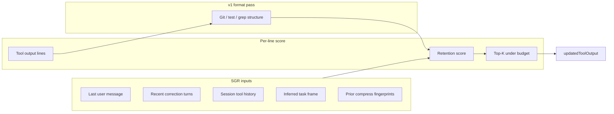

# ctx Compress v2: session-grounded retention

Plan for compression that RTK and generic log trimmers cannot replicate without ctx's session index, ingest pipeline, and hook stack.

**Prerequisite:** v1 is shipped (PostToolUse heuristics, metrics, A/B). v2 replaces *how we pick what to keep*, not the hook plumbing.

---

## Problem with v1

v1 compressors are **format-aware truncation**: git grouping, test failure extraction, line dedupe, prompt keyword substring match. Any tool with shell access can copy that in a weekend.

The defensible bet is **retention policy grounded in what this session is trying to do**, learned from ctx data that only exists after ingest + live hooks:

| Signal | Source | RTK has it? |
|--------|--------|-------------|
| Last user intent (full text) | Session JSONL tail | Partial (no index) |
| Correction / retry turns | `turns.flags`, `sessions.correction_turns` | No |
| Tools already invoked this session | `tool_invocations` | No |
| Working directory + profile | Hook payload + `sessions` | Partial |
| Similar past sessions | `session_embeddings` + `embedder` | No |
| Prior compressed outputs this session | New `compress_events` + JSONL tool rows | No |
| MCP tool shape priors | Aggregated `tool_invocations` by tool_name | No |

v2 product name (internal): **Session-grounded retention (SGR)**.

---

## Design principle

> Keep lines that change the agent's *next* decision. Drop lines that repeat what the session already proved or that do not relate to current intent.

Not summarization. Not an LLM call in the hook. A **scored line filter** with hard latency and fail-open behavior.



v1 format passes stay. SGR runs **after** structure extraction (e.g. test failures identified) and decides which blocks/lines survive the char budget.

---

## Core algorithm (v2.0)

### 1. Task frame (built once per compress call, cached 30s per session_id in-process is optional later)

Assemble `TaskFrame` from:

- `prompt`: last human message (JSONL tail, existing `load_prompt_from_session`)
- `cwd`, `active_profile` from hook payload + config
- `correction_snippets`: last 3 user turns where `flags` contains `correction` (SQLite by `session_id` external key, fallback empty if ingest lag)
- `recent_tools`: last 10 `tool_name` from `tool_invocations` for this session
- `focus_paths`: paths mentioned in prompt + paths from last 5 Read/Grep tool inputs in JSONL tail (regex, no LLM)
- `focus_symbols`: identifiers from prompt (snake_case, PascalCase, `module::fn` patterns)

Budget: **≤ 2ms** for TaskFrame. One indexed SQLite query + JSONL tail scan (already bounded to 200 lines).

### 2. Line retention score

Each line (or failure block for tests) gets a score:

| Feature | Weight | Notes |
|---------|--------|-------|
| Error / failure marker | +100 | Never drop if `compress_preserve_errors` |
| Matches `focus_paths` | +40 | Path substring or basename |
| Matches `focus_symbols` | +35 | Word boundary |
| Matches correction snippet terms | +30 | Terms from recent corrections |
| Matches prompt keyword | +20 | v1 keyword pass, demoted |
| Seen in prior compress output this session | −50 | Dedup across turns |
| Duplicate line hash in session | −30 | Same line compressed before |
| Generic boilerplate (progress spinner, `Compiling`, `Downloading`) | −20 | Pattern list |

Select lines greedily by score until `compress_target_chars`. Tie-break: later lines (recency bias for logs).

**No embedding in v2.0 hot path.** Substring and symbol rules only. Keeps p95 predictable.

### 3. Adaptive budget

Replace fixed `compress_target_chars` with session mode:

| Mode | Trigger | Target chars |
|------|---------|--------------|
| `normal` | default | config target (2500) |
| `debug` | last user message contains fix/debug/error/failing OR correction in last 2 turns | 1.5× target, failures pinned |
| `scan` | Read/Grep on large file, no failure signals | 0.8× target |

Expose mode in `compress_events.strategy` suffix (`test-runner+sgr-debug`).

### 4. Cross-turn dedup (v2.1)

Store `line_hash → first_seen_ts` in memory table or `compress_events` metadata for the session. When the same `git diff` hunk or test failure block appears again, emit:

```
[same as turn 4, 8421 chars omitted; re-run with narrower scope if needed]
```

Requires session_id stable in hook payload (already present).

---

## MCP-specific moat (v2.2)

Build **shape profiles** from observed corpus, not hand-written Notion/Jira handlers:

1. Weekly job (or post-ingest): top 20 MCP tools by `tool_invocations` count
2. For each tool, sample 50 JSON responses from ingest / fixture capture
3. Infer JSON paths that are high-signal: `id`, `title`, `status`, `error`, `url`, first array element schema
4. Store in `~/.ctx/compress-mcp-shapes.json` (versioned, user-local)

At compress time: trim using learned paths, not generic null stripping.

RTK cannot replicate without your invocation history.

---

## Semantic layer (v2.3, optional)

Only if v2.0 A/B shows correction rate gap vs keyword-only:

- Embed `TaskFrame.prompt` once per session (hash cache in hook process)
- Embed candidate **blocks** (not every line) for Read outputs > 8k chars
- Cosine sim block score replaces +20 keyword bump for Read/Grep

Cap: max 8 blocks embedded per compress call. ONNX path optional; hash embedder acceptable for ranking **relative** order.

Skip if p95 exceeds 15ms in dogfood.

---

## What we explicitly will not do

- LLM summarization inside PostToolUse (latency, non-determinism, cost)
- PreToolUse command rewriting as primary path (RTK's model; keep as optional experiment only)
- Claiming "% savings" without observed `compress_events` + correction rate guardrail
- Blocking tool success when compress fails (fail-open forever)

---

## Module changes

```
src/compress/
  context.rs      → TaskFrame builder (JSONL + SQLite)
  retain.rs       → NEW: score lines/blocks, greedy selection
  session_dedup.rs → NEW (v2.1): prior output fingerprints
  mcp_shapes.rs   → NEW (v2.2): load/apply learned MCP profiles
  mod.rs          → run v1 compressor, then SGR if enabled
  hook_io.rs      → record task_mode + top_score in compress_events
```

Config:

```toml
compress_enabled = true
compress_sgr_enabled = true          # v2 retention (default false until validated)
compress_sgr_dedup = true              # v2.1 cross-turn
compress_adaptive_budget = true
compress_mcp_shapes = true             # v2.2
```

A/B:

```toml
[ab_test]
compress_pct = 50        # existing: compress on/off
compress_sgr_pct = 50    # NEW: v1-heuristic vs v1+SGR when compress on
```

Group string adds `S:T` / `S:C` for SGR arm.

---

## KPIs (honest)

| Metric | Type | Success (4 weeks dogfood) |
|--------|------|---------------------------|
| Chars saved per compress event | Observed | ≥ v1 baseline (no regression) |
| Correction rate (turns with correction flag / turns) | Observed | SGR ≤ control + 2pp |
| Re-run rate (same command twice in 5 min) | Observed | SGR ≤ control |
| p95 hook latency | Observed | ≤ 15ms at 12k input |
| "Missing failure" incidents | Qualitative | 0 in golden + manual QA |

Primary v2 win is **not** more chars saved. It is **same or better savings with lower correction/re-run rate** because we kept the right lines.

---

## Implementation phases

### Phase 0 — Measure v1 (now)

- Run `compress_pct = 50` one week on real corpus (gaffer or ctx)
- Baseline: chars saved, correction rate, re-run proxy
- Do not start SGR until v1 baseline exists in `ab-results.json`

### Phase 1 — TaskFrame + retention score (v2.0)

- Extend `context.rs`: SQLite correction snippets, focus_paths from JSONL
- Add `retain.rs`, wire after v1 compressors
- `compress_sgr_enabled` flag, default off
- Golden tests: prompt "fix foo.rs" + read output → keeps `foo.rs` regions
- Golden tests: correction "no that's the wrong module" → boosts matching lines

### Phase 2 — Adaptive budget (v2.0)

- `debug` / `scan` modes
- Dashboard: show mode distribution in Pipeline compress card

### Phase 3 — Cross-turn dedup (v2.1)

- Session fingerprint store
- Golden: same git status twice → second output is pointer

### Phase 4 — MCP shape learning (v2.2)

- Offline `ctx compress learn-mcp-shapes` subcommand
- Top tools from DB, write shapes file
- Apply in `mcp.rs`

### Phase 5 — Semantic blocks (v2.3, gated)

- Only if Phase 1 A/B insufficient
- Read-only, block-level, strict time cap

### Phase 6 — Experiment integration

- `compress_sgr_ab` phase in the 16-day stress test (day 15, after `compress_ab`)
- Experiment tab card: SGR vs heuristic-only with chars saved and correction rate

---

## Test plan

| Layer | Cases |
|-------|-------|
| Unit | Score function weights, adaptive mode selection, TaskFrame parsing |
| Golden | `tests/fixtures/compress/sgr/` with prompt + db seed + raw → expected kept lines |
| Contract | Hook JSON unchanged; `additionalContext` mentions SGR when active |
| Integration | PostToolUse with seeded `ctx.db` session + corrections |
| E2E | Dashboard compress card shows SGR mode counts |

Regression guard: every v1 golden fixture must still pass with `compress_sgr_enabled = false`.

---

## Risks

| Risk | Mitigation |
|------|------------|
| Ingest lag: corrections not in DB yet | JSONL tail for corrections as primary; DB as enrich |
| SQLite read in hook adds latency | Single prepared query, session_id index, 3-row limit |
| Over-aggressive dedup hides new failures | Never dedup lines with failure markers |
| Shape learning stale | Re-learn on ingest weekly; version stamp in output footer |

---

## Immediate next steps

1. **Reload Window** after v1 reinstall (PostToolUse hook).
2. Dogfood v1 one week; capture baseline metrics.
3. Implement Phase 1 behind `compress_sgr_enabled = false`.
4. A/B `compress_sgr_pct` with correction rate as gate, not char count alone.

---

## One-line pitch

**v1 saves tokens by trimming logs. v2 saves tokens by knowing what this session is trying to do and keeping only lines that still matter for the next turn.**

That requires ctx's session index. RTK does not have it.
