# CTX model-path gateway implementation plan

Status: proposed
Date: 2026-07-21
Owner: Saurabh
Target: post-v0.6 cross-surface coverage wave
Parent: `docs/tool-trimming-architecture-revamp.md`
Surface plans: `docs/codex-model-gateway-implementation-plan.md`
Companions: ADR 0015, ADR 0046, ADR 0047, `docs/claims.md`, and `SECURITY.md`

## Decision summary

Build one opt-in **local CTX model gateway** with independent extension points for coding-agent
surfaces, model wire protocols, and upstream providers. Cursor, Claude Code, and Codex are the first
product wave. GitHub Copilot follows after those routes have passed live compatibility and recovery
gates.

The gateway is an explicitly configured application-layer reverse proxy. A supported client sends a
model request to a CTX loopback listener; CTX finds eligible client-side tool results in that request,
passes them through the existing canonical and evidence-gated trimming pipeline, then forwards the
request to a fixed, displayed upstream. It is not a transparent network interceptor:

- no CTX certificate authority;
- no DNS rewriting, system-wide `HTTPS_PROXY`, or arbitrary TLS interception;
- no generic `CONNECT` proxy or caller-selected destination;
- no CTX-operated cloud relay; and
- no claim over traffic that a client does not explicitly route through CTX.

ADR 0015 remains correct about certificate-based MITM interception. Before runtime implementation,
a new ADR must narrow its broader prohibition on model-request editing and record this explicit
loopback trust boundary. Standard CTX remains hook-first and MCP-gateway-first; model-path mode is a
separate, informed opt-in.

Use these names consistently:

| Concept | Meaning |
| --- | --- |
| Agent surface | The coding client: Cursor, Claude Code, Codex, or Copilot |
| Wire protocol | The model API shape: OpenAI Responses, Chat Completions, Anthropic Messages, and later cloud dialects |
| Upstream provider | The final model service: OpenAI, Anthropic, Azure, AWS, Google, or a local/OpenAI-compatible endpoint |
| Product setting | **Model-path trimming** scoped to a named route |
| Technical component | **local CTX model gateway** |
| Security description | explicitly configured loopback reverse proxy |

Cursor, Claude Code, Codex, and Copilot are surfaces, not interchangeable model providers. Keeping
those axes separate is what lets CTX reuse protocol work without turning one successful test into a
false platform-wide claim.

## Product outcome and claim boundary

When a verified route is enabled, CTX can shorten eligible client-side tool results at the final
local boundary before the client sends them to the model. That can cover built-in local tools and
direct MCP tools when their results appear in a supported, redirectable model request.

It cannot make every tool on every surface trimmable. CTX cannot change:

- hosted or server-side tool results consumed entirely beyond the local client boundary;
- traffic on subscription or built-in model routes that the surface does not allow users to
  redirect;
- encrypted or opaque content whose tool-result boundary cannot be verified;
- unknown protocol versions, item types, content encodings, or result shapes; or
- a result whose stable tool identity cannot be recovered.

The user-facing promise is:

> When model-path trimming is enabled for a supported route, model requests pass through a CTX
> process on this device before CTX forwards them to the displayed destination. CTX operates no
> cloud relay for this traffic. It changes only eligible tool results and keeps exact recovery data
> under the user's local retention and purge controls.

This does not mean prompts stay on the machine. The coding client still sends them to its configured
model service, and some surfaces may involve their own service before the final model request. The UI
must show the verified route rather than collapsing it into “local and secure.”

## Capability identity

A route is active only for the exact identity that earned evidence:

```text
surface
+ surface version and surface contract
+ authentication mode
+ ingress wire protocol and protocol version
+ transport and content encoding
+ fixed upstream class
+ normalized tool identity
+ result shape
+ transform version
```

Evidence does not cross any of those boundaries. In particular:

- Claude Code hook evidence does not activate Claude model-gateway traffic;
- Codex shell-wrapper or MCP-gateway evidence does not activate Codex Responses traffic;
- OpenAI Responses evidence does not activate Chat Completions;
- API-key evidence does not activate a subscription/OAuth route;
- Cursor evidence does not activate Codex even if both send OpenAI-shaped JSON; and
- one client release does not silently activate an untested wire contract from a later release.

The product may aggregate exact route receipts for comprehension, but the stored activation key
remains fully qualified.

## Initial route portfolio

### Wave 1 surfaces

| Surface route | Configuration boundary | Initial protocol | Target status | Hard gap |
| --- | --- | --- | --- | --- |
| Cursor IDE with OpenAI BYOK/base-URL override | explicit user model setting | captured OpenAI Responses or Chat Completions dialect | feasibility gate, then shadow | Cursor-built models and specialized features may bypass the configured route |
| Cursor CLI | supported endpoint/config only if live probe proves model routing | captured OpenAI dialect | feasibility gate | Cursor service and endpoint behavior must be measured, not inferred from CLI event output |
| Claude Code with `ANTHROPIC_BASE_URL` | supported gateway variable | Anthropic Messages over SSE | shadow, testing, active | direct fast-mode and safety traffic, plus hosted tools, can bypass the gateway path |
| Codex with `openai_base_url` or a custom provider | supported user-level provider configuration | OpenAI Responses over HTTP/SSE/WebSocket | shadow, testing, active | OpenAI-hosted tools never returned through the client request |

Wave 1 means all three product surfaces are investigated and represented honestly; it does not mean
every route ships active at the same time. Cursor receives the earliest kill-gate spike because its
redirectable coverage is the least certain. Shared runtime work should follow protocol dependencies,
not duplicate itself to preserve a marketing order.

### Wave 2 surface

| Surface route | Configuration boundary | Reused protocol | Initial scope |
| --- | --- | --- | --- |
| GitHub Copilot CLI with local BYOK | `COPILOT_PROVIDER_BASE_URL` and provider type | OpenAI Chat Completions or Anthropic Messages | local BYOK only |

Do not claim support for GitHub-hosted Copilot subscription traffic until GitHub exposes and CTX
verifies a supported local routing boundary. Copilot IDEs, Copilot CLI, the Copilot app, and the SDK
are separate surfaces even when they share a brand.

### Provider expansion after the surface waves

Provider support should be added by protocol and authentication demand, not by collecting logos:

1. OpenAI and OpenAI-compatible Responses endpoints;
2. Anthropic Messages endpoints;
3. OpenAI-compatible Chat Completions endpoints, including local Ollama or vLLM where the client
   supports them;
4. Azure OpenAI path and API-version handling;
5. Amazon Bedrock signing and InvokeModel/Converse dialects;
6. Google Cloud Vertex raw-predict and native Gemini GenerateContent; and
7. other providers only when a supported client route and real beta demand exist.

Protocol translation is not part of the first release. A protocol adapter should forward the same
protocol it receives. Translating OpenAI requests to Anthropic, or Anthropic requests to Bedrock,
turns CTX into a model router and multiplies semantic and feature-compatibility risk.

## Target architecture

```mermaid
flowchart LR
  Surface[Cursor / Claude Code / Codex / Copilot] --> SurfacePack[Surface adapter]
  SurfacePack --> Listener[Scoped loopback listener]
  Listener --> Protocol[Wire-protocol adapter]
  Protocol --> Canonical[Canonical model exchange]
  Canonical --> Gate[Existing eligibility and evidence gate]
  Gate --> Apply[Atomic trim and exact rewind store]
  Apply --> Patch[Protocol-local deterministic patch]
  Patch --> Upstream[Fixed upstream connector]
  Upstream --> Provider[Displayed model provider]
  Provider --> Relay[Streaming response relay]
  Relay --> Surface
  Gate -->|unsupported or held whole| Upstream
```



Run one model-gateway service, separate from the MCP gateway and dashboard process. Within that
service, isolate each installed route by listener/profile, fixed upstream, header policy, limits,
and capability receipt. A route must not be able to select another route's upstream or credentials.

Proposed module boundary:

```text
src/model_gateway/
├── mod.rs                    command orchestration and shared limits
├── listener.rs               loopback listeners and route ownership
├── route.rs                  immutable surface/protocol/upstream route definitions
├── relay.rs                  HTTP, SSE, and WebSocket streaming
├── encoding.rs               bounded request decoding and re-encoding
├── canonical.rs              model exchange and tool-result spans
├── correlate.rs              bounded session/call/tool identity registry
├── apply.rs                  prepare, persist, emit, and accept boundary
├── receipts.rs               route, prepared, written, and accepted evidence
├── lifecycle.rs              explicit compaction and history-change events
├── security.rs               header redaction, destination, host, and nonce policy
├── service.rs                supervised process lifecycle
├── protocols/
│   ├── mod.rs
│   ├── openai_responses.rs
│   ├── openai_chat.rs
│   └── anthropic_messages.rs
├── surfaces/
│   ├── mod.rs
│   ├── cursor.rs
│   ├── claude_code.rs
│   ├── codex.rs
│   └── copilot_cli.rs
└── upstreams/
    ├── mod.rs
    ├── openai.rs
    ├── anthropic.rs
    ├── azure.rs
    ├── bedrock.rs
    └── vertex.rs
```

Do not put trimming strategies inside surface or protocol modules. They normalize into the existing
`tool_result` boundary so safety, recovery, evidence, and learned activation remain shared.

## Extension contracts

### Surface adapter

Each surface adapter owns only client-specific setup and proof:

- detect installed client version and supported configuration locations;
- probe the supported routing and authentication boundary without changing state;
- install a reversible route transaction only after the model gateway is healthy;
- preserve unrelated configuration and detect user edits before restoration;
- classify the surface and authentication mode without persisting credentials;
- expose bypass, disable, doctor, upgrade, and uninstall operations;
- emit a route receipt describing what was actually verified; and
- provide sanitized live fixtures for every supported version family.

Surface adapters must not edit undocumented credential stores. A surface that exposes only a GUI
setting begins with guided manual activation and a machine-verifiable probe.

### Wire-protocol adapter

Each adapter must:

- match an explicit path, transport, and captured protocol version;
- recognize tool calls and client-originated tool-result nodes;
- correlate call IDs to stable tool identities;
- return exact structural paths or byte spans for eligible output content;
- preserve all unknown fields and open-ended header lists;
- leave arguments, instructions, tool definitions, model output, and reasoning untouched;
- produce the same canonical exchange for semantically equivalent result shapes;
- patch only the selected result leaf after atomic recovery preparation; and
- pass the original bytes unchanged when the route or shape is unsupported.

Protocol detection must use the request contract, not merely the URL. This matters for clients that
send a Responses-shaped body on a nominal Chat Completions path or change dialect by model.

### Upstream connector

An upstream connector owns:

- a compiled-in or explicitly approved fixed destination;
- TLS verification and redirect policy;
- required path/query rewriting that is part of the route contract;
- pass-through API-key or OAuth header policy;
- cloud credential acquisition and post-mutation signing where required;
- upstream-specific rate-limit and error forwarding; and
- a destination receipt suitable for the main dashboard.

Credentials are read from the incoming request or native credential chain, held in memory for the
minimum required lifetime, and never logged, hashed, written to SQLite, or exported in diagnostics.
Cloud routes that require CTX to acquire or re-sign credentials need a separate threat-model and
consent gate.

## Canonical model-path exchange

Normalize only the information needed to make and prove a trimming decision:

```text
CanonicalModelExchange
  route_id
  surface + surface_version
  auth_contract
  protocol + protocol_version
  upstream_class
  session_id? + request_id?
  transport + encoding
  tool_results[]
    call_id
    normalized_tool_identity
    source_item_type
    content_path_or_span
    content_kind
    original_text
    already_shortened
```

Keep raw requests in bounded process memory only. Persist an original tool result only when an
applied trim requires exact rewind recovery. Correlation registries must be bounded, content-light,
and expired on completion, cancellation, disconnect, timeout, or LRU eviction.

Tool identity should be recovered from the protocol's call/result relationship, not guessed from
the output text. If a client omits the name from a result, correlate it with the earlier tool-call
event by route, session, response/conversation ID, and call ID. A missing or ambiguous match is
observed-only.

## Atomic model-visible apply

Generalize the MCP-specific prepare/emit boundary into a transport-neutral operation:

1. Parse and validate the exact request and result node.
2. Resolve the full route, tool, result-shape, and transform activation identity.
3. Calculate or retrieve an eligible proposal without mutating the request.
4. Ask the evidence gate whether the call is control, testing, or active.
5. Commit the exact original to the bounded rewind store.
6. Render a deterministic shortened output and existing recovery marker.
7. Patch only the intended protocol leaf and write the request upstream.
8. Wait for upstream acceptance: an HTTP success or first valid streaming response event.
9. Only then record `applied = true` and model-visible character/token estimates.

If steps 1-6 fail, send the original. If the write or upstream acceptance fails, retain recovery as
needed for crash consistency but do not claim model-visible savings. Under-count rather than create
a false receipt.

Applied text must be deterministic for the same original, route contract, and transform version.
When no change is made, the request body must remain byte-identical. When a change is made, unrelated
values and ordering must be preserved as far as the protocol permits; add surgical JSON span
replacement before active release if parse-and-serialize causes material prompt-cache churn.

## Double-trim and recursion protection

- Detect a valid CTX rewind marker and never transform it again.
- Treat results already controlled by a native hook, `ctx run`, or the MCP gateway as already
  shortened.
- Never trim `ctx_expand`, `ctx_status`, recovery checks, model-gateway diagnostics, or bypass
  operations.
- Preserve the shared deny set for mutations, errors, permission prompts, incomplete calls, and
  one-shot actions.
- Record `already-shortened` as coverage, not as another applied trim.
- Do not let a model-gateway route target the CTX model gateway itself.

## Compaction and conversation lifecycle

Tool-result trimming and compaction detection are separate capabilities. The gateway must not infer
that compaction happened merely because request bytes or history length fell.

Normalize explicit lifecycle evidence as:

```text
ConversationLifecycleEvent
  surface + surface_version
  route_id
  event = explicit_client_compaction
        | provider_context_management
        | client_generated_summary
        | history_reset
        | unknown_history_change
  phase = attempted | completed | inferred
  evidence_source
  confidence
```

Only explicit client/protocol completion evidence counts as a completed compaction. A pre-event is
an attempt. Token or byte discontinuity is `unknown_history_change` unless a verified contract ties
it to compaction. Reuse ADR 0047's attempted/completed and confirmed/inferred semantics so the model
gateway does not recreate the cross-platform counting bug it is meant to solve.

Protocol-native context-management fields may be reported separately from client compaction. They
must not be merged unless a live fixture proves they represent the same event.

## Transport and fidelity requirements

- Bind only to loopback and expose only required versioned model paths plus CTX health endpoints.
- Reject absolute-form URLs, arbitrary destinations, generic proxy paths, and `CONNECT`.
- Support only transports earned by a surface route: HTTP response, SSE, or WebSocket.
- Stream provider responses without buffering the full response or changing model output.
- Preserve status codes, close codes, cancellation, backpressure, rate limits, and error bodies.
- Bound decoded request size, frame size, connections, idle time, transform time, and queued bytes.
- Support a content encoding only after byte-faithful and malformed-input fixtures pass.
- Forward unknown protocol fields and required vendor capability headers as open lists.
- Disable ambient proxy variables and upstream redirects.
- Never inspect or transform traffic outside an installed route.

The model gateway and MCP gateway are separate processes and trust boundaries. A defect or route in
one must not grant routing authority in the other.

## Failure and lifecycle behavior

“Fail open” has two different meanings:

- **Transformation failure:** the live gateway forwards the exact original.
- **Gateway unavailable:** a client configured to use the loopback endpoint cannot reach its model.

The second cannot safely fail open without bypassing the user's selected trust boundary. Mitigate it
with a supervised user service, pre-activation health probe, bounded startup retry, atomic config
transaction, route-specific bypass, doctor instructions that work without the service, and restore-
before-remove uninstall behavior.

Shared CLI shape:

```text
ctx model-gateway probe --surface <surface>
ctx model-gateway enable --surface <surface> --shadow
ctx model-gateway enable --surface <surface> --testing
ctx model-gateway status [--surface <surface>] --json
ctx model-gateway bypass --surface <surface>
ctx model-gateway disable --surface <surface>
ctx model-gateway serve
```

Surface aliases such as `ctx codex gateway ...` may remain as discoverable wrappers, but they must
delegate to the same route registry and lifecycle implementation.

The installer must start and prove the gateway before switching client configuration, back up only
the exact owned fields, preserve unrelated settings, refuse destructive restoration after ambiguous
user edits, and restore routes before removing the service or binary.

## Security and privacy contract

With a route enabled, the local CTX process can read prompts, instructions, tool definitions, tool
arguments and results, source code included in them, model metadata, and provider credentials in
memory. This disclosure must appear before enablement, in Settings, in `ctx doctor`, and in the
published threat model.

Required controls:

- loopback-only listeners with no production `0.0.0.0` option;
- separate route identity, fixed upstream, path policy, and optional install nonce;
- refusal of non-loopback Host/Origin values and generic forwarding behavior;
- platform/web PKI verification with no user-supplied CA in the first release;
- centralized log and diagnostic redaction for credentials and all request content;
- structural counters only outside the bounded recovery store;
- owner-only recovery storage, retention limits, exact restore tests, and immediate purge;
- seeded-secret audits across logs, diagnostics, crash handling, and SQLite;
- one-command bypass, disable, and complete uninstall; and
- signed artifacts, SBOM, dependency audit, and independent security review before commercial
  activation.

Every route must display its verified destination chain. If a surface service participates before
or after the local gateway, say so; do not reduce the chain to “direct to provider” until a capture
proves that description.

## Dashboard and comprehension contract

Do not show one platform-wide `active` badge. The main card should show exact paths:

```text
Claude Code · claude.ai subscription · Anthropic Messages       TESTING
Local built-in and MCP tool results                              Testing
Hosted/server-side tools                                         Not available

Codex · ChatGPT login · OpenAI Responses                         SHADOW
Built-in local results crossing the verified route               Observed here
OpenAI-hosted tools                                               Not available

Cursor · built-in model route                                    NOT ROUTED
Model-path trimming                                               Not available
Native hook/MCP coverage                                          See standard paths
```

The default view must answer:

1. Which client route is enabled right now?
2. What exact tool-result paths can be shortened?
3. Did the last upstream-accepted request contain an applied trim?
4. Where did the request go?
5. What can the local CTX process see and retain?
6. Was compaction attempted, completed, inferred, or unknown?
7. How does the user bypass the route immediately?

Detailed Evidence may show client and protocol versions, activation identity, trial arms,
confidence intervals, cache impact, latency, rejection reasons, and unsupported shape counts.

## Implementation increments

### M0 — ADR and three-surface compatibility gates

- Add the ADR allowing only an explicit loopback application gateway and preserving ADR 0015's CA
  prohibition.
- Build a content-redacting capture/probe harness before a mutating gateway.
- Probe Cursor, Claude Code, and Codex across their target authentication modes and current versions.
- Capture sanitized paths, headers, encodings, request bodies, streams, tool-call/result correlation,
  compaction markers, errors, and restoration behavior.
- Prove which requests cross the local boundary and which remain hosted or surface-controlled.

Exit gate: each candidate route has a written support/narrow/kill decision. Every surface marketed
as having model-path trimming has at least one supported route that exposes mutable client-side tool
results through supported or explicit user configuration. A Wave 1 surface may remain observed-only
rather than forcing an unsafe route.

### M1 — Provider-neutral transparent runtime

- Add the route registry, loopback listener, fixed upstream connectors, HTTP/SSE relay, shared
  bounds, content redaction, health endpoint, and supervised service skeleton.
- Keep all transformation disabled.
- Add fake-upstream and recorded-corpus tests for byte-faithful requests and streaming responses.
- Prove strict route isolation and destination enforcement.

Exit gate: every supported unchanged request is byte-identical upstream and each streaming response
is semantically and temporally equivalent to direct routing.

### M2 — Protocol adapters in shadow mode

- Implement Anthropic Messages, OpenAI Responses, and OpenAI Chat Completions as independent packs.
- Add bounded call correlation and canonical exchange construction.
- Run existing strategies in content-local shadow mode without persisting raw requests.
- Pass every unknown or ambiguous shape unchanged with a specific coverage reason.

Exit gate: supported fixtures normalize to the same canonical decisions as equivalent native/MCP
fixtures; no protocol adapter can activate another.

### M3 — Atomic model-visible apply

- Generalize prepare/persist/emit/accept receipts across transports.
- Patch only exact result leaves and preserve unrelated protocol content.
- Add deterministic replay, prompt-cache comparison, exact rewind, double-trim, rejection, and crash-
  window tests.
- Activate a synthetic contract before one low-risk real tool contract per protocol.

Exit gate: mock and live upstreams receive the intended shortened result, exact rewind works, and no
failed or rejected request is counted as applied.

### M4 — Wave 1 surface adapters and lifecycle

- Add reversible Cursor, Claude Code, and Codex setup/probe/doctor/bypass/disable operations.
- Keep manual setup where a surface lacks documented programmable configuration.
- Add auth-mode matrices, live version receipts, session correlation, and lifecycle classifiers.
- Prove clean and customized profile restoration without reauthentication.

Exit gate: a beta user can enable, verify, use, bypass, disable, reinstall, and uninstall every
supported route without hand-editing files after the documented setup flow.

### M5 — Evidence, dashboard, and claim migration

- Add surface/protocol/auth/upstream dimensions to activation and product-proof receipts.
- Show attempted, accepted, applied, held-whole, already-shortened, unknown, hosted, and bypassed
  counts by route.
- Implement destination, consent, visibility, retention, recovery, purge, health, cache, and latency
  UI.
- Implement ADR 0047-compatible lifecycle semantics and remove size-drop compaction claims.
- Update claims, security, onboarding, portfolio, and release verification.

Exit gate: first-time users can accurately explain their exact route, controlled paths, unavailable
paths, local trust boundary, recovery, compaction confidence, and bypass action from the main card.

### M6 — Wave 1 private beta and commercial gate

- Dogfood shadow, then randomized per-contract testing, then evidence-earned activation.
- Run real corpora across built-in read/search/shell/edit, direct and CTX-routed MCP, large JSON,
  errors, cancellation, parallel agents, long sessions, and compaction-adjacent turns.
- Complete macOS and Linux live coverage; keep Windows experimental until service and transport
  lifecycle tests pass there.
- Complete signed artifacts, SBOM, threat model, dependency audit, and independent review.

Exit gate: route-level safety, fidelity, cache-adjusted value, lifecycle, and security thresholds hold
for the beta cohort and every public claim maps to inspectable proof.

### M7 — Copilot CLI

- Add the Copilot CLI surface adapter using the existing Anthropic Messages and OpenAI Chat packs.
- Support only local BYOK routes with explicit base URLs in the first release.
- Test OpenAI-compatible, Anthropic, and Azure variants separately.
- Keep GitHub-hosted subscription paths unavailable until a supported redirect boundary exists.

Exit gate: Copilot CLI BYOK routes pass the same install, fidelity, acceptance, recovery, evidence,
and uninstall gates as Wave 1 without weakening their activation identities.

### M8 — Cloud and native provider expansion

- Add Azure path/API-version handling.
- Add Bedrock request dialect and post-mutation signing behind a separate credential consent.
- Add Vertex raw-predict and Gemini native protocols only from real surface demand.
- Add local/OpenAI-compatible endpoints through explicit fixed routes, never an arbitrary router.

Exit gate: every provider pack has protocol conformance, credential non-persistence, fixed-destination,
live model acceptance, recovery, and product-claim proof.

## Proposed PR sequence

Keep each increment on a focused branch and PR. Run relevant local tests and
`make pr-fitcheck PR=<number>` before merge. Let Copilot review each PR once, address or explicitly
accept that pass, and do not request or wait for a second Copilot review.

| PR | Scope | Required proof |
| --- | --- | --- |
| 1 | ADR, route vocabulary, capture harness, three Wave 1 spikes | no runtime routing change |
| 2 | route registry, transparent HTTP/SSE core, redaction, fake upstream | byte-faithful and isolated pass-through |
| 3 | Anthropic Messages adapter and Claude Code shadow route | subscription and API-key live smoke |
| 4 | OpenAI Responses HTTP/WebSocket adapter and Codex shadow route | multi-turn auth and transport matrix |
| 5 | OpenAI Chat adapter and Cursor verified shadow route | captured-dialect and next-turn acceptance proof |
| 6 | transport-neutral atomic apply and deterministic mutation | mock model-visible plus exact rewind |
| 7 | three surface transactions, service, CLI, doctor, bypass, uninstall | clean beta-user lifecycle proof |
| 8 | lifecycle classifier, dashboard, consent, privacy/security claims | comprehension and seeded-secret tests |
| 9 | trials, performance/cache gates, signed Wave 1 beta | real-session and independent review evidence |
| 10 | Copilot CLI BYOK surface adapter | reused-protocol isolation and live smoke |

The exact adapter order may change after M0, but do not combine transparent transport, active
mutation, and client configuration switching in one PR. Each must remain independently testable and
revertible.

## Cross-surface test and proof matrix

### Protocol fidelity

- HTTP request/response, SSE, and Responses WebSocket transports where applicable.
- Identity, gzip, deflate, brotli, zstd, malformed, and unsupported encodings by earned route.
- Header casing and duplication, vendor capability headers, subprotocols, queries, and rate limits.
- Streaming boundaries, fragmented/binary frames, ping/pong, cancellation, reconnect, half-close,
  backpressure, abrupt reset, and upstream error bodies.
- Stateful response/conversation IDs, parallel calls, subagents, repeated history, and unknown fields.

### Tool-result semantics

- every supported call/result type and textual content representation;
- multiple results, duplicate or missing IDs, late results, expired correlation, and ambiguous names;
- native-controlled, MCP-gateway-controlled, direct MCP, built-in, hosted, recovery, and diagnostic
  tools;
- errors, mutations, permission prompts, incomplete calls, binary/multimodal values, and one-shot
  actions remaining whole;
- deterministic repeated history and exact marker stability; and
- mock capture of the exact request the upstream accepted.

### Authentication and destination

- every surface's supported subscription, OAuth, API-key, cloud, or local auth mode separately;
- login, refresh, account switching, logout, revoked/invalid credentials, missing scopes, and rate
  limits where the surface supports them;
- no credential or request content in logs, SQLite, service definitions, diagnostics, or crash
  output;
- fixed-origin enforcement, redirects and ambient proxies disabled, and TLS failure behavior; and
- correct post-mutation signing for every cloud route that requires it.

### Compaction and lifecycle

- explicit pre and post events remain attempted and completed respectively;
- provider context management remains distinct from client compaction;
- repeated delivery is idempotent;
- byte/token drops without a contract remain unknown rather than completed;
- native and inferred evidence do not double-count; and
- session resets, resumed threads, and subagents retain correct surface attribution.

### Installation and security

- clean and customized client settings, concurrent routes, user edits, upgrades, port conflicts,
  fake listeners, stale locks, crashes, bypass, disable, uninstall, reinstall, and purge;
- loopback binding on IPv4/IPv6, Host/Origin rejection, unsupported paths, and generic-proxy attempts;
- route and credential isolation across surfaces; and
- seeded-secret network, log, diagnostic, crash, and storage audits.

## Metrics and guardrails

Product metrics by full capability identity:

- model-visible characters and estimated tokens removed;
- percentage of local tool-result bytes crossing a verified route;
- eligible, control, testing, active, held-whole, already-shortened, hosted, and unsupported shares;
- time from enablement to first recoverable upstream-accepted trim;
- recovery usage and exact success;
- correction or re-touch outcomes;
- explicit and inferred compaction events kept separate;
- cached-input and effective cost/allowance impact; and
- added latency, gateway failures, reconnects, and bypass usage.

Non-negotiable guardrails:

- credentials persisted anywhere: **zero**;
- prompts, instructions, arguments, or provider output persisted outside the exact applied-result
  recovery contract: **zero**;
- request sent to a non-approved upstream: **zero**;
- unchanged-request or streamed-response mismatch outside documented hop-by-hop policy: **zero**;
- applied receipt without upstream acceptance: **zero**;
- applied trim without exact recovery: **zero**;
- unknown route, protocol, tool, or result shape modified: **zero**;
- compaction inferred from size alone and labeled completed: **zero**; and
- hosted result or non-routed surface described as CTX-controlled: **zero**.

Provisional beta targets, excluding provider latency:

- pass-through added p95: at most 20 ms;
- applied trim added p95 for results up to 1 MiB: at most 200 ms;
- transform deadline: 500 ms, then send the exact original;
- active-session transport success: at least 99.9%; and
- gateway-caused reconnect or duplicate-turn rate: below 0.1%.

Calibrate performance numbers from M1-M3 measurements. Do not relax fidelity, recovery,
authentication, destination, or truthfulness guardrails to hit latency targets.

## Commercial-ready definition

Model-path trimming is commercially supportable for a route only when:

- current advertised client versions pass their protocol and lifecycle probes;
- advertised authentication modes work without credential persistence or unnecessary re-login;
- local built-in or direct MCP results have real upstream-accepted applied receipts;
- hosted, unknown, and non-routed gaps are shown plainly;
- cache-adjusted value remains positive over the beta cohort;
- correction/re-touch evidence is isolated by full activation identity;
- installation, bypass, upgrade, recovery, disable, uninstall, and purge pass on each supported OS;
- signed artifacts, SBOM, audit, threat model, and independent review are complete; and
- every public statement maps to an automated or inspectable proof.

Until then, each route is **observed**, **shadow**, **testing**, **experimental**, or **unavailable**.
No umbrella “active everywhere” state exists.

## Plan ownership and surface documents

This umbrella owns shared architecture, security, evidence, lifecycle semantics, implementation
ordering, and commercial gates. Surface plans own client-specific configuration, authentication,
wire shapes, exclusions, commands, fixtures, and release decisions.

- `docs/codex-model-gateway-implementation-plan.md`: Codex surface and OpenAI Responses contract.
- Cursor surface plan: create only after M0 captures establish the supported routing boundary.
- Claude Code surface plan: create from the documented Messages gateway plus live subscription and
  API-key captures.
- Copilot surface plan: create during M7 and scope it initially to Copilot CLI local BYOK.

## Open decisions

1. Whether the gateway uses one listener per route or one listener with cryptographically separated
   route prefixes; the security outcome must be equivalent.
2. Which surface/version combinations survive M0 and can be marketed rather than experimental.
3. Whether mutated JSON needs surgical byte-span replacement before beta for prompt-cache economics.
4. Whether per-install route nonces materially improve the same-user loopback threat model.
5. Whether exact originals need OS-backed encryption before commercial release or whether owner-only
   storage plus explicit disclosure is sufficient.
6. Which cloud credential/signing routes justify their expanded local trust boundary.
7. Whether model-path mode ever becomes a default; no current milestone assumes it does.
