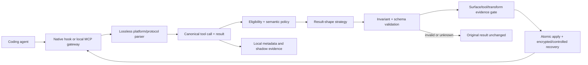

# CTX tool-result architecture revamp

Status: proposed
Date: 2026-07-18
Owner: Saurabh
Target: post-v0.5 product wave
Companions: `docs/tool-management-plan.md`, `docs/codex-plugin-implementation-plan.md`,
`docs/claims.md`, `SECURITY.md`, and ADR 0015

## Decision summary

Rebuild CTX's tool-result path around a protocol-aware, lossless canonical model instead of passing
flattened text between platform-specific hooks and compressors.

CTX will support two execution paths:

1. **Native adapter:** use a coding platform's supported hook to replace the result when that hook
   can do so faithfully. This remains the default and has the smallest trust footprint.
2. **Local MCP gateway:** an explicit, on-device MCP intermediary for servers whose results the
   platform cannot expose to a replace-capable hook. It will support local `stdio` first and remote
   Streamable HTTP only after the separate authorization and network-security gate passes.

The gateway is not a revival of the retired TLS MITM proxy. CTX will not intercept model-provider
traffic, install a certificate authority, terminate arbitrary agent TLS, or relay tool data through
a CTX-operated service. ADR 0015 remains in force for those behaviors.

At the same time, retire the absolute promise that "everything stays local and secure." The product
will make narrower claims that distinguish local MCP servers, user-configured remote MCP servers,
local persistence, and explicit CTX service actions. Each claim must be backed by a test or an
inspectable product control.

## Product outcome

The finished product should let a developer answer four questions without knowing what a hook,
proxy, confidence interval, or "harm bar" is:

- What tool result did CTX shorten?
- What important structure did CTX preserve?
- Can I recover the exact original?
- Did CTX send this data anywhere?

The commercial position becomes:

> CTX is the on-device result optimizer beneath your coding agents. It shortens supported tool
> results without changing the tool action and preserves the original for recovery. The trimming
> path does not send your code, prompts, tool calls, or results to CTX services.

That sentence is a target claim. It cannot ship on active surfaces until the claim gates in this
plan pass.

## Why the current architecture must change

The existing compressor is useful but not comprehensive:

- `CompressResult` contains one output string, character counts, and a strategy name. It cannot
  represent multiple typed content blocks or prove which parts changed.
- `extract_compressible_text` flattens tool-native output. MCP extraction takes text blocks and can
  ignore images, audio, resources, resource links, annotations, structured content, metadata, and
  unknown extension fields.
- MCP wrapping may rebuild the result as one text block. That can silently change the semantics of
  a mixed-content or schema-constrained result.
- MCP JSON trimming is shape-based: it keeps every object key, takes the first four array elements,
  truncates long strings, and caps nesting. It does not use the tool's output schema or result
  contract.
- Claude, Cursor, Codex, and shell wrappers each decide independently how to extract and rebuild an
  output. A fix in one path does not automatically protect the others.
- The current shell wrapper re-runs an allowed command through `sh -c`. That is not a universal
  semantic match for PowerShell, `cmd.exe`, fish, shell functions, interactive commands, or commands
  that depend on process-local shell state.
- Capability labels describe platforms broadly even though control is actually per transport,
  tool family, output shape, and product version.
- Public language includes both accurate, narrow privacy claims and the overly broad "everything
  stays on this machine." Remote MCP servers, update checks, and explicit reports make that phrase
  indefensible without qualification.

The current MCP tool-result contract allows multiple text, image, audio, resource-link, and embedded
resource blocks, plus `structuredContent`, `isError`, annotations, metadata, and an optional output
schema. CTX must treat this structure as the contract, not as formatting. See the current
[MCP tool-result specification](https://modelcontextprotocol.io/specification/2025-11-25/server/tools).

## Scope

### In scope

- One canonical representation for built-in tools, shell tools, and MCP results.
- Lossless parse and render boundaries for every supported platform adapter.
- Protocol-aware transforms for MCP text and structured results.
- Result-shape strategies for common shell and developer-tool output.
- Native hook application where the platform supports real replacement.
- An opt-in local MCP gateway for broader, platform-independent MCP control.
- Exact-original recovery across every applied path.
- A coverage ledger based on verified live contracts.
- A revised privacy and security promise, threat model, controls, and proof suite.
- macOS, Linux, and Windows behavior as explicit test dimensions.

### Out of scope

- Intercepting model-provider requests or responses.
- Installing a local certificate authority or performing general HTTPS interception.
- Sending tool arguments, results, originals, prompts, or source code through CTX infrastructure.
- Claiming that local execution is inherently secure.
- Transforming binary image or audio payloads in the first release.
- Guessing how to rewrite an unknown result shape.
- Hiding or pruning tool definitions; that remains the separate input-tax plan.
- Guaranteeing behavioral safety from structural validation alone. The existing earned activation
  and outcome checks still decide whether a valid transform may act.

## Design principles

1. **Parse losslessly, transform narrowly, render faithfully.** Unknown fields survive byte-for-byte
   where practical and value-for-value otherwise.
2. **Protocol facts outrank tool-name guesses.** Output schemas and trusted server contracts come
   before annotations, observed shape, and name heuristics.
3. **Unknown means pass through.** Unsupported content or an invalid rebuild keeps the original and
   records a precise reason.
4. **Errors are instructions, not noise.** Preserve `isError`, exit status, signal state, actionable
   diagnostics, and retry guidance.
5. **One transaction decides an apply.** Validation, recovery storage, result replacement, and the
   `applied` record succeed together or not at all.
6. **Coverage is a measured property.** "Supports MCP" or "supports Codex" is never enough; the
   dashboard reports the exact verified path.
7. **Local is a deployment fact, not a security guarantee.** Security claims name the threat and
   the control.
8. **No new network destination by default.** A gateway may connect only to the upstream server the
   user configured. It never contacts CTX services with tool data.

## Target architecture



### 1. Canonical tool contract

Introduce a model that preserves identity, execution state, content type, structure, and provenance.
The exact Rust API can change during implementation, but it must carry at least:

```rust
struct CanonicalToolExchange {
    identity: ToolIdentity,        // surface, server, tool, stable call id
    transport: TransportIdentity,  // native hook, stdio, streamable HTTP, shell wrapper
    input: serde_json::Value,
    contract: ToolContract,        // input/output schema, trusted annotations, protocol version
    result: CanonicalToolResult,
    provenance: Provenance,        // session, turn, cwd, adapter and transform versions
}

struct CanonicalToolResult {
    content: Vec<CanonicalContentBlock>,
    structured_content: Option<serde_json::Value>,
    is_error: Option<bool>,
    metadata: PreservedFields,
    raw: RawResult,
}

enum CanonicalContentBlock {
    Text(TextBlock),
    Image(OpaqueBlock),
    Audio(OpaqueBlock),
    ResourceLink(OpaqueBlock),
    EmbeddedTextResource(TextResourceBlock),
    EmbeddedBlobResource(OpaqueBlock),
    Unknown(OpaqueBlock),
}
```

Opaque blocks are preserved and never sent into a text compressor. Text blocks retain their block
index, annotations, resource identity, media type, and original encoding. `RawResult` exists for
faithful rollback and adapter-level equality tests; it must not become a second unbounded analytics
store.

The parser also needs a canonical shell result with distinct stdout, stderr, exit code, signal,
truncation state, ANSI state, and platform shell. It must never concatenate stdout and stderr and
then pretend their ordering or meaning was preserved.

### 2. Semantic policy resolver

Replace the current single generic MCP strategy with a layered resolver:

1. Hard safety rules: errors, write confirmations, secrets, unsupported blocks, and working-set
   guards.
2. Explicit user override for a server/tool.
3. Versioned CTX contract for a verified server/tool.
4. Output schema from `tools/list`, validated before and after transformation.
5. Trusted annotations and server identity. MCP annotations remain untrusted for unknown servers.
6. Observed result shape with a versioned confidence record.
7. Tool-name heuristic as an eligibility hint only.
8. Unknown fallback: observe and pass through.

Every decision records which layer authorized the strategy. A dashboard explanation should say
"recognized a paginated issue list" rather than exposing an internal classifier score.

### 3. Result-shape strategy registry

Strategies operate on typed fields or blocks, not on the serialized envelope:

| Shape | Safe first strategies | Must preserve |
| --- | --- | --- |
| Paginated collection | representative items, total count, cursor, omitted-count marker | IDs, cursor, order statement, schema validity |
| Search results | top relevant matches, file/entity identity, match counts | paths/IDs, ranking order, query errors |
| Entity/detail | remove redundant prose and duplicated fields | stable ID, status, requested fields, links |
| Tree/file listing | collapse repetitive branches and generated/vendor paths | root, requested depth, omitted counts |
| Table/CSV-like text | header plus representative or relevant rows | columns, types where known, row count |
| Logs | error/warning windows, first/last context, repeated-line folding | timestamps when present, severity, exit state |
| Test output | failures and surrounding diagnostics, summary totals | failing test names, counts, duration, exit code |
| Diff | changed hunks selected by intent and size budget | file names, hunk headers, binary/delete/rename state |
| Stack trace | exception, application frames, causal chain | error class/message, caused-by chain |
| JSON fallback | schema-aware field selection and bounded collections | required fields, identity fields, valid JSON |
| Plain text fallback | deterministic head/tail plus explicit omission | error lines and recovery marker |

Images, audio, binary resources, and unknown content blocks pass through unchanged in the first
release. Embedded text resources may be trimmed only while preserving their URI, media type,
annotations, and resource boundary.

Each strategy has a version, preconditions, invariants, maximum expansion ratio, recovery behavior,
and golden fixtures. A strategy version change restarts activation evidence for the affected
surface/tool/contract key.

### 4. Atomic apply boundary

All adapters call one `apply_trim` operation. It performs:

1. parse and canonical validation;
2. eligibility and transform selection;
3. transformation in memory;
4. post-transform invariants and output-schema validation;
5. evidence-gate decision;
6. durable recovery write when recovery is required;
7. adapter render and round-trip validation;
8. decision/event commit; and
9. replacement response emission.

If steps 4, 6, or 7 fail, CTX emits the original, records `applied = false`, and stores a reason
without raw payload content. There must be no state where the agent sees a trim but `ctx_expand`
cannot recover it, or where CTX records savings for an output the platform ignored.

### 5. Platform adapters

Adapters only translate contracts and report capabilities. They do not own compression logic.

| Path | Intended role | Apply rule |
| --- | --- | --- |
| Claude Code native hook | Default for built-ins and MCP where structured replacement is supported | Apply only after native-shape round-trip fixtures and a live model-visible test |
| Cursor native hook | MCP result replacement plus verified pre-call wrappers | Built-ins remain observe-only unless a live contract proves replacement |
| Codex plugin hook | Observation, compaction signals, and narrow verified controls | Feedback-style post-tool replacement stays beta because it is error-shaped and differs across execution modes |
| Local MCP gateway | Cross-platform control of explicitly configured MCP servers | Apply only to `tools/call` results; forward the rest of the protocol faithfully |
| Shell wrapper | Fallback where no faithful post-result hook exists | Only commands whose execution semantics can be preserved on that OS/shell |
| Hosted platform tools | Observe or unsupported | Never claim control without an exposed local contract |

Capability discovery is runtime and versioned. The shipped ledger records `verified`, `observe
only`, `experimental`, or `unsupported` for each platform version, tool family, and transport.

## Local MCP gateway design

Use the product term **local MCP gateway**. In technical and security documentation, state clearly
that it is an intermediary and therefore part of the local trust boundary.

### Local `stdio` MVP

Conceptual configuration:

```text
Agent -> ctx mcp gateway --server-id filesystem -> configured server executable
```

- The agent launches CTX over `stdio`; CTX launches one pre-approved server as a direct child.
- CTX uses an executable plus argument vector, never `sh -c`, PowerShell, or `cmd.exe` to launch the
  server.
- The approved server definition is stored locally and identified by an immutable ID. A network
  request can never supply a command to spawn.
- No TCP listener, browser token, or generic "execute command" API is created.
- The child gets the minimum configured environment. Secrets are never copied into diagnostics.
- JSON-RPC IDs, ordering, notifications, progress, cancellation, tasks, resources, prompts,
  elicitation, sampling, and unknown methods pass through unchanged.
- `tools/list` is observed to cache tool contracts but is not pruned by this project.
- Only successful `tools/call` result envelopes enter the trimming engine. Protocol errors pass
  through. Tool execution errors retain `isError` and actionable diagnostics.
- Child stderr remains stderr and is not treated as an MCP protocol failure.

This differs materially from the ADR 0015 proxy: it does not see the model API, terminate TLS,
install a CA, or edit the agent's request prefix.

### Remote Streamable HTTP increment

Remote support is not "stdio plus a URL." It adds authorization, SSRF, session, redirect, TLS, and
stream-resumption responsibilities, so it ships behind a separate security review.

- CTX acts as the local MCP client for a user-approved upstream server and exposes a local `stdio`
  face to the agent. It does not open a generally reachable local HTTP service.
- Production upstream and OAuth endpoints require HTTPS. Development exceptions are explicit and
  loopback-only.
- Redirects and OAuth discovery destinations are validated on every hop using maintained URL/IP
  libraries; link-local metadata endpoints and unexpected private networks are blocked.
- CTX does not blindly pass through a token presented by the agent. Tokens must be issued for the
  configured upstream resource and held by CTX's client flow.
- OAuth state is random, single-use, short-lived, and bound to the exact server/client flow.
- Tokens use the OS credential store where available and are never written to `ctx.db` or logs.
- TLS verification cannot be disabled by the normal product UI. Development overrides are noisy,
  scoped to one server, and never counted as a production-secure state.
- MCP session IDs are not authentication. Resumption and redelivery are tested for duplicate and
  cross-stream isolation.
- Outbound connections are restricted to the configured upstream plus the authorization endpoints
  discovered and approved for it. The dashboard shows those destinations.

The MCP specification explicitly calls out risks around token passthrough, SSRF, local server
compromise, and `stdio` proxy process spawning. These are release blockers, not documentation
footnotes. See the [MCP security best practices](https://modelcontextprotocol.io/docs/tutorials/security/security_best_practices)
and [transport requirements](https://modelcontextprotocol.io/specification/2025-11-25/basic/transports).

## Shell and built-in tool coverage

"All shell tools" cannot mean blindly nesting every command under a different interpreter. CTX
will define coverage by execution contract:

- Preserve the platform-provided shell executable, working directory, environment delta, timeout,
  TTY/interactive state, stdin behavior, output encoding, exit code, and signal semantics.
- Prefer post-result replacement because it does not alter execution.
- Use a pre-call wrapper only when the platform provides enough information to reproduce the call.
- Refuse wrappers for shell functions, aliases, session-local state, interactive programs, REPLs,
  full-screen tools, password prompts, background jobs, or ambiguous quoting.
- Keep stdout and stderr separate when the platform result does.
- Parse ANSI without corrupting the raw original; render a plain summary only when the client
  contract allows it.
- Build separate command classifiers and fixtures for POSIX shells, PowerShell, and `cmd.exe`.
- Treat WSL, containers, SSH, and nested shells as distinct transports, not ordinary local commands.

Built-in Read, Grep, Glob, search, diff, and test tools use the same canonical result and strategy
registry, but each platform still needs a verified parse/render adapter. A matching tool name is not
proof that the output contract matches.

## Security and privacy promise rework

### Claims to retire

- "Everything stays on this machine."
- "Nothing ever leaves your machine."
- "CTX is secure because it is local."
- "Bytes leaving the machine = 0."
- "CTX does not proxy agent traffic" after the MCP gateway ships, without specifying model traffic.

These phrases collapse four different facts: where CTX computes, where a remote tool runs, what CTX
stores, and whether the user explicitly sends a report.

### Claims that are accurate today

> CTX runs locally by default and has no background telemetry. Reports and beta check-ins are sent
> only after you review the payload and choose Send.

> Applied trims retain the original in local CTX storage so they can be recovered. Treat that
> storage as sensitive developer data.

### Target claim after the gateway gates pass

> CTX processes tool results on your device. CTX does not upload tool arguments, results, prompts,
> source code, or stored originals to CTX-operated services as part of trimming. CTX connects only
> to the remote MCP servers you configure. Updates, reports, and beta check-ins are separate,
> visible network actions. Nothing is shared with CTX unless you preview and send it.

Supporting clarification:

> The local MCP gateway can read the tool calls and results it processes. It does not intercept your
> model-provider connection, install a certificate authority, or send that content through a CTX
> relay.

A local `stdio` MCP connection remains on the device, but the server process itself may call remote
APIs. CTX cannot observe or attest to network traffic initiated independently by that server. The
product must label its destination receipt **CTX connections**, not "all connections."

Do not append "and secure." Security is a set of documented protections and residual risks, not a
property implied by local execution.

### Data inventory and defaults

| Data | Runtime | Default persistence | Destinations CTX may send it to |
| --- | --- | --- | --- |
| Tool arguments | Local process memory | No raw persistence | Configured upstream tool server when CTX is the gateway; never a CTX service |
| Tool result being transformed | Local process memory | No second analytics copy | Local agent; never a CTX service as part of trimming |
| Exact original for recovery | Local | Encrypted store when available; otherwise owner-only with an explicit warning and retention limit | Local agent on recovery; never a CTX service unless explicitly attached to a reviewed report |
| Decision metadata | Local SQLite | Yes, bounded and content-free | Reviewed aggregate report only |
| OAuth/access tokens | Local credential store | Yes when required | Issuing/configured upstream only |
| Diagnostics | Local | Metadata-only by default | Explicit reviewed issue report only |
| Update/check-in/report payloads | Local preview first | Only as documented | CTX distribution/intake service after explicit action |

Before commercial release, add configurable recovery retention, a storage size cap, immediate purge,
and a metadata-only mode that clearly disables exact rewind. If OS-backed encryption is unavailable,
the UI must describe the actual owner-permission protection rather than display an "encrypted"
badge.

### Threat model

| Threat | Required control | Residual truth to disclose |
| --- | --- | --- |
| Tool content leaks through telemetry/logs | No background payload telemetry; structural log allowlist; tests with seeded secrets | Explicit reports can include user-selected content |
| Recovery DB exposes source/output | Owner-only permissions, bounded retention, encrypted originals where supported, purge controls | Malware or a process running as the user may still access runtime data |
| Gateway becomes arbitrary command runner | No network spawn API; immutable approved server IDs; direct argv execution; explicit install consent | Approved local MCP servers run with user privileges unless separately sandboxed |
| Remote auth token leakage | OS credential store, redacted errors, audience/scope validation, no token passthrough | CTX is part of the credential trust boundary for gateway-managed servers |
| Malicious OAuth discovery or redirect causes SSRF/RCE | HTTPS, scheme/host/IP validation, no shell URL opening, per-hop redirect checks | A user can explicitly approve development exceptions |
| Local listener is reached through DNS rebinding | Prefer `stdio`; otherwise loopback/IPC, authentication, origin validation | Another process under the same user may still be in the local trust boundary |
| Malicious result corrupts the agent or parser | Size/depth limits, schema validation, opaque unknown fields, parser fuzzing | CTX does not make untrusted tool output inherently safe from prompt injection |
| Trim changes semantics | Invariants, output-schema validation, exact recovery, earned activation, fail-open original | Behavioral evidence is local and transform-specific, not a universal guarantee |
| Supply-chain compromise | Signed/notarized releases, checksum verification, SBOM, dependency audit, reproducible-build target | Current unsigned beta must remain labeled non-production |

### Proof behind the promise

The privacy/security page and dashboard may show a claim only when its automated check passes:

- Egress test proving transform paths contact no destination beyond an explicitly configured
  upstream.
- Canary-secret tests proving tool content, credentials, paths, and prompts never enter normal logs,
  metrics, check-ins, crash payloads, or update requests.
- File-permission tests on macOS, Linux, and Windows.
- Recovery-store retention, deletion, and encryption-capability tests.
- Exact CTX-originated outbound destination inventory from runtime connection events, without
  recording payloads; the UI explicitly excludes independent server-process traffic.
- Dependency audit, SBOM generation, artifact signing, and platform signature verification.
- Threat-model review for every new transport or authorization flow.
- A release checklist that fails if active copy contains a retired absolute phrase.

## Product and dashboard language

Replace broad platform labels with a capability receipt:

```text
Codex on this machine                         PARTIALLY ACTIVE
Shell results via verified wrapper            Can shorten
Local MCP via CTX gateway                     Not configured
MCP results via native hook                   Observing
Hosted tools                                  Not available to CTX

Privacy
Processed on this device                      Yes
Sent to CTX services                          No
Configured remote tool destination            github.example.com
Other tool-server network activity            Not visible to CTX
Original retained for recovery                7 days
```

Replace internal statistical language:

- "harm bar" -> "safety limit"
- "upper bound crosses the harm bar" -> "CTX does not have enough evidence yet that trimming stays
  within your safety limit"
- "collecting proof" -> "still testing"
- "left whole" remains acceptable when paired with the reason

The detailed Proof view may expose confidence intervals, sample counts, and methodology. The default
view should state the decision and the next requirement in plain language.

## Implementation plan

### T0 — Contract freeze, claim freeze, and corpus

- Add this plan as the parent of future adapter-specific work.
- Write the new ADR distinguishing the local MCP gateway from the retired model-traffic MITM proxy.
- Inventory every active privacy/security phrase in README, install prompts, dashboard, portfolio,
  reports, and release services.
- Replace immediately false absolutes with the accurate current claim; reserve the target gateway
  claim behind a feature/capability check.
- Capture sanitized native result fixtures for Claude Code, Cursor, and Codex across built-ins, local
  MCP, errors, mixed content, and unsupported tools.
- Assemble a protocol corpus covering text, mixed blocks, images, audio, resource links, embedded
  text/blob resources, structured content, output schemas, metadata, protocol errors, tool errors,
  pagination, notifications, cancellation, tasks, and unknown fields.
- Add a coverage-ledger schema with source, product version, OS, date, verification method, and
  replacement result.

Touches: `docs/claims.md`, `PRIVACY.md`, `SECURITY.md`, `README.md`, `INSTALL_PROMPT.md`, dashboard
copy, a new ADR, and `tests/fixtures/tool_contracts/`.

Exit gate: no active surface says "everything stays local"; every claimed apply path has a live
fixture and a named platform version.

### T1 — Lossless canonical result core

- Add canonical exchange, result, content-block, shell-result, contract, provenance, and preserved
  field types.
- Implement parsers/renderers for current Claude, Cursor, and Codex fixtures.
- Preserve unknown fields and opaque blocks.
- Add canonical equality and adapter round-trip tests.
- Keep the old `CompressResult` path behind a compatibility layer; do not migrate application logic
  and transports in the same change.

Likely touches: `src/compress/types.rs`, new `src/tool_result/` modules,
`src/compress/hook_io.rs`, `src/agent.rs`, and fixture tests.

Exit gate: parse -> render without a transform is value-identical for every corpus fixture, and fuzz
inputs never panic or produce a partially rebuilt result.

### T2 — Protocol-aware strategy engine

- Move text compressors behind block-aware strategy interfaces.
- Add schema capture from `tools/list` and schema validation around structured transforms.
- Implement collection, search, entity, tree, table, logs, tests, diff, stack-trace, JSON, and text
  strategies incrementally.
- Add invariant manifests and transform versions.
- Preserve all error results by default; trial narrower error transforms only with their own evidence.
- Record strategy eligibility separately from permission to apply.

Likely touches: `src/compress/`, new `src/tool_result/policy.rs`, schema cache/storage, activation
keys, and property/golden tests.

Exit gate: every strategy passes its invariants and any advertised output schema; unsupported or
invalid results remain unchanged.

### T3 — One apply transaction and native adapter migration

- Implement the central `apply_trim` transaction.
- Migrate Claude first, then Cursor, then Codex observation/control paths.
- Require a live model-visible replacement test before an adapter records `applied = true`.
- Make runtime capability status versioned and data-backed.
- Retire duplicate MCP rebuild logic from hook and Cursor modules.
- Correct the Codex contract documentation using the live `decision: block` evidence while keeping
  the error-shaped path experimental until normal and code execution modes pass UX tests.

Likely touches: `src/agent.rs`, `src/hook.rs`, `src/cursor_hook.rs`, `src/codex_hook.rs`,
`src/compress/hook_io.rs`, ADR 0021, ADR 0037, and hook contract tests.

Exit gate: all native paths produce the same canonical decision for the same result; no platform can
record savings unless the shortened result is what the model actually receives.

### T4 — Local `stdio` MCP gateway

- Add a gateway CLI and a local registry of explicitly approved server definitions.
- Proxy the complete JSON-RPC/MCP lifecycle with correlation, concurrency, cancellation, progress,
  notification, and unknown-method pass-through.
- Cache `tools/list` contracts by server identity and protocol version.
- Route only `tools/call` results through `apply_trim`.
- Add setup/doctor/uninstall support that edits only CTX-owned configuration.
- Add resource limits, child lifecycle handling, stderr handling, and crash recovery.
- Run a security review of process spawning before enabling one-click configuration.

Likely touches: new `src/mcp_gateway/`, `src/cli.rs`, `src/setup.rs`, `src/doctor.rs`, config/storage,
and end-to-end fake-server tests.

Exit gate: a local MCP server works through CTX on all supported OSes with protocol behavior
identical to direct connection when trimming is off; an applied text trim preserves every non-text
block and remains exactly recoverable.

### T5 — Remote Streamable HTTP and authorization

- Implement the remote client transport separately from the local `stdio` transport.
- Add secure discovery, OAuth, credential storage, TLS, redirect, SSRF, session, SSE, resumption, and
  redelivery handling.
- Add a reviewed outbound-destination receipt.
- Test against controlled hostile endpoints as well as compliant servers.
- Keep the feature opt-in until an external security review or equivalent independent assessment is
  complete.

Likely touches: `src/mcp_gateway/http.rs`, credential-store integration, setup/doctor, privacy UI,
and adversarial integration tests.

Exit gate: security tests cover the MCP threat classes above; no token enters SQLite/logs; the
gateway connects only to approved endpoints; direct and gateway behavior match with trimming off.

### T6 — Cross-platform shell and built-in coverage

- Define execution contracts for every platform/shell combination.
- Refactor shell result parsing to keep stdout/stderr/status separate.
- Replace blanket command-name allowlists with capability plus semantic-preservation checks.
- Add macOS/Linux POSIX, Windows PowerShell, Windows `cmd.exe`, WSL, container, timeout, signal,
  encoding, ANSI, quoting, and non-interactive fixtures.
- Expand native built-in adapters only from captured live contracts.

Likely touches: `src/cmd_run.rs`, `src/cursor_hook.rs`, `src/codex_hook.rs`, canonical shell modules,
installer scripts, and OS CI.

Exit gate: pass-through commands are behaviorally identical across the matrix; wrapped commands are
enabled only for the tested contract; interactive and ambiguous cases reliably remain untouched.

### T7 — Product proof, coverage, and recovery UX

- Replace platform-wide status with per-path capability receipts.
- Show plain-language safety status; move statistical detail behind Evidence.
- Add original retention, purge, storage-protection, and outbound-destination controls.
- Show exact reasons for pass-through: unsupported shape, safety testing, schema failure, platform
  limitation, gateway disabled, or user choice.
- Add a restore test from the dashboard and agent MCP tool.
- Measure model-visible tokens, recovery use, correction/re-touch deltas, latency, gateway failures,
  and coverage.

Exit gate: a first-time user can correctly explain what changed, why it was safe enough to try, how
to undo it, and whether CTX contacted a remote destination.

### T8 — Commercial hardening and rollout

- Sign and notarize supported artifacts; sign Windows builds.
- Produce an SBOM and automated dependency/security audit per release.
- Publish the threat model, data inventory, retention behavior, supported matrix, and known gaps.
- Run a private beta first in observe-only gateway mode, then randomized one-server trials, then
  opt-in activation.
- Commission an independent review of gateway process spawning, remote auth, storage, and egress
  controls before calling the feature production-ready.
- Update portfolio and LinkedIn material with the architecture tradeoff and evidence, not a generic
  "secure local proxy" claim.

Exit gate: release artifacts are verifiable, rollback/uninstall is proven, security findings are
resolved or disclosed, and every active marketing claim maps to an automated or inspectable proof.

## Test and proof matrix

The release suite must include:

- **Protocol conformance:** every current content type, structured output, output schema, error form,
  pagination, task, notification, cancellation, SSE, resumption, and unknown extension field.
- **Invariant/property tests:** parse/render identity, no dropped opaque blocks, stable IDs/cursors,
  valid schema, `isError` preservation, bounded output, deterministic transforms, and no panic.
- **Adversarial inputs:** huge/deep JSON, invalid UTF-8 boundaries, hostile ANSI, prompt injection,
  malformed JSON-RPC, duplicate IDs, oversized binary blocks, and malicious URLs.
- **Real server corpus:** at least one filesystem, source-control, issue tracker, database, browser
  automation, observability/logging, cloud/API, and custom local server.
- **Platform contracts:** supported Claude Code, Cursor, and Codex versions on each claimed OS.
- **Shell contracts:** POSIX, PowerShell, and `cmd.exe`, including exit/signal/stderr/timeout behavior.
- **Behavioral proof:** randomized trimmed/whole outcomes remain keyed by surface, normalized tool,
  server contract, strategy version, and transport.
- **Model-visible proof:** token measurement occurs after the adapter/gateway, not merely on CTX's
  candidate string.
- **Recovery proof:** exact original is returned after every applied strategy and survives expected
  process restarts for the configured retention window.
- **Privacy proof:** seeded secrets cannot appear in logs, analytics, updates, check-ins, or
  unreviewed reports; network capture matches the displayed destination receipt.
- **Performance:** p50/p95/p99 added latency and memory bounds by result size and transport.

## Success metrics and guardrails

### Product metrics

- Model-visible tokens reclaimed per supported path.
- Percentage of eligible result bytes covered by a verified strategy.
- Percentage of tool calls with a verified apply-capable transport.
- Time from install to first understandable, recoverable trim.
- Recovery success rate and time to recover.
- User comprehension of the capability and privacy receipt.

### Safety and reliability guardrails

- Schema/invariant violation after apply: **zero**.
- Applied trim without recoverable original when recovery is promised: **zero**.
- Recorded apply where the model received the original: **zero**.
- Tool-data egress to a CTX-operated service without explicit reviewed Send: **zero**.
- Gateway-originated unapproved outbound destination: **zero**.
- Pass-through mismatch with trimming disabled: **zero** across the supported corpus.
- Correction/re-touch safety limit: the existing evidence policy, isolated by contract and
  transform version.
- Gateway crash/error rate and added p95 latency must have explicit beta thresholds before T4.

## Rollout and fallback

1. Ship the canonical core behind shadow mode.
2. Migrate one native adapter at a time with dual-run comparison against the old path.
3. Enable the local gateway in observe-only mode for internal dogfood.
4. Run opt-in local `stdio` trials on one server at a time.
5. Add remote HTTP only after the separate security gate.
6. Promote strategies individually from observe -> testing -> active.

Every layer has a kill switch:

- global output control off;
- per-platform adapter off;
- per-server gateway bypass/direct configuration restore;
- per-strategy disable;
- remote transport off;
- metadata-only storage mode;
- complete CTX-owned configuration uninstall.

The direct pre-CTX server configuration is stored before gateway setup and restored atomically on
disable or uninstall. A gateway failure must not strand an MCP server behind a dead executable.

## MVP, beta, and commercial-ready definitions

### Architecture MVP

- Canonical model and round-trip corpus.
- Protocol-aware text/structured strategies.
- One migrated native adapter.
- Local `stdio` gateway for explicitly configured servers.
- Exact recovery and truthful capability status.
- Accurate current privacy claim with no absolutes.

### Private beta

- Claude, Cursor, and Codex adapters migrated or explicitly observe-only.
- macOS and Linux local gateway support; Windows at least contract-tested and clearly labeled.
- Real-server corpus and model-visible token measurements.
- Outbound destination receipt, retention controls, and seeded-secret privacy tests.
- Signed supported-platform artifacts or an unmissable beta limitation.

### Commercial-ready

- Supported OS matrix is green in CI and live contract probes.
- Remote transport security gate and independent review complete if remote gateway is offered.
- Signed/notarized artifacts, SBOM, dependency audit, and documented response process.
- Published threat model, privacy notice, data inventory, retention, and known limitations.
- Safety and reliability guardrails hold over the beta minimum sample.
- Installation, upgrade, bypass, recovery, and uninstall are all reversible without hand editing.

## Open decisions

These do not block T0-T2 but must be resolved before their dependent increment:

1. Default recovery retention window and storage cap.
2. Whether commercial release fails closed when an OS credential/encryption facility is unavailable
   or ships with a clearly labeled owner-permissions fallback.
3. Which MCP SDK/protocol implementation minimizes custom transport and OAuth code in Rust.
4. Whether the first gateway release supports only `stdio` or also a tightly scoped remote beta.
5. The external security-review scope and release threshold.
6. Which platform/OS combinations CTX will sell as supported versus experimental.
7. Whether error-result trimming should ever graduate from whole-result preservation.

## Delivery status and immediate next slice

CTX-71 and ADR 0038 completed the T0/T1 foundation: lossless canonical MCP results, a versioned
fixture ledger, cross-platform adapter capture, and shadow-only typed evidence are on `main`.
CTX-72 and ADR 0039 added the first T2 boundary: versioned block-aware text proposals, structural
invariants, fail-open error handling, and content-free validation evidence.

CTX-75 and ADR 0040 completed the contract boundary: lossless `tools/list` capture, a bounded
server/protocol/tool-isolated cache, and local-only output-schema validation before and after an
in-memory proposal are on `main`.

CTX-76 and ADR 0041 completed the first schema-aware structured strategy: paginated collection
proposals, a typed structured-edit validator, deterministic head-and-tail retention, and an explicit
omitted-count marker in a verified text projection are on `main`.

CTX-77 and ADR 0042 completed the ranked-result boundary: schema-authorized search proposals,
required stable-identity and match-evidence checks, deterministic ranked-prefix retention, and
search-specific content-free evidence are on `main`.

CTX-78 and ADR 0043 completed the schema-authorized entity/detail boundary: bounded requested-field
context, independent protection for required, identity, status, and link fields, and deterministic
removal of only optional verbose or proven-duplicate scalar fields are on `main`.

CTX-79 and ADR 0044 are the next T2 increment. They add a deliberately narrow rooted flat
tree/file-listing strategy, bounded requested root/depth context, exact generated/vendor segment and
directory-anchor proof, and deterministic minimal omission of only complete descendants outside the
protected depth. The increment remains shadow-only; root values, paths, omitted identities, and
structured candidates never leave the validation boundary as telemetry or model-visible output.

After that boundary is merged, T2 can add the table/CSV-like strategy without coupling it to native
adapters or the gateway. The T3 atomic apply transaction remains the first place a validated
proposal may become model-visible.
